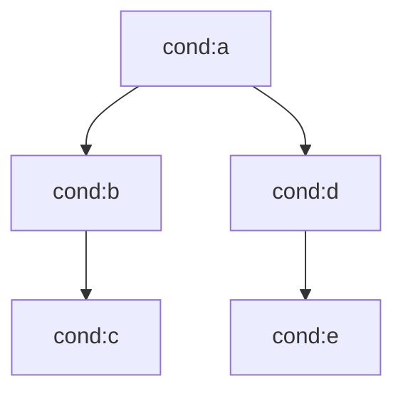

# LLM Vault Optimizer - Implementation Plan

> P0/P1/P2 roadmap for optimizing LOOP vault for LLM navigation

---

## Background

### Problem
LLM entering vault needs 8-15 file reads to answer strategic questions like "3년 전략 전부 확인해".

### Solution
Fixed entry points + Query recipes + Redundant link paths (Palantir-style safety).

### Success Criteria
- Any strategic query resolved in 2-3 file reads
- 100% of Tasks linked to Conditions via conditions_3y
- Orphan check blocks broken links at merge gate

---

## P0: Immediate (Core Infrastructure)

### 1. Upgrade _ENTRY_POINT.md

**File**: `_ENTRY_POINT.md`

**Action**: Rewrite as LLM boot protocol with 6 required sections:

```markdown
# LOOP Vault LLM Entry Point

## 1. Vault Goal
Inner Loop OS 스타트업의 전략-실행 추적 시스템

## 2. Entity Types & Locations
| Type | ID Pattern | Canonical Path |
|------|------------|----------------|
| NorthStar | ns:001 | 01_North_Star/ |
| MetaHypothesis | mh:1-4 | 01_North_Star/ |
| Condition | cond:a-e | 20_Strategy/3Y_Conditions/ |
| Track | trk:1-6 | 20_Strategy/12M_Tracks/ |
| Project | prj:001-999 | 50_Projects/{year}/ |
| Task | tsk:001-01 | 50_Projects/{year}/P*/Tasks/ |

## 3. Mandatory Link Rules
- Task → must have parent_id (Project)
- Task → must have conditions_3y (at least 1 Condition)
- Project → must have parent_id (Track)
- Track → must have parent_id (Condition)

## 4. Global Map
→ [[_Graph_Index.md]]

## 5. Schema & Relations
→ [[00_Meta/schema_registry.md]]
→ [[00_Meta/relation_types.md]]

## 6. Query Recipes
→ [[00_Meta/query_recipes.md]]
```

---

### 2. Create 3Y Conditions Index

**File**: `20_Strategy/3Y_Conditions/_INDEX.md`

**Action**: Create index listing all Conditions

```markdown
---
entity_type: Index
entity_id: idx:3y-conditions
entity_name: 3Y Conditions Index
---

# 3년 조건 인덱스

## Conditions

| ID | Name | Status | Parent MH |
|----|------|--------|-----------|
| cond:a | Condition_A_Market_PMF | planning | mh:1 |
| cond:b | Condition_B_Loop_Dataset | in_progress | mh:3 |
| cond:c | Condition_C_Global_Data | planning | mh:3 |
| cond:d | Condition_D_Healthcare | planning | mh:2 |
| cond:e | Condition_E_Revenue | planning | mh:4 |

## Condition Dependencies



## Documents

- [[Condition_A_Market_PMF]]
- [[Condition_B_Loop_Dataset]]
- [[Condition_C_Global_Data]]
- [[Condition_D_Healthcare]]
- [[Condition_E_Revenue]]
```

**Note**: Condition A, C, D, E documents need to be created if they don't exist.

---

### 3. Create Query Recipes

**File**: `00_Meta/query_recipes.md`

**Action**: Create file with common query patterns

```markdown
---
entity_type: QueryRecipes
entity_id: meta:recipes
entity_name: LLM Query Recipes
---

# Query Recipes

> LLM이 특정 질문에 답할 때 읽어야 할 파일 순서

---

## Q1: "3년 전략 전부 요약"

1. `_ENTRY_POINT.md` - 구조 파악
2. `20_Strategy/3Y_Conditions/_INDEX.md` - 모든 Condition 목록
3. 각 `Condition_*.md` 파일 순회
4. `_Graph_Index.md` - conditions_3y로 연결된 Project/Task 확인

**Expected reads**: 3-5

---

## Q2: "Condition B 관련 모든 작업"

1. `20_Strategy/3Y_Conditions/Condition_B_Loop_Dataset.md` - 조건 정의
2. `_Graph_Index.md` - Parent-Child에서 cond:b → trk:2/4 → prj:* → tsk:*
3. (Optional) 개별 Task 파일

**Expected reads**: 2-3

---

## Q3: "현재 진행중인 프로젝트"

1. `_Graph_Index.md` - Project 테이블에서 status: active 필터

**Expected reads**: 1

---

## Q4: "MH3가 깨지면 어떻게 되나?"

1. `01_North_Star/MH3_데이터_모델링_가능.md` - if_broken 필드 확인

**Expected reads**: 1

---

## Q5: "Track 2의 진행 상황"

1. `20_Strategy/12M_Tracks/Track_2_Data.md` - Track 정의 및 metrics
2. `_Graph_Index.md` - trk:2의 하위 Project/Task 상태

**Expected reads**: 2

---

## Q6: "담당자별 작업 현황"

1. `_Graph_Index.md` - Task 테이블
2. (Optional) `00_Meta/members.yaml` - 멤버 정보

**Expected reads**: 1-2
```

---

## P1: This Week (Link Enforcement)

### 4. Add conditions_3y to Templates

**Files to modify**:
- `00_Meta/_TEMPLATES/template_task.md`
- `00_Meta/_TEMPLATES/template_project.md`
- `00_Meta/_TEMPLATES/template_hypothesis.md`

**Add field**:
```yaml
# === 3Y 전략 연결 (필수) ===
conditions_3y: ["cond:{{LETTER}}"]  # 최소 1개 필수
```

---

### 5. Update validate_schema.py

**File**: `scripts/validate_schema.py`

**Changes**:

```python
# Add to REQUIRED_FIELDS
REQUIRED_FIELDS = {
    # ... existing ...
    "Track": ["owner", "horizon", "conditions_3y"],  # Add conditions_3y
    "Project": ["owner", "parent_id", "conditions_3y"],  # Add conditions_3y
    "Task": ["assignee", "project_id", "parent_id", "conditions_3y"],  # Add conditions_3y
}

# Add validation function
def validate_conditions_3y(frontmatter: Dict) -> List[str]:
    errors = []
    entity_type = frontmatter.get("entity_type")

    if entity_type in ["Task", "Project", "Track"]:
        conditions = frontmatter.get("conditions_3y", [])

        if not conditions or len(conditions) == 0:
            errors.append("conditions_3y must have at least 1 condition")

        if not isinstance(conditions, list):
            errors.append("conditions_3y must be a list")
        else:
            for cond in conditions:
                if not cond.startswith("cond:"):
                    errors.append(f"conditions_3y must reference cond:* IDs, got: {cond}")

    return errors
```

---

### 6. Update check_orphans.py (Blocking Mode)

**File**: `scripts/check_orphans.py`

**Changes**:

```python
# Change return value at end of main()
if all_warnings:
    print(f"\n--- Errors ---")  # Change from "Warnings" to "Errors"
    for warning in all_warnings:
        print(f"  - {warning}")
    return 1  # Block commit (was return 0)

# Add conditions_3y orphan check
def check_orphans(entities: Dict[str, Dict]) -> List[str]:
    # ... existing code ...

    # Add: conditions_3y reference check
    for entity_id, data in entities.items():
        fm = data["frontmatter"]

        conditions_3y = fm.get("conditions_3y", [])
        if isinstance(conditions_3y, list):
            for cond_id in conditions_3y:
                if isinstance(cond_id, str) and cond_id not in all_ids:
                    warnings.append(
                        f"{entity_id}: conditions_3y references '{cond_id}' which does not exist"
                    )

    return warnings
```

---

## P2: Next Week (Automation & Backfill)

### 7. Backfill conditions_3y to Existing Tasks

**File**: `scripts/backfill_conditions_3y.py` (new)

**Logic**:
1. Scan all Task/Project files
2. Derive conditions_3y from parent Track
3. Add field to frontmatter
4. Report changes

**Mapping** (based on current structure):
- `trk:1 → cond:a` (Product)
- `trk:2 → cond:b` (Data)
- `trk:3 → cond:a` (Content)
- `trk:4 → cond:b, cond:d` (Coaching)
- `trk:5 → cond:c, cond:d` (Partnership)
- `trk:6 → cond:e` (Revenue)

---

### 8. Generate graph.json

**File**: `scripts/build_graph_index.py`

**Add output**:

```python
# After generating _Graph_Index.md, also output JSON

def generate_json_index(entities: Dict, output_path: str):
    graph = {
        "generated": datetime.now().isoformat(),
        "total_entities": len(entities),
        "nodes": [],
        "edges": [],
        "conditions_3y_index": {}
    }

    for entity_id, data in entities.items():
        fm = data["frontmatter"]

        # Add node
        graph["nodes"].append({
            "id": entity_id,
            "type": fm.get("entity_type"),
            "name": fm.get("entity_name"),
            "status": fm.get("status"),
            "path": str(data["filepath"])
        })

        # Add edges
        parent_id = fm.get("parent_id")
        if parent_id:
            graph["edges"].append({
                "source": parent_id,
                "target": entity_id,
                "type": "parent_of"
            })

        # Build conditions_3y index
        conditions = fm.get("conditions_3y", [])
        for cond in conditions:
            if cond not in graph["conditions_3y_index"]:
                graph["conditions_3y_index"][cond] = []
            graph["conditions_3y_index"][cond].append(entity_id)

    # Write JSON
    json_path = Path(output_path) / "_build" / "graph.json"
    json_path.parent.mkdir(exist_ok=True)
    with open(json_path, "w") as f:
        json.dump(graph, f, indent=2, ensure_ascii=False)
```

---

### 9. Create Projects Index

**File**: `50_Projects/_INDEX.md`

**Content**: Auto-generated list of all Projects with conditions_3y

---

## Summary Table

| Phase | Task | Files | Status |
|-------|------|-------|--------|
| P0-1 | Upgrade _ENTRY_POINT.md | _ENTRY_POINT.md | ✅ Done |
| P0-2 | Create 3Y Conditions Index | 20_Strategy/3Y_Conditions/_INDEX.md | ✅ Done |
| P0-3 | Create Query Recipes | 00_Meta/query_recipes.md | ✅ Done |
| P1-4 | Add conditions_3y to templates | 00_Meta/_TEMPLATES/*.md | ✅ Done |
| P1-5 | Update validate_schema.py | scripts/validate_schema.py | ✅ Done |
| P1-6 | Make orphan check blocking | scripts/check_orphans.py | ✅ Done |
| P2-7 | Backfill existing Tasks | scripts/backfill_conditions_3y.py | ✅ Done |
| P2-8 | Generate graph.json | scripts/build_graph_index.py | ✅ Done |
| P2-9 | Create Projects Index | 50_Projects/_INDEX.md | ✅ Done |

---

## Dependencies

```
P0-1 (Entry Point) ← standalone
P0-2 (3Y Index) ← standalone
P0-3 (Query Recipes) ← depends on P0-1, P0-2

P1-4 (Templates) ← standalone
P1-5 (Validate) ← depends on P1-4
P1-6 (Orphan Block) ← depends on P1-5

P2-7 (Backfill) ← depends on P1-4, P1-5
P2-8 (JSON) ← standalone
P2-9 (Projects Index) ← depends on P2-7
```

---

**Created**: 2025-12-19
**Last Updated**: 2025-12-19
**Status**: ✅ Complete (All P0/P1/P2 tasks done)