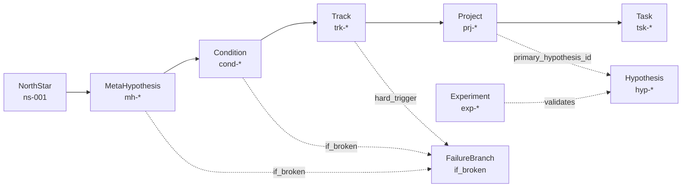

# LOOP Vault Ontology Schema (LLM Entry)

> 이 문서는 **Vault를 처음 읽는 LLM/사람**이 “이 볼트가 뭘 하는지 / 엔티티가 무엇인지 / 엔티티 간 관계가 무엇인지 / 전략 목표가 무엇인지”를 **한 번에** 이해하기 위한 온톨로지·스키마 문서다.
>
> 함께 읽기(권장):
> - `/_ENTRY_POINT.md` (LLM 부트 프로토콜)
> - `/00_Meta/LOOP_PHILOSOPHY.md` (설계 철학: Decision–Evidence–A/B–Approval–Learning)
> - `/00_Meta/relation_types.md` (관계 타입 레지스트리)

---

## 0) 이 Vault가 하는 일 (One-liner)
LOOP Vault는 **전략 계층(NorthStar→MetaHypothesis→Condition→Track)** 과 **실행 계층(Project→Task)** 을 SSOT(Frontmatter)로 고정하고, 필요 시 **증거(Evidence) 기반 A/B(기대/실제) 평가**로 학습을 누적시키는 “문서 기반 의사결정 OS”다.

---

## 1) 핵심 구조(Strategy → Execution)
### 1.1 계층(필수)
**Hierarchy (SSOT):**

`NorthStar → MetaHypothesis → Condition → Track → Project → Task`

- 오른쪽(상위)으로 갈수록 **추상도/전략 레벨**이 높다.
- 왼쪽(하위)으로 갈수록 **실행 레벨**이 높다.

### 1.2 동작 원리(의사결정 루프)
- **결정은 최소 입력으로 남기고(Decision)**
- **실행은 Task/Project로 수행하고(Action)**
- **평가는 Evidence 기반으로만 하고(Evidence)**
- **전략 변경은 트리거 기반으로만 한다(Trigger-based Update)**

> 상세 원칙: `/50_Projects/Vault_System/_SSOT_Decision_Action_Evidence_Map.md`

---

## 2) 엔티티 타입 정의 (What each node means)
아래 정의는 **그래프/검색/LLM 추론**에 필요한 최소 의미를 고정한다.

### 2.1 Strategy Layer
#### NorthStar (ns-*)
- 의미: 10년 불변 좌표(최적화 함수)
- 기대 질문: “무엇이 승리/패배인가?”

#### MetaHypothesis (mh-*)
- 의미: NorthStar를 성립시키는 **대전제(인과 가정)**
- 필수: `if_broken` (깨졌을 때의 대응/전략 전환 규칙)
- 선택: `confidence`, `evidence_status`

#### Condition (cond-a~e)
- 의미: 3년 관문(충족/실패가 전략을 바꾸는 **가드레일**)
- 필수: `if_broken`
- 선택: `metrics`, `unlock`

#### Track (trk-1~6)
- 의미: 12개월 전략 베팅 포트폴리오(조건을 충족시키기 위한 실행 방향)
- 필수: `owner`, `horizon`, `conditions_3y`
- 선택: `objectives`, `focus`, `hypothesis`

### 2.2 Execution Layer
#### Project (prj-*)
- 의미: 실행 단위이자 “베팅 단위”(A/B 평가의 가장 유용한 단위)
- 필수: `owner`, `parent_id`, `conditions_3y`, `expected_impact`
- 선택(있으면 좋음): `budget`, `deadline`, `hypothesis_id`, `primary_hypothesis_id`, `experiments`, `track_contributes`, `condition_contributes`

#### Task (tsk-*)
- 의미: 프로젝트를 구성하는 실행(행동) 단위
- 필수: `assignee`, `project_id`, `parent_id`
- 선택: `due`, `priority`, `type`, `estimated_hours`, `actual_hours`

### 2.3 Proof Layer (선택 / 성숙 단계)
> MVP 그래프에선 **옵션 레이어**. 존재하면 링크되지만, 시스템이 성숙하지 않으면 기본 표시를 강제하지 않는다.

#### Hypothesis (hyp-*)
- 의미: 검증 가능한 주장(베팅의 근거/검증 대상)
- 선택: `confidence`, `evidence_status`, `success_criteria`, `failure_criteria`

#### Experiment (exp-*)
- 의미: 가설 검증 프로토콜
- 필수: `hypothesis_id`, `metrics`

#### Evidence
- 의미: 결과/관측치/학습을 구조화한 근거 객체(사후 업데이트의 입력)
- 필수: `project`, `normalized_delta`, `evidence_strength`

---

## 3) 관계(Edges) — 의미/방향/카디널리티/표현 필드
이 섹션은 “LLM이 관계를 오해하지 않도록” **관계의 의미를 명확히 고정**한다.

### 3.1 계층 관계 (Hierarchy)
계층은 **단일 parent 포인터**로 표현한다.

| From (child) | Field | To (parent) | Meaning | Cardinality |
|---|---|---|---|---|
| MetaHypothesis | (문서/폴더 규칙 또는 `parent_id`) | NorthStar | 상위 전략 포함 | N:1 |
| Condition | (문서/폴더 규칙 또는 `parent_id`) | MetaHypothesis | 상위 가정 포함 | N:1 |
| Track | `parent_id` | Condition | 대표 상위 조건(Primary Condition) | N:1 |
| Project | `parent_id` | Track | 속한 트랙(Primary Track) | N:1 |
| Task | `parent_id` | Project | 속한 프로젝트 | N:1 |

> NOTE: 일부 상위(예: MH/Condition)는 parent_id가 파일/폴더 구조로 암묵인 경우가 있을 수 있다. 그래프 빌더는 “명시 parent_id 우선 + 없으면 표준 경로 규칙으로 보강”을 권장.

### 3.2 Strategy 기여 관계 (Contributes / Tagged)
계층(Primary) 외에, 실제 전략은 다대다로 연결된다.

#### 3.2.1 `conditions_3y` (핵심 태그/색인)
- 의미: 이 엔티티가 **어떤 3Y Condition과 관련되는지**를 빠르게 찾기 위한 SSOT 필드
- 사용처: Track, Project (필수)

| Entity | Field | To | Meaning | Cardinality |
|---|---|---|---|---|
| Track | `conditions_3y: [cond-*]` | Condition[] | 트랙이 걸려있는 3Y 조건 태그(탐색/집계용) | N:M |
| Project | `conditions_3y: [cond-*]` | Condition[] | 프로젝트가 기여/영향을 주는 3Y 조건 태그 | N:M |

> 규칙: `parent_id`는 “대표 상위 1개(Primary)”를 정하고, `conditions_3y`는 “관련 조건(다대다)”를 제공한다.

#### 3.2.2 Track ↔ Condition의 의미(중요)
Track과 Condition은 아래 3개의 신호로 연결될 수 있다.

1) **`Track.parent_id → Condition`**
- 의미: 이 트랙의 “대표 상위 조건(Primary Condition)”

2) **`Track.conditions_3y → Condition[]`**
- 의미: 트랙이 장기적으로 걸려있는 조건 태그(탐색/집계)

3) **`Track.validates → Condition[]` (사용 시)**
- 현재 relation registry에서 `validates`는 “Project/Experiment → Hypothesis” 의미가 강하다.
- 하지만 운영적으로 Track이 Condition에 기여함을 표시하기 위해 `validates`가 사용될 수 있다.
- **권장(차기 개선):** Track이 Condition에 기여하는 관계는 `outgoing_relations`로 분리하여 `supports`(또는 새 타입 `contributes_to`)로 명시.
- **MVP 그래프 호환:** 기존 데이터에서 Track.validates가 Condition을 가리키면 UI 라벨을 “contributes to condition”으로 명확히 표시.

### 3.3 Proof(검증) 관계 (선택)
> 시스템 성숙 단계에서 활성화.

| From | Field / Relation | To | Meaning |
|---|---|---|---|
| Project | `primary_hypothesis_id` | Hypothesis | 이 프로젝트가 검증하려는 대표 가설 |
| Project / Task / Experiment | `validates: [hyp-*]` | Hypothesis[] | 가설을 검증한다 |
| Hypothesis | `validated_by` (가능하면 Derived) | Project/Experiment | 역방향 인덱스(자동 파생 권장) |

---

## 4) Failure / Trigger (깨졌을 때의 경로)
이 Vault에서 “실패”는 단일 사건이 아니라, **전략을 바꾸는 규칙**으로 다룬다.

### 4.1 `if_broken` (Condition / MetaHypothesis)
- 의미: 이 노드가 깨질 경우 실행할 **명시적 대응(피벗/종료/전환)**
- 그래프에서의 표현(MVP 권장):
  - Condition/MH 노드에서 `if_broken`을 **FailureBranch 노드(가상 노드)** 로 생성
  - dotted edge로 연결

### 4.2 Track Hard Trigger
- Track 문서에서 “실패 시 회사 종료 위험/전환” 같은 강한 트리거가 명시될 수 있다.
- 그래프 표현(MVP 권장):
  - Track 노드에서 FailureBranch로 dotted edge
  - 라벨에 “Hard Trigger” 배지를 추가(텍스트 그대로)

---

## 5) 그래프 구축 규칙 (MVP 구현 가이드)
### 5.1 최소 그래프(필수 노드)
- NorthStar, MetaHypothesis, Condition, Track, Project, Task, FailureBranch

### 5.2 최소 엣지(필수)
- 계층(parent): NS→MH→Condition→Track→Project→Task
- 실패(failure): Condition/MH/Track → FailureBranch

### 5.3 레이아웃 권장
- X축: 왼쪽=Execution(Project/Task), 오른쪽=Strategy(NorthStar)
- Project 클릭 시: Why Ladder(상위 경로)만 하이라이트 + 나머지는 dim

### 5.4 확률/신뢰도(%) 표기 규칙 (MVP 현실 버전)
- **원칙:** “정교한 확률”이 아니라 “일관된 표기”가 목적
- 표시 소스 우선순위:
  1) 노드 `confidence`가 있으면 `confidence*100`%
  2) 노드 `progress`가 있으면 `progress*100`%
  3) 둘 다 없으면 % 미표시(상태/리스크 배지로 대체)

---

## 6) 도식(LLM/사람용, parse-safe)

---

## 7) 읽는 순서(LLM Quick Start)
1) `/_ENTRY_POINT.md` — 전체 구조/필수 링크 규칙/빠른 질의 레시피
2) `/00_Meta/LOOP_PHILOSOPHY.md` — 이 시스템이 왜 A/B·Evidence·Approval을 쓰는지
3) **이 문서** — 엔티티/관계 의미를 오해 없이 고정
4) 실제 전략: `/01_North_Star/`, `/20_Strategy/` 문서들

---

## 8) Known caveats (현재 상태의 불일치/보완)
- `00_Meta/schema_registry.md`가 현재 경로에서 발견되지 않을 수 있다(레거시/이동). 이 경우 실제 스키마 소스는 서버의 `get_schema_info` 출력이 기준이며, 본 문서는 “LLM/사람 이해”를 위한 상위 요약으로 유지한다.
- `validates`는 “가설 검증” 의미가 강하므로, **Track→Condition의 기여 관계는 차기 버전에서 outgoing_relations 기반 관계 타입으로 분리**하는 것을 권장한다.

---

## 변경 이력
- v1.0 (2026-01-18): 최초 작성. Strategy→Execution 계층, 조건/트랙 관계 의미, FailureBranch 규칙, 그래프 MVP 규칙 고정.
