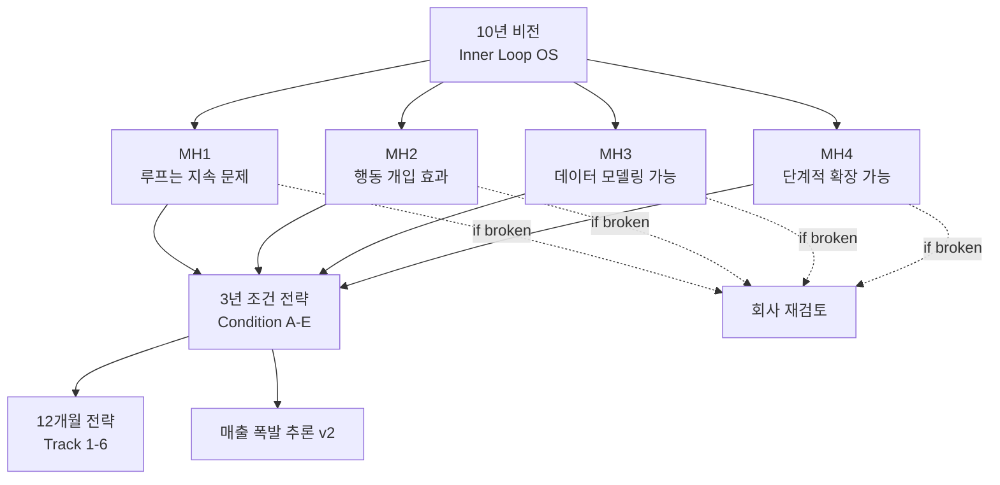

# 10년 비전 (North Star)

> 좌표 ID: `vision:inner-loop-os` | 상태: Fixed | 변경 불가

## 비전 선언

**인간의 정서–섭식–습관 루프를 읽고, 예측하고, 전환하는**
**Human Inner Loop OS의 글로벌 표준**

---

## 이 좌표의 성격

### ✅ 제품 형태 독립
- 앱 형태든
- 코칭 서비스든
- DTx(디지털 치료제)든
- API/SDK든
- **모두 가능**

→ 10년 뒤 앱이 사라져도 이 비전은 유효

### ✅ 시장 변화 독립
- GLP-1이 있든 없든
- 체중 문제가 해결되든 안 되든
- 다이어트 시장이 커지든 줄어들든
- **무관**

→ 인간은 여전히 정서-섭식-습관 루프를 가지고 살아감

### ✅ 인과 구조만 고정
- "인간 행동의 인과 구조를 데이터로 다룬다"
- 이 한 가지만 불변

→ 어떻게 다루는지(방법론)는 시대에 따라 변할 수 있음

---

## 10년 좌표가 요구하는 전제 (Meta Hypotheses)

이 비전이 타당하려면 아래 4개 가설이 모두 참이어야 함:

### [[MH1_루프는_지속적_문제]]
**가설**: "인간은 체중이 아니라 정서–섭식–습관 루프를 지속적 문제로 인식한다"

**의미**:
- 체중 조절이 완벽해져도 (GLP-1로 해결)
- 사람들은 여전히 "왜 스트레스 받으면 먹게 되지?", "야식 습관을 못 끊겠어" 같은 루프 문제를 가짐
- 이것이 10~20년 이상 지속되는 인간 보편 문제

**만약 거짓이라면**?
→ 회사 존재 이유 재검토. GLP-1로 모든 문제가 해결되고, 사람들이 루프에 관심 없다면 OS 의미 없음.

---

### [[MH2_행동개입_효과]]
**가설**: "이 루프는 행동·정서 개입으로 의미 있게 변한다"

**의미**:
- 단순히 "참아라"가 아니라
- 구조화된 개입(천천히 먹기, 멈춤, 대체 행동, 인지적 재구성)으로
- 루프가 실제로 바뀜 (폭식 빈도 감소, 충동 억제 성공률 증가 등)

**만약 거짓이라면**?
→ 회사 존재 이유 재검토. 개입이 안 먹히면 OS가 아니라 단순 기록 앱.

---

### [[MH3_데이터_모델링_가능]]
**가설**: "이 루프는 데이터로 모델링 가능한 구조를 가진다"

**의미**:
- 정서-섭식-습관 루프가 무작위 노이즈가 아니라
- 재현 가능한 패턴을 가짐
- Event-Action-Result 인과 구조로 데이터화 가능
- 예측 모델 구축 가능

**만약 거짓이라면**?
→ 회사 존재 이유 재검토. 데이터로 모델링 불가능하면 OS 불가능.

**검증 방법**:
- [[30_Ontology|온톨로지 v0.1]] - 5개 코어 엔티티로 표현 가능한지
- [[Track_2_Data]] - 재현 패턴 10개 이상 발견되는지
- [[Condition_B_Loop_Dataset]] - 패턴 재현율 70% 이상

---

### [[MH4_단계적_확장_가능]]
**가설**: "비규제 → 의료 → 글로벌로 단계적 확장 경로가 가능하다"

**의미**:
- 처음부터 글로벌 규제 대응 필요 없음
- 국내 웰니스/코칭으로 시작 → PMF 확보
- 데이터 쌓이면 의료 진입 (IRB, 임상)
- 의료 검증되면 글로벌 확장

**만약 거짓이라면**?
→ 회사 존재 이유 재검토. 처음부터 글로벌 규제 대응 필요하면 스타트업으로 불가능.

---

## Meta Hypotheses 중단 조건

**이 중 하나라도 무너지면 → 회사 존재 이유 재검토**

| MH | 무너지는 증상 | 대응 |
|----|-------------|------|
| MH1 | GLP-1 사용자들이 루프 문제에 무관심 | 회사 피봇/종료 |
| MH2 | 6개월간 개입해도 루프 변화 없음 | 회사 피봇/종료 |
| MH3 | 패턴이 전혀 재현 안 됨, 데이터가 노이즈 | 회사 피봇/종료 |
| MH4 | 비규제 시작 불가, 처음부터 FDA 필요 | 회사 피봇/종료 |

---

## 10년 좌표가 열어주는 것

### Layer 2 OS 포지셔닝
```
Layer 0 - AGI Foundation (GPT, Claude 등)
   ↓
Layer 1 - Cognitive API (Memory, Context, Planning)
   ↓
Layer 2 - INNER LOOP OS ← 우리 위치
   ↓
Layer 3 - Applications (앱, 코칭, DTx)
```

### 범용 LLM이 못 다루는 것
- 정서적 허기 vs 신체적 배고픔 구분
- 폭식 전조 패턴 (2-4시간 위험 구간)
- GLP-1 중단 후 반동 예측
- 스트레스-섭식 루프의 약한 고리 파악
- 개인별 Loop 가중치 (emotional 0.4, habit 0.3 ...)

### AGI 시대에도 살아남는 이유
**범용 AI는 인간의 내면 루프 데이터가 없음**

- GPT는 일반 지식은 많지만, "내가 왜 어제 야식을 먹었는지"는 모름
- Inner Loop OS는 이 데이터를 10년간 축적
- AGI가 인간을 이해하려면 이 레이어를 호출해야 함

---

## 10년 후 세상

### 앱은 사라짐
사용자는 "앱을 연다"가 아니라 "AI에게 말한다"

```
User: "나 지금 배고픈 것 같아"

AI Agent → Inner Loop OS 호출:
innerloop.get_state(user):
  → Emotional loop: 0.72
  → Physical hunger: 0.18
  → Habit trigger: commute pattern
  → Recommended: 따뜻한 물 + 2분 호흡

AI Agent: "지금 배고픔이 아니라 불안 루프야.
따뜻한 물 한 모금 먼저 마셔볼까?"
```

### Inner Loop OS가 제공하는 것
- 개인의 5대 루프 상태 (실시간)
- 다음 2시간 위험 예측
- 약한 고리 파악
- 개입 추천 (타이밍 + 종류)
- 장기 루프 변화 추적

---

## 경쟁 우위 (10년 관점)

### 1. 데이터 희소성
- 범용 LLM은 인간 내면 루프 데이터 부재
- 우리는 10만명 × 90일 × 5대 루프 데이터 독점

### 2. 도메인 깊이
- GLP-1 제약사들은 약물만 다룸
- 정신건강 앱들은 정서만 다룸
- 우리는 정서-섭식-습관-보상-신경계를 하나의 시스템으로

### 3. OS 레이어 선점
- 앱은 누구나 만들 수 있음
- OS는 먼저 표준을 만든 자가 가져감
- TCP/IP, HTTP, GPS처럼

---

## 비전 달성 경로 (역산)

```
2035년 (10년 후)
  ↓
Human Inner Loop OS = 글로벌 표준
모든 AGI가 호출하는 Layer 2

2032년 (7년 후)
  ↓
글로벌 의료 기관 도입
FDA/MFDS 승인 DTx

2029년 (5년 후)
  ↓
국내 의료 기관 파트너십
IRB 승인, 임상 검증

2028년 (3년 후)
  ↓
Condition A-E 충족
3년 전략 진입 자격

2025년 (지금)
  ↓
12개월 전략: Runway + Condition A,B 명확화
```

---

## 이 비전을 지키는 방법

### ✅ 변하지 않는 것
- 인간의 인과 구조를 데이터로 다룬다
- 정서-섭식-습관 루프는 인간 보편 문제
- OS 레이어를 목표로 한다

### 🔄 변할 수 있는 것
- 제품 형태 (앱 → API → SDK)
- 수익 모델 (B2C → B2B → B2B2C)
- 시장 (웰니스 → 의료 → 글로벌)
- 기술 스택 (현재 Flutter/Firebase → 미래 ??)

### ❌ 하지 말아야 할 것
- 단순 칼로리/체중 앱으로 피봇
- GLP-1 보조제 판매
- 범용 정신건강 앱으로 확장
- Meta Hypotheses 검증 없이 스케일업

---

## 관계도



---

## 참고 문서

### Meta Hypotheses (상세)
- [[MH1_루프는_지속적_문제]]
- [[MH2_행동개입_효과]]
- [[MH3_데이터_모델링_가능]]
- [[MH4_단계적_확장_가능]]

### 전략 문서
- [[20_Strategy/_MOC_전략]]
- [[Revenue_Roadmap]] - 매출 폭발 시기 및 규모 추론
- [[Condition_B_Loop_Dataset]] - MH3 검증의 핵심
- [[Track_2_Data]] - MH3 검증 실행

### 시스템 정의
- [[Inner Loop OS 정의v1]]
- [[40_LOOP_OS/LOOP OS관련 문서]]

---

**최초 작성**: 2024-12-18
**마지막 검토**: 2024-12-18
**다음 검토**: Meta Hypotheses 하나라도 흔들릴 때
**책임자**: Founder
