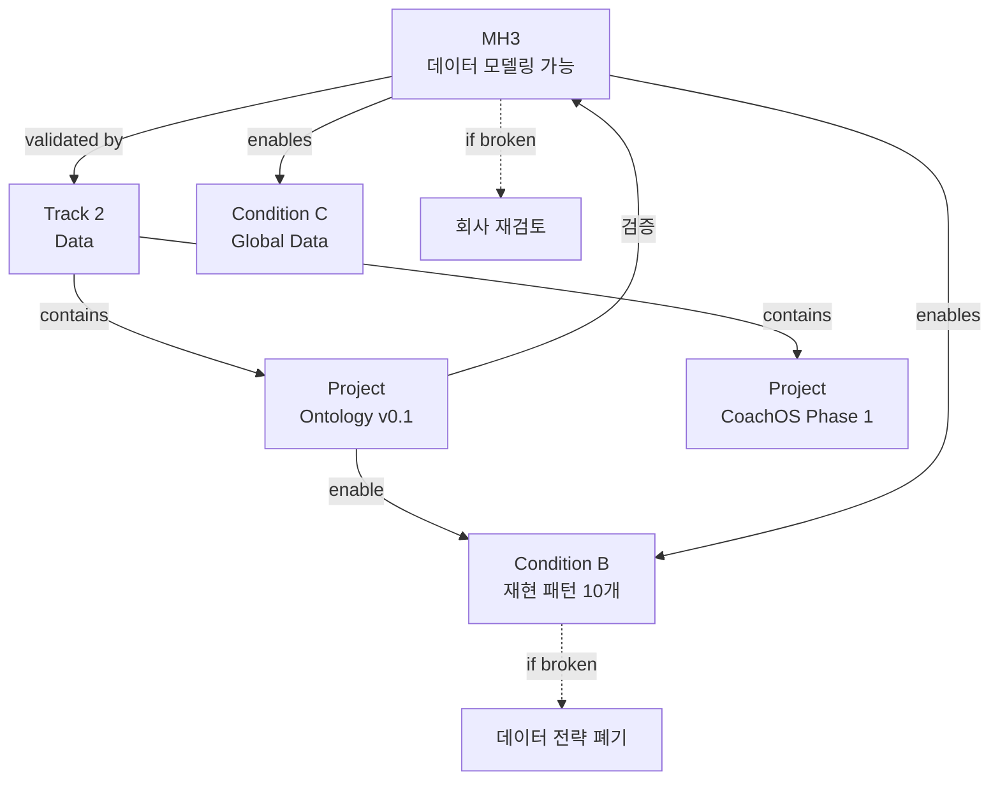

# MH3: 데이터 모델링 가능성

> Meta Hypothesis 3 | 상태: Validating (70%) | **온톨로지 핵심 가설**

## 가설 선언

**"정서-섭식-습관 루프는 데이터로 모델링 가능한 구조를 가진다"**

---

## 이 가설이 의미하는 것

### ✅ 참이라면
- 루프는 무작위 노이즈가 아니라 **재현 가능한 패턴**을 가짐
- Event-Action-Result **인과 구조**로 데이터화 가능
- 예측 모델 구축 가능 (다음 2시간 폭식 위험 70% 등)
- **Inner Loop OS 구축 가능** ← 10년 비전의 전제

### ❌ 거짓이라면
- 루프는 사람마다/날마다 완전히 랜덤
- 패턴을 찾을 수 없음
- 데이터 쌓아도 예측 불가능
- **OS 불가능 → 회사 존재 이유 재검토**

---

## 검증 전략

### 1단계: 스키마 안정성 (Project: Ontology v0.1)
**목표**: 5개 코어 엔티티로 모든 Loop 데이터 표현 가능

**검증 방법**:
- Event, Episode, LoopStateWindow, ActionExecution, OutcomeMeasurement
- SoSi/KkokKkokFit 실제 구현에서 3개월 깨지지 않는지
- 코치 라벨링 시 일관성 유지되는지

**현재 상태**:
- ✅ 5개 엔티티 정의 완료
- ✅ v0.1 스키마 확정 (4조건 규칙)
- 🟡 실제 구현 검증 진행 중
- 🟡 3개월 안정성 테스트 진행 중

**문서**: [[30_Ontology/Schema/v0.1/Ontology-lite v0.1]]

---

### 2단계: 재현 패턴 발견 (Condition B)
**목표**: 재현 가능한 패턴 10개 이상 발견

**검증 방법**:
- 같은 패턴이 다른 사용자에게서도 나타나는지
- 시간이 지나도 패턴이 유지되는지
- 패턴 재현율 70% 이상

**현재 상태**:
- 🟡 패턴 3개 발견 (목표 10개)
  1. "스트레스(anxiety) → 공허감(emptiness) → 강한 갈망 → 폭식"
  2. "저녁 퇴근 → 환경 변화 → 습관적 snacking"
  3. "GLP-1 중단 3주 후 → 식욕 rebound → 보상 먹기"
- ❌ 재현율 측정 미완 (데이터 부족)

**문서**: [[Condition_B_Loop_Dataset]]

---

### 3단계: 예측 모델 성능 (미래)
**목표**: 폭식/야식 위험 예측 정확도 70% 이상

**검증 방법**:
- LoopStateWindow 기반 위험 예측
- 실제 발생 vs 예측 비교
- Precision/Recall 측정

**현재 상태**:
- ⏸️ 아직 시작 안 함 (1단계 우선)
- 데이터 최소 임계치 필요 (고밀도 50명 × 3개월)

---

## 현재 증거

### ✅ 긍정적 증거 (MH3 지지)

#### 1. 엔티티 표현력
- **meal, emotion, urge, binge 모두 Event로 표현 가능**
- satiety_check, pms, sleep도 Event로 캡처
- 2-4시간 위험 구간이 Episode로 묶임
- 30-60분 5대 루프 상태가 LoopStateWindow로 추적

→ **다양한 Loop 데이터가 5개 엔티티로 표현됨**

#### 2. 패턴 발견 (3개)
- **패턴 1**: anxiety(7) → emptiness(8) → urge(9) → binge(8)
  - 재현: 사용자 A(3회), 사용자 B(2회), 사용자 C(1회)
  - 시간차: 2-4시간
- **패턴 2**: 퇴근 후 환경 변화 → 습관적 snacking
  - 재현: 사용자 D(매일), 사용자 E(주 4회)
- **패턴 3**: GLP-1 중단 후 rebound
  - 재현: 사용자 F(3주 후), 사용자 G(4주 후)

→ **패턴이 여러 사람에게서 재현됨**

#### 3. 스키마 안정성
- SoSi 앱에서 3개월간 v0.1 스키마 사용
- 큰 변경 없이 유지 중
- 코치 5명이 동일 스키마로 라벨링 가능

→ **스키마가 실전에서 작동함**

---

### ⚠️ 부정적 증거 (MH3 도전)

#### 1. 패턴 정체
- 3개월간 패턴 3개에서 증가 없음
- 목표 10개에 한참 부족
- 새 패턴 발견 속도 느림

→ **패턴 발견이 예상보다 어려움**

#### 2. 일부 표현 어려움
- 사회적 압력 루프 (친구 모임에서의 먹기)
- 관계 루프 (배우자/가족과의 갈등 → 먹기)
- 일부 복합 루프 (여러 루프 동시 활성)

→ **모든 루프를 표현하기엔 스키마 부족**

#### 3. 개인차
- 같은 패턴이라도 강도/순서가 사람마다 다름
- 일반화된 모델 만들기 어려움
- 개인화 필요

→ **단일 모델로는 한계, 개인화 필수**

---

## 만약 MH3가 깨진다면?

### 시나리오 1: 패턴이 전혀 재현 안 됨
**증상**:
- 6개월간 패턴 3개 그대로
- 새 데이터를 아무리 모아도 패턴 추출 실패
- 재현율 30% 미만

**원인 가능성**:
- 루프는 정말 랜덤이다 (MH3 거짓)
- 데이터 수집 방식이 잘못됨
- 패턴 정의가 잘못됨

**대응**:
1. **Hard Trigger**: 회사 존재 이유 재검토
2. Option A: 루프 정의 재검토 (다른 각도로 접근)
3. Option B: 개인화 극대화 (일반 패턴 포기, 개인 패턴만)
4. Option C: 피봇 - Loop OS 아닌 다른 방향

---

### 시나리오 2: 스키마가 계속 깨짐
**증상**:
- SoSi/KkokKkokFit에서 매주 스키마 변경 필요
- 5개 엔티티로 표현 불가능한 중요 데이터 발견
- 코치 라벨링 일관성 50% 미만

**원인 가능성**:
- 스키마 설계가 잘못됨
- 5개 엔티티가 부족함
- 루프가 너무 복잡해서 단순 스키마로 불가능

**대응**:
1. v0.1 폐기, v0.2로 재설계
2. 엔티티 추가 (Rule A 위반 아님, 새 엔티티는 허용)
3. 더 유연한 구조로 변경

→ **이 경우 MH3 자체는 유효** (모델링은 가능, 단지 스키마가 틀렸을 뿐)

---

### 시나리오 3: 예측이 전혀 안 됨
**증상**:
- 폭식 위험 예측 정확도 30% (동전 던지기보다 나쁨)
- LoopStateWindow 기반 모델이 작동 안 함
- 개인화해도 소용없음

**원인 가능성**:
- 루프는 예측 불가능하다 (MH3 부분 거짓)
- 입력 피처가 잘못됨
- 시간 스케일이 잘못됨

**대응**:
1. Loop OS는 예측 아닌 **관찰/기록**에 집중
2. "예측 OS"가 아니라 "패턴 인식 OS"로 피봇
3. 예측은 포기, 대신 사후 분석/인사이트 제공

→ **이 경우 MH3 부분 유효** (구조는 있으나 예측은 안 됨)

---

## MH3 검증 타임라인

### Phase 1 (현재 - 2025.06)
**목표**: 스키마 안정성 + 패턴 5개

- ✅ Ontology v0.1 확정
- 🟡 SoSi 실제 구현 안정화
- 🟡 패턴 3개 → 5개 증가
- 🟡 코치 라벨링 일관성 70% 달성

**성공 기준**: 3개월간 스키마 변경 없음

**실패 신호**: 매주 스키마 변경 / 패턴 3개 정체

---

### Phase 2 (2025.06 - 2025.12)
**목표**: 패턴 10개 + 재현율 70%

- 패턴 5개 → 10개 증가
- 패턴 재현율 측정 시작
- 고밀도 사용자 50명 확보
- Condition B 충족

**성공 기준**: 재현 패턴 10개, 재현율 70%

**실패 신호**: 6개월간 패턴 5개 정체

---

### Phase 3 (2026+)
**목표**: 예측 모델 구축

- LoopStateWindow 기반 예측 모델
- 폭식 위험 예측 정확도 70%
- 개인화 모델 정확도 75%

**성공 기준**: 예측 정확도 70%+

**실패 신호**: 예측 정확도 40% 미만 (랜덤 수준)

---

## 온톨로지의 역할

### 온톨로지 = MH3 검증 도구

```
MH3: "루프는 데이터 모델링 가능"
   ↓
검증 방법: 온톨로지로 표현 가능한지
   ↓
Ontology v0.1: 5개 코어 엔티티
   ↓
실제 데이터로 테스트
   ↓
결과: 표현 가능 → MH3 지지
      표현 불가능 → MH3 거짓
```

### 온톨로지 성공 = MH3 부분 검증

- ✅ 스키마 안정 → 구조가 있음 (MH3 지지)
- ✅ 패턴 발견 → 재현 가능함 (MH3 지지)
- ❌ 예측 실패 → 예측은 어려움 (MH3 부분 거짓)

---

## 관계도



---

## 참고 문서

### 온톨로지 (MH3 검증 도구)
- [[30_Ontology/Schema/v0.1/Ontology-lite v0.1]] - 스키마 정의
- [[30_Ontology/_Strategy_Link]] - 온톨로지-전략 연결
- [[Event (GraphRAG 최적화 예시)]] - 엔티티 예시

### 전략 연결
- [[10년 비전]] - 상위 비전
- [[Condition_B_Loop_Dataset]] - MH3 검증의 핵심
- [[Track_2_Data]] - MH3 검증 실행

### 프로젝트
- [[50_Projects/P3_Ontology_v0.1/Project_정의]] - 온톨로지 프로젝트
- [[60_Hypotheses/H_Loop_모델링_가능]] - 세부 가설

---

**최초 작성**: 2024-12-18
**마지막 검증**: 2024-12-18 (70% 확신)
**다음 검증**: 2025-06 (Phase 1 완료 시)
**책임자**: Founder + 온톨로지 팀
