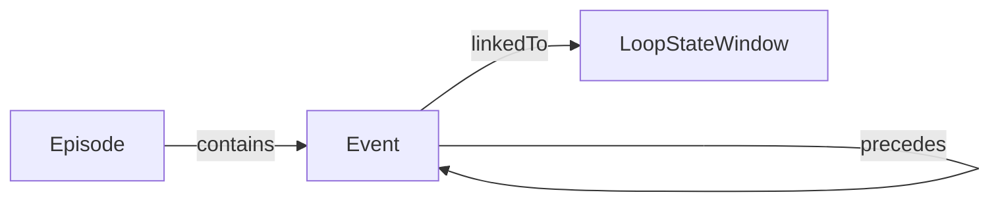
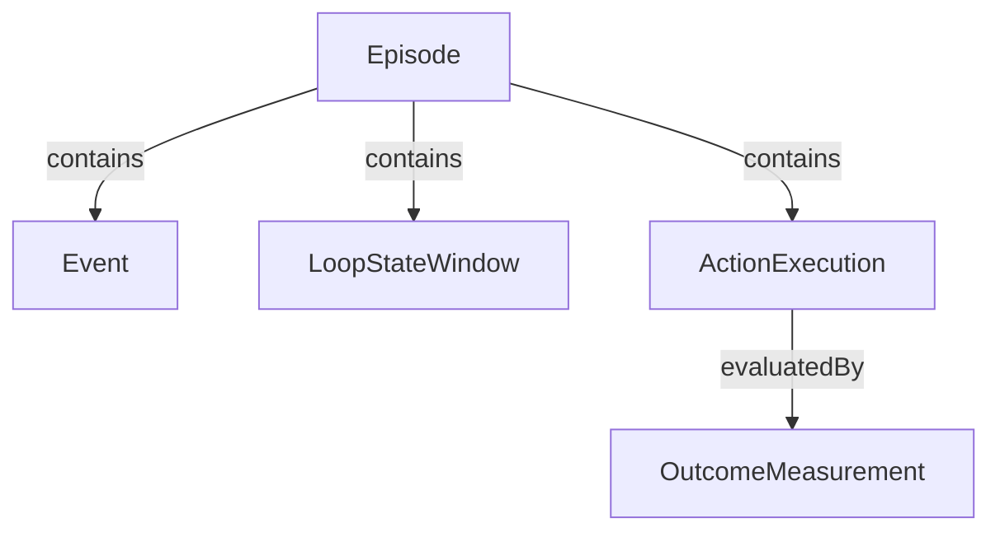
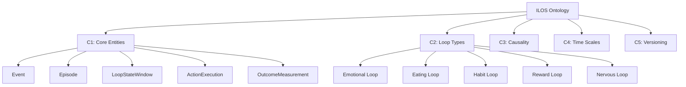

# GraphRAG 최적화 가이드

> LOOP Ontology Vault를 GraphRAG에 최적화하기 위한 구조 및 형식 가이드

## 목차
1. [GraphRAG란?](#graphrag란)
2. [현재 구조의 강점](#현재-구조의-강점)
3. [최적화 전략](#최적화-전략)
4. [구현 가이드](#구현-가이드)
5. [예시](#예시)

---

## GraphRAG란?

Microsoft의 GraphRAG는 전통적인 RAG를 개선한 방식:

**전통적 RAG:**
- 문서 → 청크 → 벡터 임베딩 → 유사도 검색
- 문제: 문서 간 관계 손실, 전체 맥락 파악 어려움

**GraphRAG:**
1. 문서 → 엔티티 & 관계 추출 → 지식 그래프 구축
2. 커뮤니티 탐지 (Leiden 알고리즘) → 주제별 클러스터
3. 계층적 요약 (각 커뮤니티마다)
4. 쿼리 시: 그래프 탐색 + 커뮤니티 요약 활용

**장점:**
- 전체적(global) 질문 답변 가능 ("ILOS의 핵심 아키텍처는?")
- 관계 기반 추론 ("Event와 Episode의 차이는?")
- 다층 추상화 (상위 개념 ↔ 구체 구현)

---

## 현재 구조의 강점

LOOP vault는 이미 GraphRAG 친화적:

✅ **명시적 온톨로지 구조**
- `Entities/`, `Relations/`, `Rules/` 폴더 분리
- 엔티티-관계 명확히 정의

✅ **계층적 조직**
- MOC 파일 (Map of Content)
- 폴더 기반 주제 분류 (Study/Ontology/Strategy/LOOP_OS)

✅ **위키링크 기반 연결**
- `[[Event]]`, `[[Episode]]` 등 Obsidian 링크
- 양방향 링크 자동 추적

✅ **태그 시스템**
- `#ontology/entity`, `#loop/emotional` 등

✅ **버전 관리**
- `specVersion`, 스키마 버전 폴더

---

## 최적화 전략

### 1. 구조화된 메타데이터 (YAML Frontmatter)

**목적**: GraphRAG가 엔티티 타입, 관계, 속성을 자동 인식

**구현**:
```yaml
---
# 엔티티 식별
entity_type: CoreEntity | Relation | Rule | Concept
entity_name: Event
entity_id: entity:event:v0.1

# 온톨로지 계층
parent: [LoopInstance]
children: []
related: [Episode, LoopStateWindow]

# 관계 명시
relations:
  - type: contains
    target: Episode
    direction: incoming
    cardinality: 0..1
  - type: precedes
    target: Event
    direction: bidirectional
    cardinality: N:M

# 버전 & 상태
version: "0.1"
status: active | draft | deprecated
lifecycle: stable | experimental

# 커뮤니티/클러스터
community: [core-entities, event-action-result]
domain: [eating-loop, emotional-loop, habit-loop]
layer: [data-model, implementation, strategy]

# 중요도 (GraphRAG 가중치)
importance: critical | high | medium | low
centrality: 0.95  # 네트워크 중심성 (수동 또는 자동 계산)

# 태그 (기존 유지)
tags: [ontology/entity, version/v0-1, status/active]

# 메타
created: 2024-12-18
updated: 2024-12-18
author: ontology-team
---
```

### 2. 명시적 관계 문서화

**문제**: Obsidian 링크는 방향/의미가 불명확
**해결**: 관계를 1급 엔티티로

**엔티티 문서 내 관계 섹션**:
```markdown
## 관계 (Relations)

### 들어오는 관계 (Incoming)
| 관계 | From | 설명 | Cardinality |
|------|------|------|-------------|
| `contains` | Episode | 에피소드가 이벤트를 포함 | 0..1:N |
| `triggers` | Event | 선행 이벤트가 이 이벤트를 촉발 | N:M |

### 나가는 관계 (Outgoing)
| 관계 | To | 설명 | Cardinality |
|------|-----|------|-------------|
| `precedes` | Event | 이 이벤트가 후속 이벤트를 선행 | N:M |
| `linkedTo` | LoopStateWindow | 이 이벤트가 상태 윈도우와 연관 | N:1 |

### 관계 그래프

```

### 3. 계층적 커뮤니티 구조

**목적**: GraphRAG의 커뮤니티 탐지 활용

**구현**: 폴더 구조 + 메타데이터

```
20_Ontology/
├── _Communities/              # 새 폴더: 주제별 클러스터
│   ├── C1_Core_Entities.md   # 커뮤니티 1: 핵심 엔티티
│   ├── C2_Loop_Types.md       # 커뮤니티 2: 5대 루프
│   ├── C3_Causality.md        # 커뮤니티 3: 인과 구조
│   ├── C4_Time_Scales.md      # 커뮤니티 4: 시간 스케일
│   └── C5_Versioning.md       # 커뮤니티 5: 버전 관리
│
├── Entities/
├── Relations/
└── Rules/
```

**커뮤니티 문서 예시** (`C1_Core_Entities.md`):
```markdown
---
entity_type: Community
community_id: C1
community_name: Core Entities
level: 1  # 계층 레벨
parent_community: null
child_communities: []
members: [Event, Episode, LoopStateWindow, ActionExecution, OutcomeMeasurement]
importance: critical
tags: [community, core]
---

# Community: Core Entities

## 요약 (Summary)
ILOS의 5개 핵심 엔티티. v0.1에서 고정되어 절대 변경 불가.
Event-Action-Result 인과 구조의 기반.

## 멤버 엔티티
- [[Event]] - 원자적 사실, 관찰 데이터
- [[Episode]] - 한 번의 루프 단위 컨테이너
- [[LoopStateWindow]] - 30-60분 상태 벡터 윈도우
- [[ActionExecution]] - 개입 실행 트랜잭션
- [[OutcomeMeasurement]] - 결과 측정

## 핵심 관계


## 설계 원칙
1. Type System 고정 (Rule A)
2. ID & Reference 불변 (Rule B)
3. 공통 필드 강제 (id, userId, createdAt, updatedAt, source, specVersion)

## 관련 커뮤니티
- [[C3_Causality]] - 인과 구조
- [[C5_Versioning]] - 버전 관리
```

### 4. 다층 요약 (Multi-Level Summaries)

**목적**: GraphRAG는 추상화 레벨별 요약 활용

**구현**: 각 문서에 여러 레벨의 요약

```markdown
---
entity_type: CoreEntity
entity_name: Event
summaries:
  executive: "원자적 사실 기록 엔티티"
  technical: "관찰 기반 최소 단위 데이터. 단독으로는 상관까지만, 인과는 아님"
  detailed: "meal, emotion_tag, urge, binge 등 eventType별 payload를 가진 불변 기록. episodeId로 Episode에 연결 가능"
---

# Event

## Executive Summary (1-liner)
원자적 사실 기록 엔티티

## Technical Summary (2-3 문장)
관찰 기반 최소 단위 데이터.
단독으로는 상관까지만, 인과는 아님.
eventType과 timestamp를 필수로 가지며, Episode에 선택적으로 연결됨.

## Detailed Summary (1 문단)
Event는 ILOS에서 관찰 가능한 사실(fact)의 최소 단위입니다.
meal, emotion_tag, urge, binge, sleep 등 다양한 eventType을 가질 수 있으며,
각 타입별로 payload 스키마가 정의됩니다.
Event 단독으로는 상관관계 분석까지 가능하지만, 인과관계를 확정하려면
ActionExecution과 OutcomeMeasurement와의 연결이 필요합니다.
episodeId 필드를 통해 Episode 컨테이너에 선택적으로(0..1) 연결됩니다.

(이하 상세 내용...)
```

### 5. 쿼리 지원 구조

**목적**: Dataview 플러그인 + 미래 SPARQL 쿼리

**구현**: 일관된 필드명 + 타입

```yaml
---
# 표준 필드 (모든 문서)
entity_type: CoreEntity | Relation | Rule | Community | Concept
entity_name: Event
entity_id: entity:event:v0.1

# 관계 필드 (쿼리 가능)
parent: [LoopInstance]
children: []
related_to: [Episode, LoopStateWindow]
depends_on: []
enables: [Episode, ActionExecution]

# 도메인 분류
domain: [eating-loop, emotional-loop]
loop_type: [eating, emotional, habit, reward, nervous]
time_scale: [micro, meso, macro]

# 메타
version: "0.1"
status: active
importance: critical
---
```

**Dataview 쿼리 예시**:
```dataview
TABLE entity_type, version, importance, status
FROM "20_Ontology"
WHERE entity_type = "CoreEntity" AND version = "0.1"
SORT importance DESC
```

### 6. 관계 타입 레지스트리

**새 폴더 생성**: `20_Ontology/RelationTypes/`

**목적**: 모든 관계 타입을 명시적으로 정의

**예시** (`RelationTypes/contains.md`):
```markdown
---
entity_type: RelationType
relation_name: contains
relation_id: rel:contains:v0.1
semantic: "A가 B를 시간적/의미적으로 포함"
directionality: directed
cardinality_pattern: "1:N"
inverse: isContainedBy
domain_range:
  - source: [Episode, LoopInstance]
    target: [Event, LoopStateWindow, ActionExecution]
version: "0.1"
status: active
---

# Relation Type: contains

## 정의
주체(source) 엔티티가 객체(target) 엔티티를 시간적/의미적 범위 안에 포함하는 관계

## 사용 사례
1. Episode contains Event
2. Episode contains LoopStateWindow
3. Episode contains ActionExecution

## 제약조건
- Source는 컨테이너 타입이어야 함
- Target은 Timestamp를 가져야 함
- Target의 timestamp는 Source의 [startTime, endTime] 범위 내

## 추론 규칙
```
IF Episode(id=E, startTime=T1, endTime=T2)
   AND Event(id=V, timestamp=T, episodeId=E)
   AND T1 <= T <= T2
THEN Episode --contains--> Event
```

## 관련 관계
- 역관계: `isContainedBy`
- 유사 관계: `includes`, `encompasses`
```

### 7. 인덱스 문서 (Graph Index)

**새 파일**: `20_Ontology/_Graph_Index.md`

**목적**: GraphRAG가 전체 그래프 구조를 빠르게 파악

```markdown
---
entity_type: Index
index_type: GraphStructure
---

# ILOS Ontology Graph Index

## 엔티티 인덱스

### Core Entities (5개)
| Entity | ID | Version | Importance | Community |
|--------|-----|---------|------------|-----------|
| [[Event]] | entity:event:v0.1 | 0.1 | critical | C1 |
| [[Episode]] | entity:episode:v0.1 | 0.1 | critical | C1 |
| [[LoopStateWindow]] | entity:statewindow:v0.1 | 0.1 | critical | C1 |
| [[ActionExecution]] | entity:action:v0.1 | 0.1 | critical | C1 |
| [[OutcomeMeasurement]] | entity:outcome:v0.1 | 0.1 | critical | C1 |

### Extended Entities
| Entity | ID | Version | Status |
|--------|-----|---------|--------|
| [[SignalObservation]] | entity:signal:v0.1 | 0.1 | active |
| [[UserLoopModelSnapshot]] | entity:usermodel:v0.1 | 0.1 | active |
| [[PredictionRun]] | entity:prediction:v0.1 | 0.1 | active |

## 관계 인덱스

### Primary Relations
| Relation | Source | Target | Type | Cardinality |
|----------|--------|--------|------|-------------|
| contains | Episode | Event | compositional | 0..1:N |
| contains | Episode | LoopStateWindow | compositional | 1:N |
| evaluatedBy | ActionExecution | OutcomeMeasurement | evaluative | 1:N |
| precedes | Event | Event | temporal | N:M |
| triggers | Event | ActionExecution | causal | N:M |

## 커뮤니티 구조



## 통계
- 총 엔티티: 5 (Core) + 8 (Extended) = 13
- 총 관계 타입: 12
- 커뮤니티: 5
- 버전: v0.1 (stable)
```

---

## 구현 가이드

### Phase 1: 메타데이터 표준화 (1주)

**작업:**
1. 모든 엔티티 문서에 YAML frontmatter 추가
2. `entity_type`, `entity_name`, `entity_id` 필수 필드
3. `relations`, `community`, `importance` 추가

**체크리스트:**
```bash
# 20_Ontology/Entities/ 하위 모든 파일
[ ] Event.md - frontmatter 추가
[ ] Episode.md - frontmatter 추가
[ ] LoopStateWindow.md - frontmatter 추가
[ ] ActionExecution.md - frontmatter 추가
[ ] OutcomeMeasurement.md - frontmatter 추가
```

### Phase 2: 관계 명시화 (1주)

**작업:**
1. `20_Ontology/RelationTypes/` 폴더 생성
2. 모든 관계 타입 문서화 (contains, triggers, evaluatedBy 등)
3. 엔티티 문서에 관계 섹션 추가 (표 형식)

### Phase 3: 커뮤니티 구조 (1주)

**작업:**
1. `20_Ontology/_Communities/` 폴더 생성
2. 5개 커뮤니티 문서 작성
3. 각 엔티티에 커뮤니티 메타데이터 추가

### Phase 4: 다층 요약 (1주)

**작업:**
1. 모든 엔티티 문서에 3-level summary 추가
2. 커뮤니티 문서에 요약 추가
3. MOC 파일 업데이트

### Phase 5: 인덱스 & 쿼리 (1주)

**작업:**
1. `_Graph_Index.md` 생성
2. Dataview 플러그인 설치 (Obsidian)
3. 쿼리 테스트

---

## 예시

### Before (현재)

```markdown
# Event

## 정의
원자적 사실 기록

## 필드
- eventType
- timestamp
- payload
```

### After (GraphRAG 최적화)

```markdown
---
entity_type: CoreEntity
entity_name: Event
entity_id: entity:event:v0.1

parent: [LoopInstance]
related: [Episode, LoopStateWindow]

relations:
  - type: contains
    target: Episode
    direction: incoming
    cardinality: 0..1:N
  - type: precedes
    target: Event
    direction: bidirectional
    cardinality: N:M

community: [C1_Core_Entities, C3_Causality]
domain: [eating-loop, emotional-loop, habit-loop]
layer: data-model

version: "0.1"
status: active
importance: critical
centrality: 0.95

summaries:
  executive: "원자적 사실 기록 엔티티"
  technical: "관찰 기반 최소 단위 데이터. episodeId로 Episode에 선택적 연결"
  detailed: "ILOS에서 meal, emotion_tag, urge 등을 기록하는 불변 엔티티"

tags: [ontology/entity, version/v0-1, status/active]
---

# Event

## Executive Summary
원자적 사실 기록 엔티티

## Technical Summary
관찰 기반 최소 단위 데이터.
eventType과 timestamp를 필수로 가지며, Episode에 선택적으로 연결됨.

## Detailed Summary
Event는 ILOS에서 관찰 가능한 사실(fact)의 최소 단위입니다...

## 관계 (Relations)

### 들어오는 관계
| 관계 | From | 설명 | Cardinality |
|------|------|------|-------------|
| `contains` | Episode | 에피소드가 이벤트를 포함 | 0..1:N |

### 나가는 관계
| 관계 | To | 설명 | Cardinality |
|------|-----|------|-------------|
| `precedes` | Event | 시간적 선행 관계 | N:M |

(이하 상세 내용...)
```

---

## GraphRAG 파이프라인 통합

### Option 1: Microsoft GraphRAG 직접 사용

```bash
# 설치
pip install graphrag

# Obsidian vault를 GraphRAG 입력으로
graphrag index --root /path/to/LOOP

# 쿼리
graphrag query --root /path/to/LOOP --method global \
  "ILOS의 핵심 아키텍처를 설명해줘"
```

### Option 2: LangChain + Neo4j

```python
from langchain.document_loaders import ObsidianLoader
from langchain.graphs import Neo4jGraph

# Obsidian 로드
loader = ObsidianLoader("/path/to/LOOP")
docs = loader.load()

# 그래프 구축
graph = Neo4jGraph(url="bolt://localhost:7687")
for doc in docs:
    # YAML frontmatter 파싱
    # 엔티티 & 관계 추출
    # Neo4j에 저장
```

### Option 3: Obsidian Dataview 활용

```dataview
# 모든 CoreEntity의 관계 시각화
TABLE
  entity_name as "Entity",
  relations.type as "Relation Types",
  community as "Communities"
FROM "20_Ontology/Entities"
WHERE entity_type = "CoreEntity"
```

---

## 유지보수 체크리스트

### 새 엔티티 추가 시
- [ ] YAML frontmatter 완성 (entity_type, entity_id, relations 등)
- [ ] 3-level summary 작성
- [ ] 관계 섹션 추가 (테이블 형식)
- [ ] 커뮤니티 할당
- [ ] `_Graph_Index.md` 업데이트

### 관계 추가 시
- [ ] `RelationTypes/{relation}.md` 문서 생성
- [ ] 양방향 엔티티 문서 업데이트
- [ ] 관계 인덱스 업데이트

### 버전 업그레이드 시
- [ ] 모든 문서 `version` 필드 업데이트
- [ ] 변경된 관계 문서화
- [ ] 커뮤니티 재구성 (필요시)

---

## 참고 자료

- [Microsoft GraphRAG](https://github.com/microsoft/graphrag)
- [Obsidian Dataview](https://blacksmithgu.github.io/obsidian-dataview/)
- [Knowledge Graph Construction](https://www.microsoft.com/en-us/research/project/graphrag/)

---

**작성**: 2025-12-18
**버전**: 1.0
