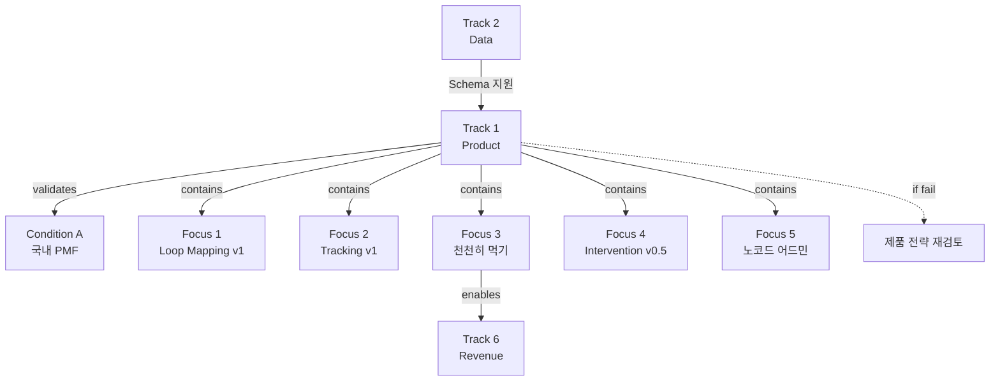

# Track 1: Product (Loop Core OS)

> Track ID: `track:1` | 상태: Active (40%) | 위험도: Medium | **Condition A 달성 Track**

## Track 선언

**"Loop Core OS 제품이 국내 PMF를 달성할 수 있다"**

---

### 제품 타입 선언

| Daily habit app ❌ | Episode(전환점) OS ✅ |
|-------------------|----------------------|
| 매일 쓰게 만들기 | 위험 순간에 기본값 되기 |
| DAU/스트릭 중심 | TTR/Relapse Interval 중심 |
| 습관 형성 | 사건 꺾기 |

> ⚠️ 단, **습관 PMF(타이머 코어)는 Wedge로 보존**한다. OS 확장을 위해 Wedge를 버리지 않는다.
>
> 참고: [[OS_Stickiness]]

---

### 기준 이벤트 정의 (Problem Event / Trigger Event)

```
problem_event := 폭식(자가리포트) OR 통제붕괴(충동≥7 AND problem_behavior 발생)
problem_behavior ∈ {폭식, 과식, 야식, 배달/간식 폭주, 음주, 쇼핑 등 보상행동}
trigger_event := 충동≥7 (자가리포트)
Cohort := problem_event ≥ 1회 + 개입 세션 ≥ 1회 사용자
```

> 모든 Episode OS 지표(TTR, LTO, D+1, TBR, Relapse)는 이 정의를 전제로 한다.

---

## 이 Track의 본질

### ❌ 기능 개발이 아니다
- 기능 많이 만들기 ❌
- 모든 요청 반영하기 ❌
- 완벽한 제품 만들기 ❌

### ✅ PMF 검증
- Loop Mapping이 사용자 문제를 해결하는가?
- 천천히 먹기가 행동 변화를 일으키는가?
- 제품이 안정적으로 작동하는가?

→ **Condition A (국내 PMF) 달성 Track**

---

## 트랙 목적

Product(Loop Core OS) 트랙. Loop Mapping v1, Emotion–Eating–Habit Tracking v1, 천천히 먹기 기능, Loop Intervention v0.5, 노코드 어드민 도입 등 제품·경험 레벨의 핵심 기능을 책임진다.

---

## 12개월 Focus (5가지)

### Focus 1: Loop Mapping v1 완성
**현재**: v0.3
**목표**: v1
**진행률**: 30%

**목표**:
- 사용자가 자신의 Loop 패턴을 시각적으로 확인
- 정서-섭식-습관 연결 고리 표시
- 주간/월간 Loop 트렌드 제공

**v0.3 → v1 차이**:
- 패턴 자동 감지 추가
- 개인화된 인사이트 제공
- 코치 피드백 연동

---

### Focus 2: Episode Logging v1 (사건 기록)
**현재**: 기본 기록
**목표**: Episode Logging v1
**진행률**: 40%

**Episode Logging이란?**
- "매일 기록"이 아니라 **사건(problem_event) 발생 시 기록**
- 트리거 발생 시점, 충동 레벨, 행동(폭식/보상), 개입 실행 여부, 완화 체감

**기록 항목**:
- 정서 상태 (충동 레벨 0~10)
- 섭식 행동 (속도, 포만감)
- 트리거 → 행동 → 결과 체인
- **개입 실행 여부 + 완화까지 시간 (TTR)**

**성공 기준**:
- ❌ 매일 기록률
- ✅ problem_event 발생 시 기록률, TTR 측정 가능 여부

---

### Focus 3: Episode Brake (천천히 먹기 = 에피소드 개입 모듈)
**현재**: 구현됨 (타이머 플로우)
**목표**: Episode Brake로 재포지셔닝
**진행률**: 60%

**Episode Brake란?**
- ❌ 식사 습관 교정
- ✅ 전환점(자동폭주)에서 브레이크 거는 개입 모듈

**3단 구조**:
1. **급정지 (Prevention)**: 타이머 + 포만감 체크 + 심호흡 → 충동 낮춰서 사건 꺾기
2. **재조절 (Regulation)**: 한입 체크 → 자동폭주 끊고 선택권 회복
3. **회복 (Recovery)**: 식후 감정일기 + 식후 루틴 → 2차 폭식/자기비난 차단

**성공 기준**:
- ❌ 매일 실행률, 식사시간 +20%
- ✅ TTR (p50 ≤ 10분, Cohort 기준 4주 내 20% 개선), Relapse Interval 증가

**TTR 결측 처리 규칙**:
> 완화 체크 미응답 30분 이내 => censored as 30min

**Wedge Guardrails** (반드시 보존):
- Meal Session Completion Rate ≥ 70%
- Timer Start Rate ≥ 50% (주 3회+)
- Session Drop-off at First 30s ≤ 20%

**왜 중요한가?**
- Track 6 유료화의 핵심 기능 (보험형 가치)
- **사건을 꺾는** 가장 명확한 개입점

---

### Focus 4: Loop Intervention v0.5
**현재**: v0.2
**목표**: v0.5
**진행률**: 40%

**목표**:
- 패턴 감지 시 적절한 개입 제안
- 코치 추천 연동
- 개입 효과 측정

**v0.2 → v0.5 차이**:
- 자동 개입 트리거 추가
- 개입 타입 다양화 (호흡, 지연, 대체행동)
- 효과 추적 기능

---

### Focus 5: 노코드 어드민 도입
**현재**: 수동 관리
**목표**: Retool 기반 어드민
**진행률**: 20%

**목표**:
- 사용자 관리 대시보드
- 데이터 조회/수정 기능
- 코치 배정 관리
- 콘텐츠 관리

**왜 노코드?**
- 개발 리소스 절약
- 빠른 반복 가능
- 비개발자도 운영 가능

---

## 12개월 목표 (중단 신호, NOT 목표)

### Objective 1: Loop Mapping v1
**현재**: v0.3 (30%)
**임계치**: v1 완성
**중단 신호**: 6개월 시점에 v0.6 미만

**의미**:
- Loop Mapping이 제품의 핵심 가치
- v1 없으면 PMF 달성 불가

**못 달성 시**:
- Condition A 위험
- 제품 전략 재검토

---

### Objective 2: Product 안정성 95%
**현재**: 80% (80%)
**임계치**: 95%
**중단 신호**: 주간 크래시 5건 이상

**의미**:
- 안정성은 PMF의 기본 조건
- 불안정한 제품은 유료화 불가

**못 달성 시**:
- 사용자 이탈 가속
- 코칭 품질 저하

---

### Objective 3: Episode OS KPI

**기준 이벤트**: `problem_event := 폭식(자가리포트) OR 통제붕괴(충동≥7 AND problem_behavior 발생)`

**핵심 지표**:
| 지표 | 정의 | 분모 | 임계치 |
|------|------|------|--------|
| TTR | 개입 시작 → 완화까지 시간 | 개입 시작한 세션 | (절대) p50 ≤ 10분 / (상대) Cohort 기준 4주 내 20% 개선 |
| Relapse Interval | 재발 간격 | problem_event 발생 사용자 | (절대) 주 단위 증가 / (상대) baseline +3일 |
| D+1 Recovery | 다음날 회복 프로토콜 **실행** | problem_event 기록된 사용자 | 60%+ |
| LTO | problem_event 후 첫 **오픈**까지 시간 | problem_event 발생 사용자 | p50 ≤ 24h |
| TBR-24 | trigger_event 발생 후 24h 내 앱 실행률 | trigger_event 감지 사용자 | 40%+ (planned) |

**결측 처리**: TTR 완화 체크 미응답 30분 이내 => censored as 30min

**중단 신호**: 6개월 시점에 D+1 Recovery 40% 미만

---

### Objective 4: Wedge Guardrails (습관 PMF 보존)

| 지표 | 임계치 | 중단 신호 |
|------|--------|-----------|
| Meal Session Completion Rate | ≥ 70% | 50% 미만 3개월 지속 |
| Timer Start Rate | ≥ 50% (주 3회+) | 30% 미만 |
| Avg Meal Duration (10~20분) | ≥ 60% | 40% 미만 |
| Session Drop-off at First 30s | ≤ 20% | 40% 초과 |

> ⚠️ Guardrail이 깨지면 OS 확장도 같이 망한다. Episode OS로 가는 것이 습관 PMF를 버리는 것이 아님.

---

## 2층 구조: Recovery OS → Micro Brake

| 단계 | 설명 | 측정 지표 | 현재 상태 |
|------|------|-----------|-----------|
| Recovery OS | 다음날 복귀 (폭식 후 회복) | D+1 Recovery, LTO | ✅ 이미 작동 |
| Micro Brake | 당일 15~30초 초저마찰 개입 | TBR-24 | 🔜 planned |

**전략**:
1. Recovery OS로 D+1 Recovery 60%+ 달성
2. 이후 Micro Brake로 당일 개입까지 확장

---

## Track 1과 다른 Track의 관계

### ← Track 2 (Data): 의존
**의존 내용**:
- Schema가 제품 데이터 구조 정의
- 패턴 데이터가 Loop Mapping 콘텐츠

**만약 Track 2 실패하면**:
- 제품 데이터 구조 불안정
- Loop Mapping 콘텐츠 부실

---

### → Track 4 (Coaching): 지원
**지원 내용**:
- 코치가 제품 통해 사용자 관리
- 제품 데이터로 코칭 품질 향상

---

### → Track 6 (Revenue): Enable
**Enable 내용**:
- "Episode Brake + Recovery + Insight" = 유료 구독 핵심 (보험형 가치)
- Quick Brake(15~30초) + 회복 시작(첫 1분) = Free
- 제품 안정성 = 유료화 전제조건

---

## 12개월 액션 플랜

### Q1 2026 (1-3월): 기반 구축
**목표**:
- Loop Mapping v0.6
- 천천히 먹기 기본 기능
- 노코드 어드민 알파

**액션**:
1. Loop Mapping 패턴 감지 알고리즘
2. 천천히 먹기 UX 설계 및 구현
3. Retool 어드민 기본 구조

**성공 기준**: Loop Mapping v0.6, 천천히 먹기 베타

---

### Q2 2026 (4-6월): 핵심 기능 완성
**목표**:
- Loop Mapping v0.8
- 천천히 먹기 정식 런칭
- Loop Intervention v0.4

**액션**:
1. Loop Mapping 인사이트 기능
2. 천천히 먹기 최적화
3. 개입 트리거 시스템

**성공 기준**: 천천히 먹기 정식, PMF 신호 확인

---

### Q3-Q4 2026 (7-12월): 안정화 + 확장
**목표**:
- Loop Mapping v1
- Product 안정성 95%
- Loop Intervention v0.5

**액션**:
1. 버그 픽스 및 안정화
2. 성능 최적화
3. 코치 피드백 반영

**성공 기준**: Condition A 달성

---

## 관계도



---

## 참고 문서

### Conditions
- [[Condition_A_국내_PMF]] - Track 1이 달성할 조건

### 다른 Tracks
- [[Track_2_Data]] - 의존 관계 (Schema)
- [[Track_4_Coaching]] - 지원 관계 (제품으로 코칭)
- [[Track_6_Revenue]] - Enable 관계 (천천히 먹기 = 유료화)

---

**최초 작성**: 2024-12-18
**마지막 업데이트**: 2024-12-18 (40% 진행)
**다음 체크**: 2026-01 (Q1 진행 상황)
**책임자**: PM 1 + 개발 1 + 노코드 지원
