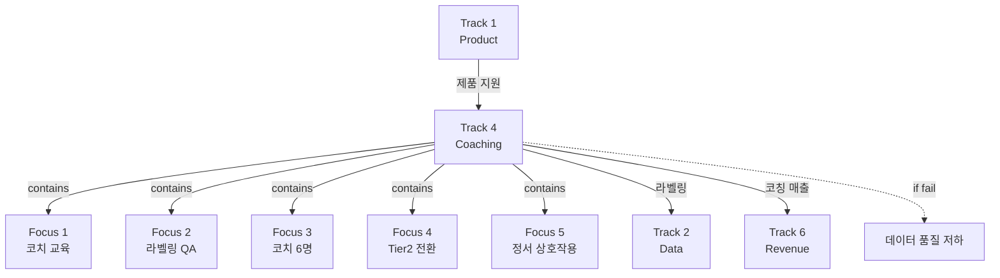

# Track 4: Coaching (Human-in-the-loop Labeling Engine)

> Track ID: `track:4` | 상태: Active (40%) | 위험도: Medium | **라벨링 엔진 Track**

## Track 선언

**"코치가 라벨러 역할로 전환하여 고품질 데이터를 생성할 수 있다"**

---

## 이 Track의 본질

### ❌ 코칭 서비스가 아니다
- 코칭 시간 늘리기 ❌
- 코치 만족도 높이기 ❌
- 코칭 매출만 추구 ❌

### ✅ Human-in-the-loop 라벨링 엔진
- 코치가 데이터 라벨러로서 고품질 데이터 생성하는가?
- 라벨링 품질이 일관적인가?
- 코칭 참여자가 고밀도 데이터 생성자가 되는가?

→ **Track 2 (Data) 지원 + Track 6 (Revenue) 매출 기여**

---

## 트랙 목적

Coaching(Human-in-the-loop Labeling Engine) 트랙. 코치 교육·라벨링·QA, 코치 수 확장, 고밀도 Tier2 이상 전환 등 코칭/라벨링 엔진을 책임진다.

---

## 12개월 Focus (5가지)

### Focus 1: 코치 교육
**현재**: 기본 교육
**목표**: 라벨링 전문 교육 완료
**진행률**: 30%

**교육 내용**:
- **루프 라벨링**: Loop 패턴 식별 및 태깅
- **정서 라벨링**: 감정 상태 코딩
- **섭식 라벨링**: 섭식 행동 분류

**왜 중요한가?**
- 코치 = 고품질 라벨러
- 라벨링 일관성이 패턴 발견의 기초
- AI 학습 데이터의 품질 결정

---

### Focus 2: 라벨링 품질 QA
**현재**: 주 30건
**목표**: 주 150건
**진행률**: 20%

**QA 규칙**:
- 일관성: 동일 케이스에 동일 라벨
- 완전성: 누락 없는 라벨링
- 정확성: 전문가 검증 통과

**목표 지표**:
- 코치간 일관성 70% 이상
- 라벨 완전성 95% 이상
- 주간 QA 리뷰 시스템

---

### Focus 3: 코치 수 확장
**현재**: 3명
**목표**: 6명
**진행률**: 50%

**확장 계획**:
- 2-3명 → 5-8명 (제공 정보 기준)
- 각 코치당 참여자 20-25명
- 총 참여자 150명 커버

**채용 기준**:
- 섭식/정서 관련 경력
- 라벨링 교육 이수
- 데이터 품질 의식

---

### Focus 4: 고밀도 Tier2 이상 전환
**현재**: 부분 전환
**목표**: 코칭 참여자 전원 Tier2 이상
**진행률**: 40%

**Tier2 기준**: 주 3회 이상 기록

**전환 전략**:
- 코칭 세션에서 기록 습관 형성
- 기록 리마인더
- 기록 품질 피드백

**왜 중요한가?**
- 코칭 참여자 = 가장 충성도 높은 사용자
- 이들이 Tier2라면 고밀도 데이터 확보 보장

---

### Focus 5: 정서 기반 상호작용 증가
**현재**: 기본 상호작용
**목표**: 정서 중심 코칭
**진행률**: 30%

**목표**:
- 정서 패턴 중심 대화
- 감정-행동 연결 탐색
- 정서 기반 개입 제안

---

## 12개월 목표 (중단 신호, NOT 목표)

### Objective 1: 코치 6명
**현재**: 3명 (50%)
**임계치**: 6명
**중단 신호**: 6개월 시점에 4명 미만

**의미**:
- 6명이면 참여자 150명 커버
- 고품질 라벨링 생산력 확보

**못 달성 시**:
- 참여자 확장 제한
- 라벨링 병목

---

### Objective 2: 참여자 150명
**현재**: 60명 (40%)
**임계치**: 150명
**중단 신호**: 6개월 시점에 100명 미만

**의미**:
- 150명 = Track 2 고밀도 50명의 소스
- 코칭 매출 기반

**못 달성 시**:
- Track 2 고밀도 확보 실패
- Track 6 매출 목표 미달

---

### Objective 3: 라벨링 주 150건
**현재**: 30건 (20%)
**임계치**: 150건
**중단 신호**: 6개월 시점에 80건 미만

**의미**:
- 150건 = 패턴 발견 속도 유지
- 데이터 품질의 핵심 지표

**못 달성 시**:
- 패턴 발견 지연
- Condition B 위험

---

## Track 4와 다른 Track의 관계

### → Track 2 (Data): 핵심 지원
**지원 내용**:
- 코치 라벨링 = 고품질 데이터
- 코칭 참여자 = 고밀도 사용자

**만약 Track 4 실패하면**:
- Track 2 데이터 품질 저하
- 패턴 발견 불가능

→ **Track 4는 Track 2의 연료**

---

### → Track 6 (Revenue): 매출 기여
**기여 내용**:
- 코칭 월매출 직접 기여
- 500-1,000만 → 1,500만

**코칭 매출 구조**:
- 참여자당 월 10만원 가정
- 150명 × 10만원 = 1,500만원/월

---

### ← Track 1 (Product): 의존
**의존 내용**:
- 제품으로 코칭 세션 관리
- 제품 데이터로 코칭 품질 향상

---

## 12개월 액션 플랜

### Q1 2026 (1-3월): 교육 + 확장
**목표**:
- 코치 4명
- 참여자 100명
- 라벨링 주 80건

**액션**:
1. 코치 1명 채용
2. 라벨링 교육 커리큘럼 완성
3. QA 규칙 정의

**성공 기준**: 코치 4명, 라벨링 품질 기준 확립

---

### Q2 2026 (4-6월): 품질 + 규모
**목표**:
- 코치 5명
- 참여자 120명
- 라벨링 주 120건

**액션**:
1. QA 시스템 운영
2. 코치간 일관성 측정
3. Tier2 전환 캠페인

**성공 기준**: 일관성 60%, Tier2 전환율 70%

---

### Q3-Q4 2026 (7-12월): 안정화
**목표**:
- 코치 6명
- 참여자 150명
- 라벨링 주 150건

**액션**:
1. 코치 팀 안정화
2. 라벨링 자동화 일부 도입
3. 매출 안정화

**성공 기준**: Track 4 목표 달성

---

## 관계도

---

## 참고 문서

### 다른 Tracks
- [[Track_2_Data]] - 지원 관계 (라벨링 데이터)
- [[Track_6_Revenue]] - 매출 기여 (코칭 매출)
- [[Track_1_Product]] - 의존 관계 (제품 지원)

---

**최초 작성**: 2024-12-18
**마지막 업데이트**: 2024-12-18 (40% 진행)
**다음 체크**: 2026-01 (Q1 진행 상황)
**책임자**: 코치 팀 리드
