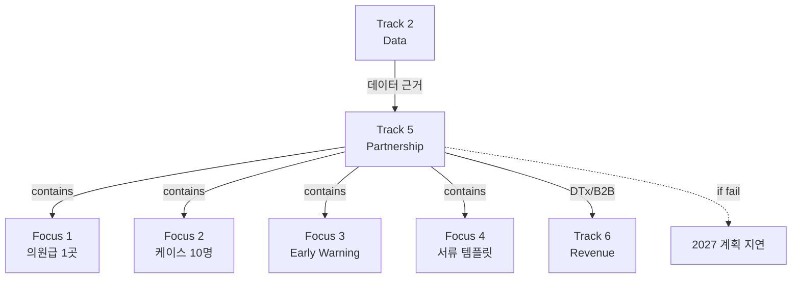

# Track 5: Partnership (국내 의료/클리닉)

> Track ID: `track:5` | 상태: Planning (10%) | 위험도: Medium | **의료 제휴 기반 Track**

## Track 선언

**"국내 의원급 파트너십으로 2027 의료 제휴 기반을 마련할 수 있다"**

---

## 이 Track의 본질

### ❌ IRB/대학병원이 아니다
- 대학병원 제휴 ❌
- IRB 승인 ❌ (2026 목표 아님)
- 본격 임상 ❌

### ✅ 2027 기반 마련
- 의원급(비만·정신건강)에서 파일럿 가능한가?
- 케이스 스터디로 효과 초기 검증 가능한가?
- 의료 서류 템플릿이 준비되는가?

→ **2027 의료 파트너십 본격화를 위한 기반 Track**

---

## 트랙 목적

Partnership(국내 의료/클리닉) 트랙. 의원급 파일럿, 케이스 스터디, 의료 서류 템플릿 등 국내 의료 파트너십 기반을 책임진다.

---

## 12개월 Focus (4가지)

### Focus 1: 의원급 파일럿 1곳
**현재**: 0곳
**목표**: 1곳
**진행률**: 0%

**타겟**:
- 대학병원이 아닌 **의원급**
- 비만 클리닉 또는 정신건강의학과
- 혁신적 시도에 열린 원장

**왜 의원급?**
- 의사결정 빠름
- IRB 없이 시작 가능
- 실제 환자 데이터 확보

**파일럿 내용**:
- Loop 앱 사용
- 데이터 공유 동의
- 월 1회 리뷰 미팅

---

### Focus 2: 케이스 스터디 10명
**현재**: 0명
**목표**: 10명
**진행률**: 0%

**케이스 스터디 설계**:
- 3-6개월 추적
- Loop 데이터 + 의료 데이터 연계
- 행동 변화 측정

**측정 항목**:
- Loop 패턴 변화
- 체중/BMI 변화
- 섭식 행동 변화
- 정서 상태 변화

**성공 기준**:
- 10명 중 7명 이상 긍정적 변화
- 재현 가능한 패턴 2-3개 발견

---

### Focus 3: Early Warning Index 초기 검증
**현재**: 미정의
**목표**: 초기 버전 검증
**진행률**: 0%

**Early Warning Index**:
- 폭식/재발 위험 예측 지표
- Loop 데이터 기반
- 의료진에게 유용한 형태

**검증 목표**:
- 위험 신호 3개 이상 정의
- 케이스 스터디에서 예측 정확도 측정
- 의료진 피드백 수집

---

### Focus 4: 의료 서류 템플릿 정리
**현재**: 미정리
**목표**: 템플릿 완성
**진행률**: 10%

**필요 서류**:
- 환자 동의서 템플릿
- 데이터 공유 계약서
- 파일럿 프로토콜
- 결과 보고서 양식
- (향후) IRB 신청 기초 자료

**왜 중요한가?**
- 2027 본격 제휴 시 재사용
- 법적 리스크 관리
- 전문성 어필

---

## 12개월 목표 (중단 신호, NOT 목표)

### Objective 1: 의원급 1곳 제휴
**현재**: 0곳 (0%)
**임계치**: 1곳
**중단 신호**: 6개월 시점에 LOI 없음

**의미**:
- 1곳이라도 제휴해야 케이스 스터디 가능
- 의료 시장 진입 신호

**못 달성 시**:
- 의료 파트너십 전략 재검토
- 2027 계획 지연

---

### Objective 2: 케이스 스터디 10명
**현재**: 0명 (0%)
**임계치**: 10명
**중단 신호**: 9개월 시점에 5명 미만

**의미**:
- 10명 = 최소 통계적 의미
- 2027 IRB 준비 근거

**못 달성 시**:
- 효과 검증 불가
- 의료 설득 자료 부재

---

## Track 5와 다른 Track의 관계

### ← Track 2 (Data): 의존
**의존 내용**:
- 재현 패턴 10개가 의료 기관 설득 근거
- 스키마 안정성이 데이터 공유 기반
- 데이터 품질이 케이스 스터디 신뢰도

**만약 Track 2 실패하면**:
- Track 5 설득 근거 없음
- 파트너십 확보 어려움

→ **Track 5는 Track 2 성공에 의존**

---

### → Track 6 (Revenue): Enable
**Enable 내용**:
- 의료 제휴 = DTx/B2B 수익 기반
- 케이스 스터디 = 유료화 마케팅 자료
- 의료 채널 = 고객 확보 경로

**장기 매출 영향**:
- B2B 계약 (의원당 월 100-500만원)
- DTx 보험 적용 (2028+)

---

## 12개월 액션 플랜

### Q1 2025 (1-3월): 탐색 + 준비
**목표**:
- 타겟 의원 5곳 리스트
- 서류 템플릿 초안
- 제안서 준비

**액션**:
1. 비만/정신건강 의원 리서치
2. 네트워킹 (학회, 지인)
3. 제안서 작성

**성공 기준**: 타겟 5곳, 제안서 완성

---

### Q2 2025 (4-6월): 제휴 확보
**목표**:
- 의원 1곳 LOI
- 파일럿 프로토콜 확정
- 케이스 스터디 참여자 모집 시작

**액션**:
1. 미팅 및 협상
2. LOI 체결
3. 참여자 모집

**성공 기준**: LOI 체결, 참여자 3명

---

### Q3-Q4 2025 (7-12월): 파일럿 실행
**목표**:
- 케이스 스터디 10명 완료
- Early Warning Index 초기 버전
- 결과 보고서

**액션**:
1. 파일럿 운영
2. 데이터 수집 및 분석
3. 의료진 피드백 수집

**성공 기준**: 케이스 10명, 긍정적 결과 7명+

---

## 관계도

---

## 2027 로드맵 연결

### 2026 Track 5 성공 시
- 2027 대학병원 IRB 신청
- DTx 임상 시작
- B2B 제휴 확대

### 2026 Track 5 실패 시
- 의료 전략 재검토
- 소비자 직접 전략 강화
- 또는 2027까지 파트너십 재시도

---

## 참고 문서

### Conditions
- [[Condition_B_Loop_Dataset]] - Track 5 설득 근거

### 다른 Tracks
- [[Track_2_Data]] - 의존 관계 (데이터 근거)
- [[Track_6_Revenue]] - Enable 관계 (DTx/B2B)

---

**최초 작성**: 2024-12-18
**마지막 업데이트**: 2024-12-18 (10% 진행)
**다음 체크**: 2025-01 (Q1 진행 상황)
**책임자**: Founder + BD 담당
