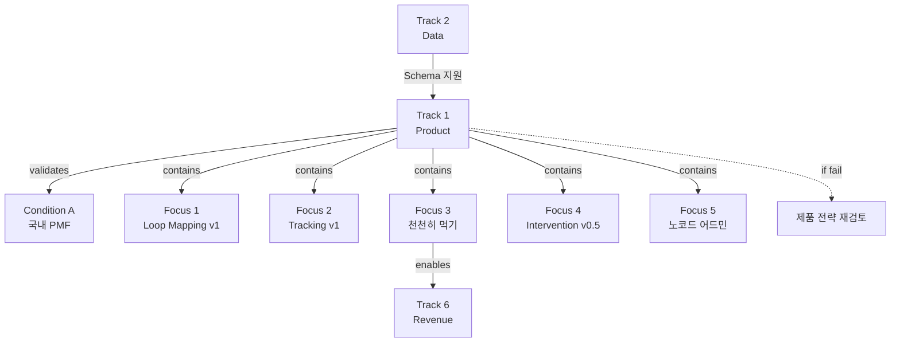

# Track 1: Product (Loop Core OS)

> Track ID: `track:1` | 상태: Active (40%) | 위험도: Medium | **Condition A 달성 Track**

## Track 선언

**"Loop Core OS 제품이 국내 PMF를 달성할 수 있다"**

---

## 이 Track의 본질

### ❌ 기능 개발이 아니다
- 기능 많이 만들기 ❌
- 모든 요청 반영하기 ❌
- 완벽한 제품 만들기 ❌

### ✅ PMF 검증
- Loop Mapping이 사용자 문제를 해결하는가?
- 천천히 먹기가 행동 변화를 일으키는가?
- 제품이 안정적으로 작동하는가?

→ **Condition A (국내 PMF) 달성 Track**

---

## 트랙 목적

Product(Loop Core OS) 트랙. Loop Mapping v1, Emotion–Eating–Habit Tracking v1, 천천히 먹기 기능, Loop Intervention v0.5, 노코드 어드민 도입 등 제품·경험 레벨의 핵심 기능을 책임진다.

---

## 12개월 Focus (5가지)

### Focus 1: Loop Mapping v1 완성
**현재**: v0.3
**목표**: v1
**진행률**: 30%

**목표**:
- 사용자가 자신의 Loop 패턴을 시각적으로 확인
- 정서-섭식-습관 연결 고리 표시
- 주간/월간 Loop 트렌드 제공

**v0.3 → v1 차이**:
- 패턴 자동 감지 추가
- 개인화된 인사이트 제공
- 코치 피드백 연동

---

### Focus 2: Emotion–Eating–Habit Tracking v1
**현재**: 기본 기록
**목표**: 통합 트래킹 v1
**진행률**: 40%

**목표**:
- 정서 기록 (감정 상태, 충동 레벨)
- 섭식 기록 (식사 속도, 포만감)
- 습관 기록 (트리거, 행동, 결과)
- 세 영역의 상관관계 분석

---

### Focus 3: "천천히 먹기" 기능
**현재**: 미구현
**목표**: 핵심 기능으로 탑재
**진행률**: 0%

**세부 기능**:
- **씹는 속도**: 식사 페이스 가이드
- **포만감 타이머**: 20분 식사 유도
- **식사 페이스 가이드**: 실시간 피드백

**왜 중요한가?**
- Track 6 유료화의 핵심 기능
- 행동 개입의 가장 명확한 시작점
- 측정 가능한 결과 (식사 시간, 포만감 점수)

---

### Focus 4: Loop Intervention v0.5
**현재**: v0.2
**목표**: v0.5
**진행률**: 40%

**목표**:
- 패턴 감지 시 적절한 개입 제안
- 코치 추천 연동
- 개입 효과 측정

**v0.2 → v0.5 차이**:
- 자동 개입 트리거 추가
- 개입 타입 다양화 (호흡, 지연, 대체행동)
- 효과 추적 기능

---

### Focus 5: 노코드 어드민 도입
**현재**: 수동 관리
**목표**: Retool 기반 어드민
**진행률**: 20%

**목표**:
- 사용자 관리 대시보드
- 데이터 조회/수정 기능
- 코치 배정 관리
- 콘텐츠 관리

**왜 노코드?**
- 개발 리소스 절약
- 빠른 반복 가능
- 비개발자도 운영 가능

---

## 12개월 목표 (중단 신호, NOT 목표)

### Objective 1: Loop Mapping v1
**현재**: v0.3 (30%)
**임계치**: v1 완성
**중단 신호**: 6개월 시점에 v0.6 미만

**의미**:
- Loop Mapping이 제품의 핵심 가치
- v1 없으면 PMF 달성 불가

**못 달성 시**:
- Condition A 위험
- 제품 전략 재검토

---

### Objective 2: Product 안정성 95%
**현재**: 80% (80%)
**임계치**: 95%
**중단 신호**: 주간 크래시 5건 이상

**의미**:
- 안정성은 PMF의 기본 조건
- 불안정한 제품은 유료화 불가

**못 달성 시**:
- 사용자 이탈 가속
- 코칭 품질 저하

---

## Track 1과 다른 Track의 관계

### ← Track 2 (Data): 의존
**의존 내용**:
- Schema가 제품 데이터 구조 정의
- 패턴 데이터가 Loop Mapping 콘텐츠

**만약 Track 2 실패하면**:
- 제품 데이터 구조 불안정
- Loop Mapping 콘텐츠 부실

---

### → Track 4 (Coaching): 지원
**지원 내용**:
- 코치가 제품 통해 사용자 관리
- 제품 데이터로 코칭 품질 향상

---

### → Track 6 (Revenue): Enable
**Enable 내용**:
- "천천히 먹기 + Loop Tracker" = 유료 구독 핵심
- 제품 안정성 = 유료화 전제조건

---

## 12개월 액션 플랜

### Q1 2025 (1-3월): 기반 구축
**목표**:
- Loop Mapping v0.6
- 천천히 먹기 기본 기능
- 노코드 어드민 알파

**액션**:
1. Loop Mapping 패턴 감지 알고리즘
2. 천천히 먹기 UX 설계 및 구현
3. Retool 어드민 기본 구조

**성공 기준**: Loop Mapping v0.6, 천천히 먹기 베타

---

### Q2 2025 (4-6월): 핵심 기능 완성
**목표**:
- Loop Mapping v0.8
- 천천히 먹기 정식 런칭
- Loop Intervention v0.4

**액션**:
1. Loop Mapping 인사이트 기능
2. 천천히 먹기 최적화
3. 개입 트리거 시스템

**성공 기준**: 천천히 먹기 정식, PMF 신호 확인

---

### Q3-Q4 2025 (7-12월): 안정화 + 확장
**목표**:
- Loop Mapping v1
- Product 안정성 95%
- Loop Intervention v0.5

**액션**:
1. 버그 픽스 및 안정화
2. 성능 최적화
3. 코치 피드백 반영

**성공 기준**: Condition A 달성

---

## 관계도

---

## 참고 문서

### Conditions
- [[Condition_A_국내_PMF]] - Track 1이 달성할 조건

### 다른 Tracks
- [[Track_2_Data]] - 의존 관계 (Schema)
- [[Track_4_Coaching]] - 지원 관계 (제품으로 코칭)
- [[Track_6_Revenue]] - Enable 관계 (천천히 먹기 = 유료화)

---

**최초 작성**: 2024-12-18
**마지막 업데이트**: 2024-12-18 (40% 진행)
**다음 체크**: 2025-01 (Q1 진행 상황)
**책임자**: PM 1 + 개발 1 + 노코드 지원
