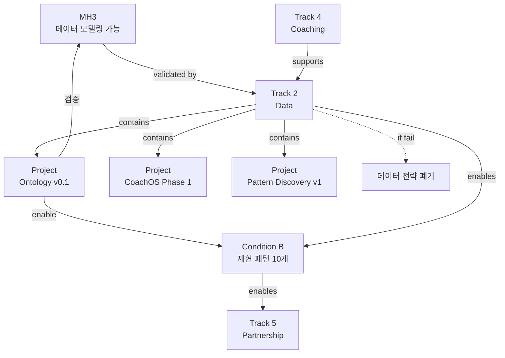

# Track 2: Data

> Track ID: `track:2` | 상태: Active (60%) | 위험도: Medium | **온톨로지 소속**

## Track 선언

**"코치+기록 기반 데이터는 패턴화 가능하다"**

---

## 이 Track의 본질

### ❌ 데이터 수집이 아니다
- 사용자 많이 모으기 ❌
- 일기 많이 쌓기 ❌
- 고밀도 데이터 양 늘리기 ❌

### ✅ 패턴화 가능성 검증
- 데이터에서 재현 가능한 Loop 패턴을 찾을 수 있는가?
- 패턴을 안정적인 스키마로 저장할 수 있는가?
- 코치 + 기록 조합이 패턴 품질을 높이는가?

→ **MH3 (데이터 모델링 가능) 검증 Track**

---

## 12개월 Focus (3가지)

### Focus 1: 고밀도 Tier1/Tier2 확장
**현재**: 32명
**목표**: 50명
**진행률**: 64%

**Tier1 (초고밀도)**:
- 정의: 주 4회 이상 기록 + 코치 세션 주 1회
- 목표: 20명
- 현재: 12명

**Tier2 (고밀도)**:
- 정의: 주 2-3회 기록 + 코치 세션 격주 1회
- 목표: 30명
- 현재: 20명

**왜 50명인가?**
- 재현 패턴 10개 발견하려면 최소 50명 필요
- 통계적 유의성 (패턴당 최소 5명)
- 코치 8명이 관리 가능한 최대 인원

---

### Focus 2: Loop Pattern v1
**현재**: 3개 패턴 발견
**목표**: 10개 패턴 + 재현율 70%
**진행률**: 30%

**목표**:
- 재현 가능한 Loop 패턴 10개 확립
- 각 패턴의 재현율 70% 이상
- 패턴 발견 속도 월 1개 유지

**현재 패턴** (3개):
1. Anxiety-Emptiness-Binge
2. Commute-Habit-Snack
3. GLP-1 Rebound

**패턴 후보** (검증 중):
4. PMS-Emotional-Binge
5. Sleep Debt-Impulse Control
6. Social Pressure-Override
7. Stress-Screen-Snack

→ **Condition B 직접 충족**

---

### Focus 3: Schema 안정화 ⭐ **온톨로지**
**현재**: v0.1 (2개월 안정)
**목표**: 3개월 변경 없음
**진행률**: 67%

**목표**:
- Ontology-lite v0.1 확정
- 5개 코어 엔티티로 모든 Loop 데이터 표현 가능
- SoSi/KkokKkokFit 실제 구현 안정화
- 코치 라벨링 일관성 70% 이상

**5개 코어 엔티티**:
- Event (사실)
- Episode (컨테이너)
- LoopStateWindow (상태 벡터)
- ActionExecution (개입)
- OutcomeMeasurement (결과)

→ **MH3 검증 + Condition B Enable**

---

## Track 2 = 3개 Project

### Project 1: Ontology v0.1 ⭐ **핵심**
**가설**: "Loop는 5개 코어 엔티티로 모델링 가능하다"

**목표**:
- Schema 안정화 (3개월 변경 없음)
- 5개 엔티티로 표현 불가능한 중요 데이터 0건
- 코치 라벨링 일관성 70%

**현재 상태**: 80% 완료
- ✅ v0.1 스키마 확정
- ✅ 4조건 규칙 확정
- 🟡 실제 구현 검증 중 (SoSi/KkokKkokFit)
- 🟡 3개월 안정성 테스트 중

**책임자**: Founder + 온톨로지 팀

**문서**: [[50_Projects/P3_Ontology_v0.1/Project_정의]]

---

### Project 2: CoachOS Phase 1
**가설**: "라벨링 어드민은 패턴 품질을 높인다"

**목표**:
- 코치 라벨링 어드민 구축
- QA 규칙 정의 (일관성 70%)
- 고품질 데이터 보장

**현재 상태**: 60% 완료
- ✅ 라벨 구조 설계
- 🟡 어드민 개발 중
- ❌ QA 규칙 미완

**책임자**: CTO + Data Team

**문서**: [[50_Projects/P2_CoachOS_Phase1/Project_정의]]

---

### Project 3: Pattern Discovery v1
**가설**: "코치 인터뷰 + AI 분석으로 패턴 발견 가능"

**목표**:
- 재현 패턴 10개 발견
- 패턴 발견 속도 월 1개
- 재현율 70% 달성

**현재 상태**: 30% 완료
- ✅ 패턴 3개 발견
- 🟡 패턴 후보 4개 검증 중
- ❌ 재현율 미측정

**책임자**: Founder + 코치 팀

**문서**: [[50_Projects/P4_Pattern_Discovery_v1/Project_정의]]

---

## 온톨로지의 위치 (Track 2 핵심)

### 온톨로지 = Track 2의 기반 인프라

```
Track 2: Data
   ↓
Focus 3: Schema 안정화
   ↓
Project: Ontology v0.1
   ↓
5개 코어 엔티티
   ↓
패턴 저장 & 재현 테스트
   ↓
Condition B 충족
```

### 온톨로지 없으면?
- ❌ 패턴을 데이터로 저장 못 함
- ❌ 재현 테스트 불가능
- ❌ 코치 라벨링 일관성 확보 불가
- ❌ SoSi/KkokKkokFit 구현 불가

→ **온톨로지 = Track 2의 필수 조건**

### 온톨로지 성공 = Track 2 성공
- ✅ 스키마 안정 → 패턴 저장 가능
- ✅ 패턴 10개 → Condition B 충족
- ✅ Condition B → 3년 전략 진입

---

## 12개월 목표 (중단 신호, NOT 목표)

### Objective 1: 고밀도 사용자 50명
**현재**: 32명 (64%)
**임계치**: 50명 이상
**중단 신호**: 6개월 시점에 40명 미만

**의미**:
- 패턴 10개 발견하려면 50명 필요
- 이것은 목표가 아니라 **최소 조건**

**못 달성 시**:
- 패턴 발견 불가능
- Condition B 달성 불가능
- Track 2 실패

---

### Objective 2: 재현 패턴 10개
**현재**: 3개 (30%)
**임계치**: 10개 이상
**중단 신호**: 6개월 시점에 5개 미만

**의미**:
- 이것이 Condition B 핵심
- 10개는 의료/글로벌 진입 최소 근거

**못 달성 시**:
- Condition B 미달
- 3년 전략 진입 불가
- 데이터 전략 폐기

---

### Objective 3: 스키마 안정성 3개월
**현재**: 2개월 (67%)
**임계치**: 3개월 변경 없음
**중단 신호**: 매주 스키마 변경 필요

**의미**:
- 스키마가 안정적이어야 패턴 저장 가능
- 3개월은 최소 검증 기간

**못 달성 시**:
- 온톨로지 v0.1 실패
- MH3 위험
- Track 2 재설계 필요

---

## Track 2 실패 시나리오

### 시나리오 1: 패턴 정체
**증상**:
- 6개월 시점에 패턴 3개 그대로
- 사용자 50명 확보했음에도 정체
- 데이터는 쌓이는데 패턴은 안 늘어남

**원인**:
- 패턴 발견 방법론 틀림
- 또는 루프는 정말 패턴화 불가능 (MH3 거짓)

**대응**:
- **Hard Trigger**: Condition B 깨짐
- 데이터 전략 폐기
- MH3 재검토 → 회사 존재 이유 재검토

---

### 시나리오 2: 스키마 붕괴
**증상**:
- SoSi/KkokKkokFit에서 매주 스키마 변경
- 5개 엔티티로 표현 불가능한 데이터 발견
- 코치 라벨링 일관성 50% 미만

**원인**:
- 온톨로지 설계 틀림
- 5개 엔티티가 부족
- Loop가 너무 복잡

**대응**:
- 온톨로지 v0.2로 재설계
- 엔티티 추가 (Rule A 위반 아님)
- Track 2 지연 (3개월)

→ **MH3는 여전히 유효** (모델링은 가능, 스키마만 틀림)

---

### 시나리오 3: 코치 의존도 폭발
**증상**:
- 코치 없이는 패턴 발견 불가능
- 코치 시간 부족으로 병목
- 자동화 불가능

**원인**:
- "코치 + 기록" 조합 가설 부분 거짓
- AI 자동 패턴 탐지 실패

**대응**:
- Track 4 (Coaching) 확장 (코치 8명 → 12명)
- 또는 AI 패턴 탐지 알고리즘 강화
- 또는 코치 의존도 수용 (스케일 포기)

---

## Track 2와 다른 Track의 관계

### ← Track 4 (Coaching): 의존
**의존 내용**:
- 코치가 고밀도 사용자 관리
- 코치가 패턴 발견 인터뷰
- 코치가 데이터 라벨링

**만약 Track 4 실패하면**:
- Track 2도 실패
- 고밀도 데이터 확보 불가
- 패턴 발견 불가

→ **Track 2는 Track 4에 의존적**

---

### → Track 5 (Partnership): 지원
**지원 내용**:
- 재현 패턴 10개는 의료 기관 설득 근거
- 스키마 안정성은 IRB 승인 근거
- 데이터 품질은 임상 프로토콜 근거

**Track 2 성공 시**:
- Track 5 본격 시작 가능
- 의료 파트너십 확보

**Track 2 실패 시**:
- Track 5 불가능
- 의료 진입 포기

---

## 온톨로지-전략 연결 (핵심)

### 온톨로지가 검증하는 것
**MH3**: "루프는 데이터 모델링 가능하다"

**검증 방법**:
1. 5개 엔티티로 Loop 데이터 표현 가능한지
2. 스키마가 3개월간 안정적인지
3. 재현 패턴을 데이터로 저장 가능한지

**현재 상태**: 70% 검증 (긍정적)

---

### 온톨로지가 Enable하는 것
**Condition B**: "재현 패턴 10개"

**Enable 방법**:
- 패턴을 Event-Episode-Action-Outcome으로 데이터화
- 패턴 재현 테스트 가능
- 패턴 수 카운트 가능

**만약 온톨로지 없으면**:
- Condition B 측정 불가능
- 3년 전략 진입 불가

---

### 온톨로지 실패 = Track 2 실패?
**No!**

**시나리오 1**: 스키마 재설계
- 온톨로지 v0.1 실패
- v0.2로 재설계
- Track 2 지연 (실패 아님)

**시나리오 2**: 패턴 정체
- 온톨로지는 안정
- 하지만 패턴이 안 늘어남
- Track 2 실패 (온톨로지 탓 아님)

→ **온톨로지는 Track 2의 일부, 전부 아님**

---

## 12개월 액션 플랜

### Q1 2025 (1-3월): 패턴 5개
**목표**:
- 고밀도 40명
- 패턴 3개 → 5개
- 스키마 3개월 안정

**액션**:
1. Ontology v0.1 확정 완료
2. SoSi 실제 구현 안정화
3. CoachOS Phase 1 알파 버전
4. 패턴 후보 4개 중 2개 검증

**성공 기준**: 패턴 5개, 스키마 안정

**실패 신호**: 패턴 3개 정체, 스키마 매주 변경

---

### Q2 2025 (4-6월): 패턴 10개 + Condition B
**목표**:
- 고밀도 50명
- 패턴 5개 → 10개
- Condition B 충족

**액션**:
1. 패턴 발견 속도 월 1개 유지
2. 재현율 측정 시작
3. CoachOS Phase 1 완료
4. Condition B 최종 검증

**성공 기준**: Condition B 충족

**실패 신호**: 패턴 5개 정체, 재현율 50% 미만

---

### Q3-Q4 2025 (7-12월): 안정화 + Track 5 준비
**목표**:
- 패턴 품질 향상
- 의료 파트너십 근거 준비
- 글로벌 데이터 수집 설계

**액션**:
1. 패턴 10개 품질 검증
2. IRB 서류 준비
3. 의료 기관 설득 자료
4. Condition C 준비

---

## 관계도



---

## 참고 문서

### Meta Hypothesis
- [[MH3_데이터_모델링_가능]] - Track 2가 검증할 가설

### Conditions
- [[Condition_B_Loop_Dataset]] - Track 2가 enable할 조건

### Projects (Track 2 하위)
- [[50_Projects/P3_Ontology_v0.1/Project_정의]] ⭐ 핵심
- [[50_Projects/P2_CoachOS_Phase1/Project_정의]]
- [[50_Projects/P4_Pattern_Discovery_v1/Project_정의]]

### 온톨로지
- [[30_Ontology/Schema/v0.1/Ontology-lite v0.1]]
- [[30_Ontology/_Strategy_Link]]
- [[Event (GraphRAG 최적화 예시)]]

### 다른 Tracks
- [[Track_4_Coaching]] - 의존 관계
- [[Track_5_Partnership]] - 지원 관계

---

**최초 작성**: 2024-12-18
**마지막 업데이트**: 2024-12-18 (60% 진행)
**다음 체크**: 2025-01 (Q1 진행 상황)
**책임자**: Founder + Data Team + 온톨로지 팀
