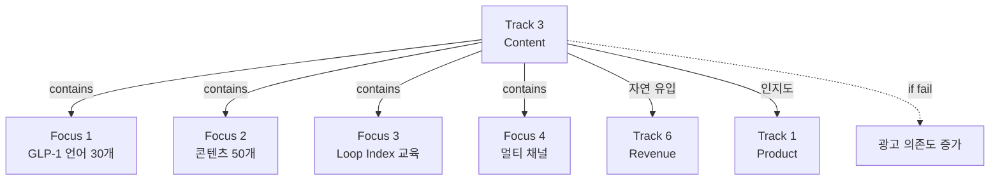

# Track 3: Content (GLP-1 & Loop Narrative)

> Track ID: `track:3` | 상태: Active (20%) | 위험도: Low | **자연 유입 Track**

## Track 선언

**"GLP-1 언어 선점과 Loop Narrative로 자연 유입 기반을 확보할 수 있다"**

---

## 이 Track의 본질

### ❌ 콘텐츠 양이 아니다
- 콘텐츠 많이 만들기 ❌
- 조회수 높이기 ❌
- 바이럴 만들기 ❌

### ✅ 언어 선점 + 자연 유입
- GLP-1 Off-phase 언어를 정의하고 선점하는가?
- Loop 개념이 타겟 오디언스에게 전달되는가?
- 광고 없이 자연 유입이 발생하는가?

→ **Track 6 (Revenue) 자연 유입 기반 구축**

---

## 트랙 목적

Content(GLP-1 & Loop Narrative) 트랙. GLP-1 Off-phase 언어 정의, Loop Index 교육 콘텐츠, 유튜브/블로그/TikTok 분산 배포 등 내러티브와 콘텐츠 파이프라인을 책임진다.

---

## 12개월 Focus (4가지)

### Focus 1: GLP-1 Off-phase 언어 정의
**현재**: 0개 정의
**목표**: 30개 키워드 선점
**진행률**: 0%

**정의할 언어**:
- **Crash**: GLP-1 중단 후 반동
- **Empty Loop**: 빈 포만감 사이클
- **Substitution**: 대체행동 실패
- **Rebound Eating**: 반동 섭식
- **Loop Collapse**: 루프 붕괴

**왜 중요한가?**
- GLP-1 시장 급성장 (2025 글로벌 $50B+)
- Off-phase 케어 언어는 아직 정의 안 됨
- 언어를 정의하는 자가 시장을 지배

---

### Focus 2: 콘텐츠 50개 배포
**현재**: 10개
**목표**: 50개
**진행률**: 20%

**콘텐츠 카테고리**:
1. **교육** (20개): Loop 개념, 정서-섭식 연결
2. **케이스** (15개): 실제 사례, 패턴 스토리
3. **GLP-1** (10개): Off-phase 케어, Rebound 방지
4. **제품** (5개): 기능 소개, 튜토리얼

**배포 주기**: 주 1-2개

---

### Focus 3: Loop Index 교육 콘텐츠
**현재**: 미구현
**목표**: 교육 시리즈 완성
**진행률**: 0%

**목표**:
- Loop Index 개념 설명
- 자가 진단 가이드
- 코치 활용 가이드
- 패턴 인식 교육

**형식**:
- 유튜브 시리즈 (5-10분)
- 블로그 아티클
- 인포그래픽

---

### Focus 4: 유튜브/블로그/TikTok 분산 배포
**현재**: 단일 채널
**목표**: 멀티 채널
**진행률**: 20%

**채널별 전략**:
- **유튜브**: 교육 콘텐츠, 긴 형식
- **블로그**: SEO 최적화, 키워드 선점
- **TikTok**: 숏폼, 빠른 인사이트

**왜 분산?**
- 채널별 오디언스 다름
- 리스크 분산
- SEO 시너지

---

## 12개월 목표 (중단 신호, NOT 목표)

### Objective 1: GLP-1 키워드 30개
**현재**: 0개 (0%)
**임계치**: 30개 선점
**중단 신호**: 6개월 시점에 10개 미만

**의미**:
- 키워드 선점 = 검색 유입 기반
- 30개는 최소 SEO 포트폴리오

**못 달성 시**:
- 검색 유입 없음
- Track 6 자연 유입 기반 취약

---

### Objective 2: 콘텐츠 50개
**현재**: 10개 (20%)
**임계치**: 50개 배포
**중단 신호**: 6개월 시점에 25개 미만

**의미**:
- 50개는 콘텐츠 자산의 최소 규모
- 지속적인 유입 트래픽 확보

**못 달성 시**:
- 콘텐츠 마케팅 실패
- 유료 광고 의존도 증가

---

## Track 3과 다른 Track의 관계

### → Track 6 (Revenue): Enable
**Enable 내용**:
- 콘텐츠가 자연 유입 견인
- 유입 → 전환 → 매출

**만약 Track 3 실패하면**:
- 광고 비용 증가
- 런웨이 압박

---

### → Track 1 (Product): 지원
**지원 내용**:
- 콘텐츠로 제품 인지도 확보
- 교육 콘텐츠로 사용자 온보딩 지원

---

## 12개월 액션 플랜

### Q1 2025 (1-3월): 언어 정의 + 기반
**목표**:
- GLP-1 언어 10개 정의
- 콘텐츠 20개
- 채널 구조 확립

**액션**:
1. GLP-1 Off-phase 언어 리서치
2. 블로그 SEO 최적화
3. 유튜브 채널 정비

**성공 기준**: 키워드 10개, 콘텐츠 20개

---

### Q2 2025 (4-6월): 확산
**목표**:
- GLP-1 키워드 20개
- 콘텐츠 35개
- Loop Index 교육 시리즈

**액션**:
1. TikTok 숏폼 실험
2. Loop Index 교육 콘텐츠 제작
3. 키워드 성과 분석

**성공 기준**: 자연 유입 증가 신호

---

### Q3-Q4 2025 (7-12월): 성숙
**목표**:
- GLP-1 키워드 30개
- 콘텐츠 50개
- 채널별 성과 최적화

**액션**:
1. 고성과 콘텐츠 식별
2. 유입-전환 파이프라인 분석
3. 콘텐츠 리사이클링

**성공 기준**: 자연 유입 기반 확보

---

## 관계도

---

## 참고 문서

### 다른 Tracks
- [[Track_6_Revenue]] - Enable 관계 (자연 유입)
- [[Track_1_Product]] - 지원 관계 (인지도)

---

**최초 작성**: 2024-12-18
**마지막 업데이트**: 2024-12-18 (20% 진행)
**다음 체크**: 2025-01 (Q1 진행 상황)
**책임자**: 콘텐츠 담당
