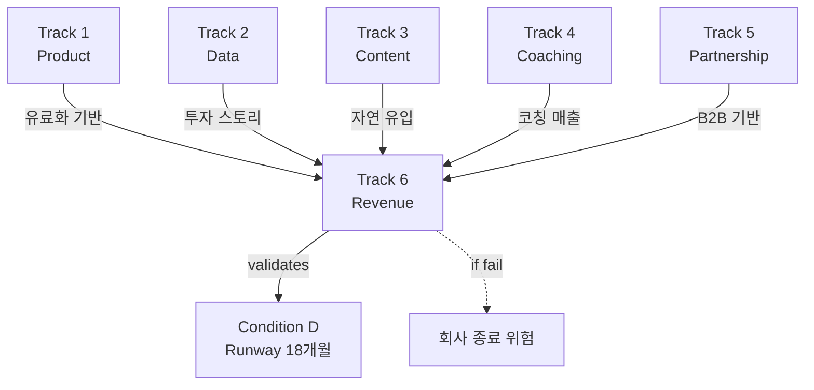

# Track 6: Revenue & Runway

> Track ID: `track:6` | 상태: Active (35%) | 위험도: **High** | **생존 Track**

## Track 선언

**"전면 유료화와 투자 확보로 18개월 런웨이를 확보할 수 있다"**

---

## 이 Track의 본질

### ❌ 성장이 아니다
- 매출 극대화 ❌
- 빠른 확장 ❌
- 시장 점유율 ❌

### ✅ 생존 = 런웨이 확보
- 18개월 런웨이를 확보할 수 있는가?
- 현금 흐름이 지속 가능한가?
- 회사가 살아남을 수 있는가?

→ **모든 Track의 최종 수렴점**

---

## 트랙 목적

Revenue & Runway 트랙. 전면 유료화, 코칭 매출 확대, Loop Pro Lite, Seed/Bridge 투자 등 매출과 런웨이 확보를 책임진다.

---

## 12개월 Focus (4가지)

### Focus 1: 유료 구독
**현재**: 부분 유료
**목표**: 전면 유료화
**진행률**: 30%

**유료 구독 구조**:
- **천천히 먹기 + Loop Tracker** 패키지
- 월 9,900원 ~ 19,900원
- 연간 구독 할인

**왜 천천히 먹기?**
- 명확한 기능 가치
- 측정 가능한 결과
- Track 1의 핵심 기능

**목표**:
- 유료 전환율 5%
- 구독자 500명 → 월 500-1,000만원

---

### Focus 2: 코칭 월매출 확대
**현재**: 500-1,000만원
**목표**: 1,500만원
**진행률**: 50%

**코칭 매출 구조**:
- 참여자 150명 (Track 4 목표)
- 참여자당 월 10만원
- 150 × 10만원 = 1,500만원

**확대 전략**:
- Track 4 참여자 확대
- 코칭 패키지 다양화
- 리텐션 향상

---

### Focus 3: Loop Pro Lite 판매 구조
**현재**: 미설계
**목표**: 판매 구조 완성
**진행률**: 10%

**Loop Pro Lite**:
- B2B 라이트 버전
- 의원/클리닉용
- 월 50-100만원/의원

**2026 목표**:
- 판매 구조 설계 완료
- 가격 체계 확정
- 2027 본격 판매 준비

---

### Focus 4: Seed/Bridge 투자
**현재**: 탐색 중
**목표**: Q2-Q4 클로징
**진행률**: 20%

**투자 목표**:
- Seed/Bridge 5-10억
- Q2-Q4 2025 클로징
- 런웨이 18개월+ 확보

**투자 스토리**:
- Loop OS 국내 PMF (Condition A)
- 재현 패턴 데이터 (Condition B)
- 의료 파트너십 기반 (Track 5)
- GLP-1 Off-phase 시장 기회

---

## 12개월 목표 (중단 신호, NOT 목표)

### Objective 1: 월매출 2,000만원
**현재**: 500-1,000만원 (35%)
**임계치**: 2,000만원
**중단 신호**: 6개월 시점에 1,200만원 미만

**매출 구성**:
- 구독: 500-1,000만원
- 코칭: 1,000-1,500만원
- 합계: 1,500-2,500만원

**의미**:
- 2,000만원 = 최소 운영 비용 커버
- 투자 없이 6개월+ 생존 가능

**못 달성 시**:
- 투자 의존도 증가
- 런웨이 압박

---

### Objective 2: 런웨이 18개월
**현재**: 6-9개월 (40%)
**임계치**: 18개월
**중단 신호**: 6개월 시점에 12개월 미만

**런웨이 확보 방법**:
1. 매출 증가 (월 2,000만원+)
2. 투자 유치 (5-10억)
3. 비용 절감 (필요시)

**의미**:
- 18개월 = 다음 마일스톤까지 생존
- Condition A, B 검증 시간 확보

**못 달성 시**:
- **회사 생존 위협**
- 긴급 피봇 또는 폐업 고려

---

## Track 6과 다른 Track의 관계

### ← Track 1-5 전체: 수렴
**모든 Track이 Track 6에 기여**:

| Track | 기여 내용 |
|-------|----------|
| Track 1 (Product) | 천천히 먹기 = 유료화 핵심 |
| Track 2 (Data) | 패턴 데이터 = 투자 스토리 |
| Track 3 (Content) | 자연 유입 = CAC 절감 |
| Track 4 (Coaching) | 코칭 매출 = 직접 기여 |
| Track 5 (Partnership) | 의료 제휴 = B2B 기반 |

→ **Track 6은 모든 Track의 최종 output**

---

### Track 6 실패 = 회사 종료
**Hard Trigger**:
- 런웨이 6개월 미만 진입
- 월매출 1,000만원 미만 지속 (3개월)
- 투자 유치 실패 (Q4까지)

**대응**:
- 긴급 비용 절감
- 피봇 검토
- 최악의 경우 정리

---

## 12개월 액션 플랜

### Q1 2025 (1-3월): 유료화 + 매출 기반
**목표**:
- 월매출 1,200만원
- 유료 구독 런칭
- 투자 IR 준비

**액션**:
1. 천천히 먹기 유료화
2. 코칭 참여자 확대 (100명)
3. IR 덱 작성

**성공 기준**: 월매출 1,200만원, IR 덱 완성

---

### Q2 2025 (4-6월): 투자 클로징 시작
**목표**:
- 월매출 1,500만원
- Seed 투자 협상
- 런웨이 12개월

**액션**:
1. 투자자 미팅
2. 유료 전환율 최적화
3. 코칭 매출 확대

**성공 기준**: 투자 LOI, 월매출 1,500만원

---

### Q3-Q4 2025 (7-12월): 안정화
**목표**:
- 월매출 2,000만원
- 투자 클로징
- 런웨이 18개월

**액션**:
1. 투자 클로징
2. 매출 안정화
3. Loop Pro Lite 설계

**성공 기준**: 런웨이 18개월, Condition D 충족

---

## 관계도

---

## 월별 매출 목표 (가이드)

| 월 | 구독 | 코칭 | 합계 | 런웨이 |
|----|------|------|------|--------|
| 1월 | 400만 | 700만 | 1,100만 | 8개월 |
| 2월 | 500만 | 750만 | 1,250만 | 9개월 |
| 3월 | 550만 | 800만 | 1,350만 | 10개월 |
| 4월 | 600만 | 900만 | 1,500만 | 11개월 |
| 5월 | 650만 | 950만 | 1,600만 | 12개월 |
| 6월 | 700만 | 1,000만 | 1,700만 | 13개월 |
| 7-12월 | ... | ... | 2,000만+ | 18개월 |

*투자 클로징 시 런웨이 급증*

---

## 참고 문서

### Conditions
- [[Condition_D_Runway]] - Track 6이 충족할 조건

### 다른 Tracks
- [[Track_1_Product]] - 유료화 기반
- [[Track_2_Data]] - 투자 스토리
- [[Track_3_Content]] - 자연 유입
- [[Track_4_Coaching]] - 코칭 매출
- [[Track_5_Partnership]] - B2B 기반

---

**최초 작성**: 2024-12-18
**마지막 업데이트**: 2024-12-18 (35% 진행)
**다음 체크**: 2025-01 (월간 리뷰)
**책임자**: Founder + 전 팀
