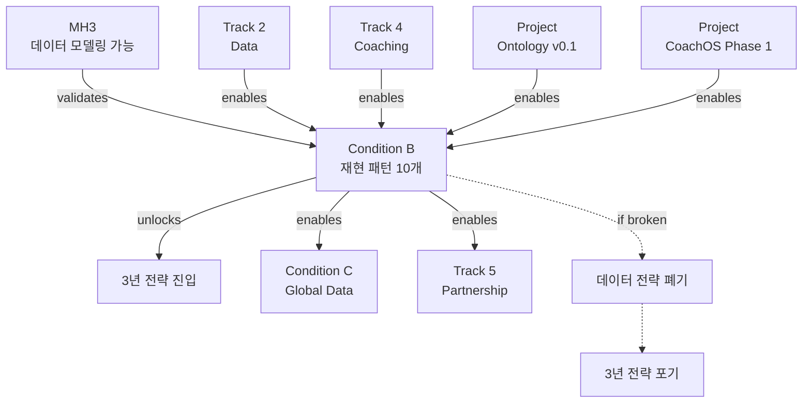

# Condition B: Loop Dataset

> 조건 ID: `cond-b` | 상태: In Progress (60%) | 위험도: Medium

## 조건 선언

**"데이터 수가 아니라 재현 가능한 패턴이 늘어나는가?"**

---

## 이 조건의 의미

### ❌ 데이터 수가 아니다
- 사용자 1만명 확보 ≠ 성공
- 일기 10만개 수집 ≠ 성공
- 고밀도 데이터 100명 ≠ 성공

→ **양(quantity)은 중단 신호가 아님**

### ✅ 재현 패턴이 늘어나는가
- **패턴**: 여러 사용자에게서 반복되는 Loop 시퀀스
- **재현 가능**: 사용자 A에서 발견된 패턴이 사용자 B, C에서도 나타남
- **늘어남**: 시간이 지날수록 새로운 패턴 발견

→ **질(quality) = 패턴화 가능성**

---

## 조건 충족 기준 (중단 신호, NOT 목표)

### ⚠️ 중요: 이것은 목표가 아니다
- 숫자는 "이 정도면 3년 전략 갈 만하다"는 **최소 임계치**
- 달성했다고 축하하는 것이 아니라
- **못 달성하면 3년 전략 포기**하는 중단 신호

---

### Metric 1: 재현 패턴 수
**임계치**: 10개 이상
**현재**: 3개
**진행률**: 30%

**의미**:
- 최소 10개의 distinct한 Loop 패턴 발견
- 각 패턴은 최소 3명 이상의 사용자에게서 재현

**현재 발견된 패턴 (3개)**:
1. **Anxiety-Emptiness-Binge**
   - `anxiety(7+) → emptiness(8+) → urge(9+) → binge(8+)`
   - 재현: 사용자 A(3회), B(2회), C(1회)
   - 시간차: 2-4시간

2. **Commute-Habit-Snack**
   - `퇴근 → 환경 변화 → 자동 snacking 충동`
   - 재현: 사용자 D(매일), E(주 4회), F(주 3회)
   - 시간차: 10-30분

3. **GLP-1 Rebound**
   - `GLP-1 중단 → 3-4주 후 → 식욕 폭발 → 보상 먹기`
   - 재현: 사용자 G(3주), H(4주)
   - 시간차: 3-4주

**목표 패턴 예시 (추가 발견 필요)**:
4. PMS-Emotional-Binge
5. Sleep Debt-Impulse Control
6. Social Pressure-Override
7. Stress-Screen-Snack
8. Success-Reward-Overeat
9. Restriction-Rebound
10. Evening-Boredom-Grazing

---

### Metric 2: 패턴 재현율
**임계치**: 70% 이상
**현재**: 측정 중
**상태**: 데이터 부족

**의미**:
- 발견된 패턴이 다른 사용자에게서도 나타나는 비율
- 재현율 = (패턴을 보인 사용자 수) / (패턴을 보일 가능성이 있는 사용자 수)

**예시 (패턴 1)**:
- 발견: 사용자 A에서 "anxiety → emptiness → binge"
- 테스트: 다른 10명의 불안 높은 사용자에게서도 나타나는지
- 재현: 7명에서 동일 패턴 → 재현율 70%

**현재 상태**:
- 사용자 수 부족으로 재현율 측정 불가
- 최소 고밀도 50명 필요 (현재 32명)

---

### Metric 3: 패턴 발견 속도
**임계치**: 월 1개 이상
**현재**: 1.0개/월
**상태**: 임계치 충족 (하지만 초기 단계)

**의미**:
- 새로운 패턴이 발견되는 속도
- 속도가 느리면 패턴 10개 달성 불가능

**추세**:
- 2024-09: 패턴 1개 (Anxiety-Emptiness-Binge)
- 2024-10: 패턴 1개 (Commute-Habit-Snack)
- 2024-11: 패턴 1개 (GLP-1 Rebound)
- 2024-12: 0개 (진행 중)

**위험 신호**:
- 12월 패턴 0개면 위험
- 2개월 연속 0개면 중단 트리거

---

## 조건 깨짐 트리거 (데이터 전략 폐기)

### Trigger 1: 패턴 정체 (6개월)
**증상**:
- 2025-06까지 패턴 3개에서 증가 없음
- 고밀도 사용자 50명 확보했음에도 정체
- 데이터는 쌓이는데 패턴은 안 늘어남

**판단**:
→ **루프는 패턴화 불가능 (MH3 거짓일 수도)**
→ 데이터 전략 폐기, 3년 전략 포기

**대응**:
1. Option A: 데이터 수집 방식 전면 재검토
2. Option B: 패턴 정의 완화 (기준 낮춤)
3. Option C: 개인화 극대화 (일반 패턴 포기)
4. Option D: Loop OS 피봇 (패턴 없이도 가치 있는 방향)

---

### Trigger 2: 재현율 참사 (30% 미만)
**증상**:
- 패턴은 10개 발견했지만
- 재현율이 30% 미만 (거의 재현 안 됨)
- 패턴이라기보다 개인 특이성

**판단**:
→ **일반화 불가능, 개인마다 완전히 다름**
→ 데이터 전략 폐기

**대응**:
1. Option A: 개인화 100% (일반 패턴 포기)
2. Option B: 클러스터링 (유형별 패턴)
3. Option C: Loop OS 피봇

---

### Trigger 3: 발견 속도 0 (3개월)
**증상**:
- 3개월 연속 신규 패턴 0개
- 데이터 100명으로 확장했음에도 0개
- 패턴 발견 엔진 자체가 막힘

**판단**:
→ **패턴 발견 방법론 자체가 틀림**
→ 중단 후 재설계

**대응**:
1. 패턴 탐지 알고리즘 전면 재검토
2. 코치 인터뷰 방식 재설계
3. 데이터 구조 재검토 (온톨로지 v0.2)

---

## Condition B가 Enable하는 것

### ✅ 충족 시 Unlock
1. **3년 전략 진입**
   - Condition A, B, D, E 충족 시
   - 본격적인 의료/글로벌 확장 시작

2. **MH3 검증**
   - "루프는 데이터 모델링 가능하다" 확인
   - 10년 비전 타당성 강화

3. **Track 5 본격 진입**
   - 의료 파트너십 가능
   - IRB 통과 근거 (재현 패턴 10개)

### ❌ 깨질 시 폐기
1. **데이터 전략 폐기**
   - 더 이상 데이터 쌓는 것 무의미
   - Track 2 (Data) 중단

2. **3년 전략 진입 불가**
   - Condition B는 필수 조건
   - 다른 Condition 충족해도 소용없음

3. **MH3 재검토**
   - "루프는 모델링 가능한가?" 의문
   - 회사 존재 이유 흔들림

---

## 현재 상태 분석

### 🟡 Medium Risk (60% 확신)

**긍정적 신호**:
- ✅ 패턴 3개 발견 (증거 존재)
- ✅ 재현 확인 (최소 3명 이상)
- ✅ 발견 속도 1개/월 유지
- ✅ 온톨로지 안정 (패턴 데이터화 가능)

**부정적 신호**:
- ⚠️ 패턴 3개로 정체 (1개월)
- ⚠️ 목표의 30% (10개 필요)
- ⚠️ 재현율 미측정 (사용자 부족)
- ⚠️ 새 패턴 후보 부족

**위험 요소**:
- 고밀도 사용자 확보 속도 느림 (32명)
- 코치 시간 부족으로 패턴 분석 지연
- 데이터 구조 불완전 (일부 맥락 누락)

---

## Enable 구조

### Condition B를 Enable하는 것들

#### Track 2: Data
- 고밀도 Tier1/Tier2 확장
- Loop Pattern v1
- Schema 안정화

→ **데이터 인프라 제공**

#### Project: Ontology v0.1
- 5개 코어 엔티티로 패턴 데이터화
- Event-Action-Result 인과 구조
- 재현 패턴 저장 가능한 스키마

→ **패턴 저장소 제공**

#### Project: CoachOS Phase 1
- 코치 라벨링 어드민
- 패턴 QA 규칙
- 고품질 데이터 보장

→ **패턴 품질 보장**

#### Track 4: Coaching
- 코치 5-8명 확장
- 고밀도 사용자 관리
- 패턴 발견을 위한 인터뷰

→ **패턴 발견 엔진**

---

### Condition B가 Enable하는 것들

#### Condition C: Global Data
- 국내 패턴 10개 확립 후
- 글로벌 데이터 수집 가능
- 문화권 간 패턴 비교

→ **글로벌 확장 가능**

#### Track 5: Partnership
- 재현 패턴 10개는 의료 기관 설득 근거
- IRB 승인 가능
- 임상 프로토콜 설계 가능

→ **의료 진입 가능**

---

## 온톨로지의 역할

### 온톨로지 = 패턴 저장소

```
패턴 발견 (코치/AI)
   ↓
패턴을 데이터로 표현
   ↓
온톨로지 스키마 (Event-Episode-Action-Outcome)
   ↓
패턴 저장 & 재현 테스트
   ↓
Condition B 충족
```

### 온톨로지 없으면?
- 패턴을 발견해도 저장 못 함
- 재현 테스트 불가능
- 패턴 수 카운트 불가능

→ **온톨로지는 Condition B의 필수 인프라**

---

## 액션 플랜 (2025-06까지)

### Phase 1: 패턴 5개 (2025-03)
**목표**: 3개 → 5개

**액션**:
1. 고밀도 사용자 40명 확보 (현재 32명)
2. 코치 인터뷰 강화 (주 1회 → 주 2회)
3. 패턴 후보 4개 검증
   - PMS-Emotional-Binge
   - Sleep Debt-Impulse Control
   - Social Pressure-Override
   - Stress-Screen-Snack

**성공 기준**: 2개 이상 검증 성공

**실패 신호**: 3개월간 0개 검증

---

### Phase 2: 패턴 10개 + 재현율 (2025-06)
**목표**: 5개 → 10개 + 재현율 70%

**액션**:
1. 고밀도 사용자 50명 확보
2. 패턴 재현율 측정 시작
3. 온톨로지 v0.1 안정화 완료
4. CoachOS Phase 1 완료

**성공 기준**: 패턴 10개 + 재현율 70%

**실패 신호**: 패턴 5개 정체 + 재현율 50% 미만

---

## 관계도



---

## 참고 문서

### Meta Hypothesis
- [[MH3_데이터_모델링_가능]] - 상위 가설

### Tracks
- [[Track_2_Data]] - 주요 실행 Track
- [[Track_4_Coaching]] - 패턴 발견 엔진

### Projects
- [[50_Projects/P3_Ontology_v0.1/Project_정의]] - 패턴 저장소
- [[50_Projects/P2_CoachOS_Phase1/Project_정의]] - 패턴 품질

### 온톨로지
- [[30_Ontology/Schema/v0.1/Ontology-lite v0.1]]
- [[30_Ontology/_Strategy_Link]] - 전략 연결

---

**최초 작성**: 2024-12-18
**마지막 체크**: 2024-12-18 (60% 확신)
**다음 체크**: 2025-01 (패턴 4개 달성 여부)
**책임자**: Founder + Data Team
