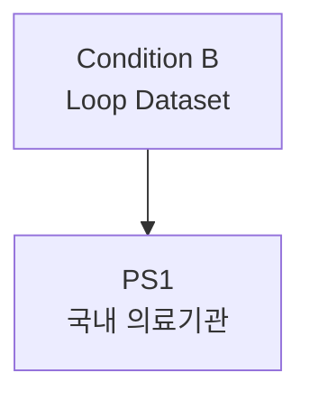

# PS1: 국내 의료기관 제휴

> Partnership Stage ID: `ps-1` | 상태: Planning | 기간: 2026-2027

## 개요

국내 비만/정신건강센터와의 제휴를 통한 의료 기반 구축.

## Unlock 조건

- **Condition B (Loop Dataset)**: 고밀도 3,000명 이상

## 결과물

1. 비만/정신건강센터 제휴
2. Early Warning Index validation
3. IRB 준비
4. DTx 프로토콜 공동 개발

## 관계도

