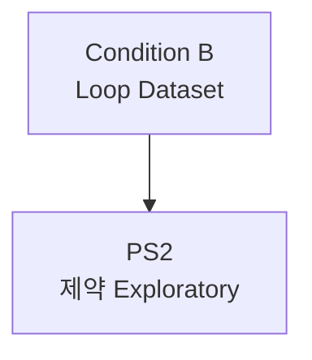

# PS2: 제약사 Exploratory

> Partnership Stage ID: `ps-2` | 상태: Planning | 기간: 2027

## 개요

제약사와의 탐색적 협업 단계. GLP-1 사용자 데이터를 기반으로 니즈 확보.

## Unlock 조건

- **GLP-1 사용자 데이터** >= 1,000명

## 결과물

1. 유지율/RWE 니즈 확보
2. Behavioral OS 협업 논의
3. GLP-1 병용 DTx 초기 구조 공유

## 관계도

