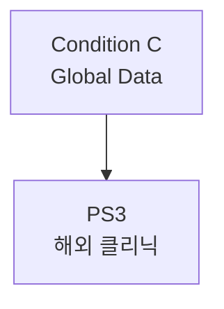

# PS3: 해외 클리닉 파일럿

> Partnership Stage ID: `ps-3` | 상태: Planning | 기간: 2027-2028

## 개요

해외 클리닉과의 파일럿 협업. Cross-Cultural Loop Model 검증이 핵심.

## Unlock 조건

- **Condition C Phase 1**: 해외 사용자 500~2,000명

## 결과물

1. Non-regulated Behavioral Pilot
2. Loop Index 국제 버전 검증
3. Cross-Cultural Loop Model 확보

## 관계도

