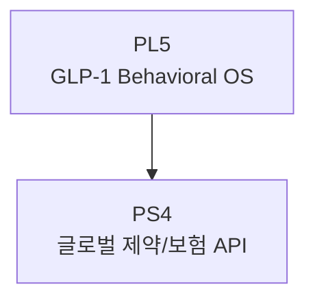

# PS4: 글로벌 제약/보험 API

> Partnership Stage ID: `ps:4` | 상태: Planning | 기간: 2028+

## 개요

글로벌 제약사/보험사와의 API 파트너십. Inner Loop OS의 최종 목표.

## Unlock 조건

- **PL5 (GLP-1 Behavioral OS)** v1 완료

## 결과물

1. 보험 유지율 API 적용
2. 제약 파트너링
3. 글로벌 OS 확장

## 관계도

