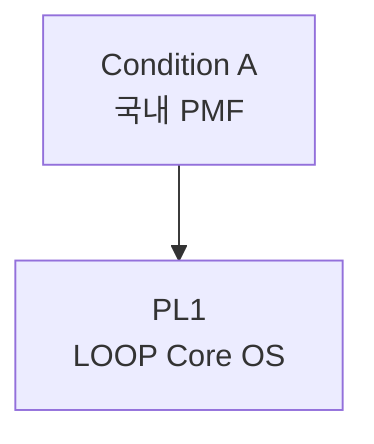

# PL1: LOOP Core OS

> Product Line ID: `pl-1` | 상태: Active | 기간: 2026

## 개요

국내 PMF 확립을 위한 핵심 Inner Loop OS 제품.

## Unlock 조건

- **Condition A (국내 PMF)** 충족 시 활성화

## 구성 요소

- Loop Mapping v1
- Emotion-Eating-Habit Tracking v1
- Loop Intervention v0.5
- 폭식/정서 루프 탐지 기능
- GLP-1 대비 Core Schema

## 목표

1. 국내 PMF 확립
2. 고밀도 루프 데이터 확보

## 관계도

