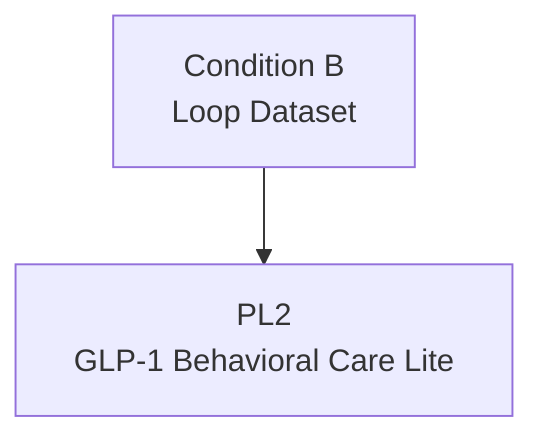

# PL2: GLP-1 Behavioral Care Lite

> Product Line ID: `pl:2` | 상태: Planning | 기간: 2026-2027

## 개요

GLP-1 약물 사용자를 위한 행동 케어 라이트 버전. 2027년 GLP-1 Crash 전 시장 선점이 핵심.

## Unlock 조건

- **Condition B (Loop Dataset)**: 고밀도 5,000~7,000명

## 구성 요소

- GLP-1 ON-phase 정서 둔화 탐지
- OFF-phase Crash Predictor v1
- Rebound/요요/충동 모델
- 행동 루틴 자동화
- 의사/클리닉용 행동 지표 리포트

## 목표

- 2027 Crash 전 GLP-1 Behavioral OS 1등 포지션 확보

## 관계도

