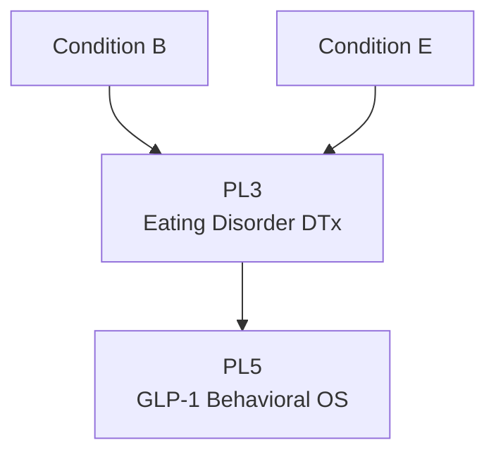

# PL3: Eating Disorder DTx

> Product Line ID: `pl-3` | 상태: Planning | 기간: 2027-2028

## 개요

섭식장애 디지털 치료제. 한국 중심으로 의료 등급(Medical Grade) 권위 획득이 목표.

## Unlock 조건

- **Condition B (Loop Dataset)** + **Condition E (Team Readiness)**
- 국내 병원 2곳 제휴

## 구성 요소

- DTx 프로토콜 v1
- Early Warning Index v1
- IRB/임상 설계
- 비급여/식약처 루트

## 목표

- 매출이 아니라 **Medical Grade 권위** 획득

## 관계도

