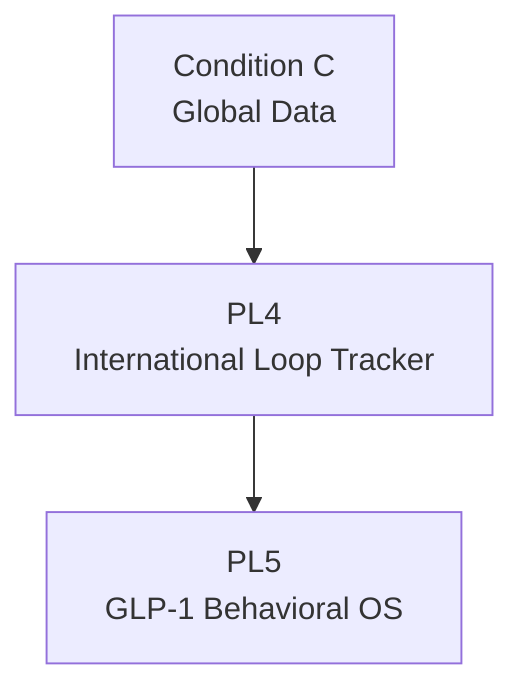

# PL4: International Loop Tracker

> Product Line ID: `pl-4` | 상태: Planning | 기간: 2027-2028

## 개요

미국/일본 대상 국제 루프 트래커. 글로벌 Loop Schema 정합성 확보가 핵심.

## Unlock 조건

- **Condition C (Global Data)**: 해외 스키마 검증

## 구성 요소

- 감정-섭식 루프 국제 스키마 적용
- Mini Loop Agent v0
- 자동/반자동 루프 기록
- 국가별 언어 Skin Layer 적용

## 목표

1. 해외 데이터 분포 확보
2. 글로벌 Loop Schema 정합성 확보

## 관계도

