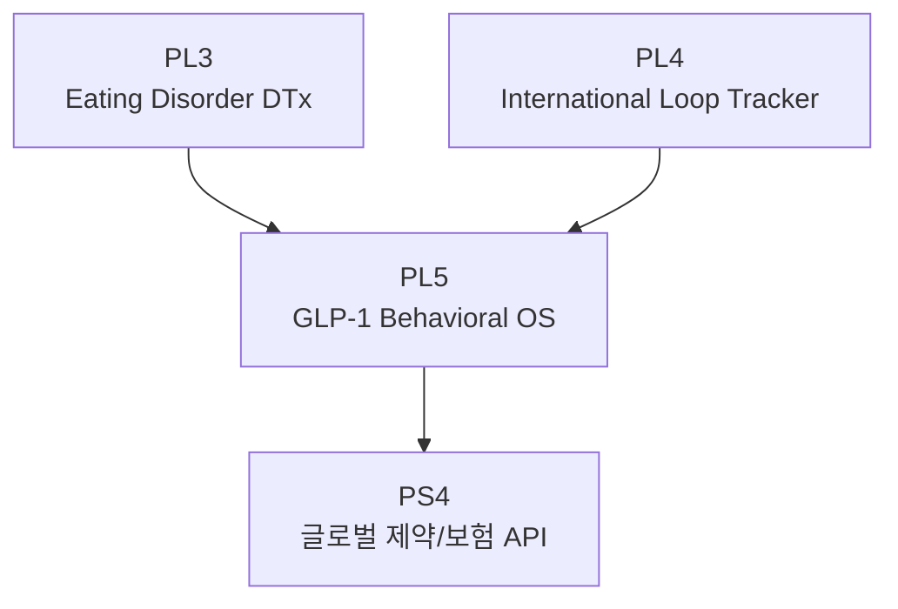

# PL5: GLP-1 Behavioral OS

> Product Line ID: `pl-5` | 상태: Planning | 기간: 2028+

## 개요

GLP-1 병용 DTx 및 글로벌 Behavioral OS. 최종 목표는 **"GLP-1 + LOOP = 정석 조합"** 시장 공식화.

## Unlock 조건

- **Product Line 3 완료** (Eating Disorder DTx)
- **Product Line 4 완료** (International Loop Tracker)
- **Global Schema v1**

## 구성 요소

- Off-phase Crash Predictor v2
- GLP-1 Behavioral DTx v1
- 제약/보험사 유지율 API
- 글로벌 파트너십 확장

## 목표

- **"GLP-1 + LOOP = 정석 조합"** 시장 공식화

## 관계도

