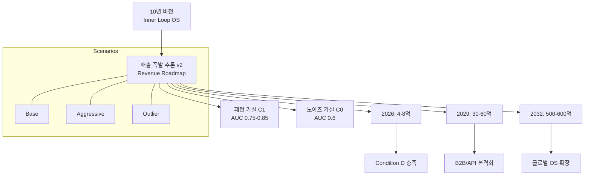

# 매출 폭발 시기 및 규모 추론 정리 v2

(10년 방향성 + 3년 전략 + 패턴 가설 기반)

> [!CAUTION]
> **리얼리티 필터**
> - 아래 숫자는 모두 **사업 계획을 위한 [추론]/[추측]**이며, 실제 매출이 이렇게 될지 **확인할 수 없습니다.**
> - 외부 리포트/연구 기반 수치는 **정확한 재검증 없이 인용한 값**으로, **[검증되지 않음]**으로 표시합니다.

---

## 1. 목적

이 문서는 다음 세 가지를 정리하기 위한 내부용 메모다.

1. **LOOP의 매출이 “꺾이는 시점(폭발 구간)”이 언제인지**,
2. **그때 현실적으로 기대할 수 있는 규모(범위)**가 어느 정도인지,
3. 그 추론의 **근거(내부 로드맵 + 시장 규모 + 패턴 가설)**를 한 번에 볼 수 있게 정리.

---

## 2. 전제: 내부 전략 문서 기준 타임라인

### 2-1. 10년 방향성 문서 기준 단계 요약 [[10년 비전]]

10-year direction 정리 문서에 따르면:

1. **1단계 (2025–2026)** — Behavioral Data Layer
    - 한국 Inner Loop Dataset 구축 (정서·섭식·습관·신경계)
    - GLP-1 대비 루프 모델 설계, Loop Schema/Intervention v1
2. **2단계 (2027)** — 의료/클리닉 연계 + 해외 데이터 파이프라인
    - 한국: 비만·정신건강 센터 제휴, GLP-1 Off-phase Protocol v1, Early Warning Index
    - 해외(미/일): 경량 Loop Tracker, Reddit/TikTok 자연 유입, Cross-cultural Schema
3. **3단계 (2028)** — Eating Disorder DTx
    - 한국: 섭식장애 DTx 허가, 임상 기반 회복 프로토콜 확립
    - 해외: 미국 비규제 Behavioral Pilot, 일본 Wellness DTx
4. **4단계 (2029)** — GLP-1 Behavioral OS / 병용 DTx
    - GLP-1 Behavioral DTx 출시
    - Off-phase Crash 모델 공식화
    - **글로벌 제약/보험 대상 유지율 API 제공 시작**
5. **5단계 (2030–2032)** — 해외 본격 확장
    - Inner Loop OS 글로벌 버전
    - Multi-country Loop Model
    - **API 기반 헬스케어 인프라 진입, 글로벌 파트너십 확장**
6. **6단계 (2033–2035)** — Human Inner Loop OS 완성
    - Stress–Reward–Emotion–Habit 통합 OS
    - 생산성/소비/정신건강 루프 확장
    - Global License / M&A / IPO 옵션

→ 요약:
- **2025–2028**: 한국 중심 B2C + 일부 의료/파일럿
- **2029**: GLP-1 Behavioral OS + API로 **첫 B2B 레버리지** 시작
- **2030–2032**: 글로벌 OS/API 확장으로 **매출이 구조적으로 꺾일 수 있는 시기**

---

## 3. 단기(2026–2028) 매출 시나리오: “폭발 전” 구간 [추론]

### 3-1. 유닛 단위 (코칭·앱) 전제

**코칭**
- 2026 단가: 1인당 월 30–35만 원
    - 보수적(Cons): 30만
    - 기준(Base): 32.5만
    - 상단(Stretch): 35만 [추론]
- 2027: 35–40만 (평균 37.5만) [추측]
- 2028: 40–50만 (평균 45만) [추측]
- 코치 1명당 25–30명 책임, “코치는 적은 수를 깊게 관리” 원칙.

**앱(꼭꼭)**
- 2025년부터 전면 유료화
- MAU 기준 모두가 월 9,800원 내는 구조를 목표 [전략 전제]
- 2026 평균 단가: 1분기 5,900원 → 2분기 말 9,800원 → **연 평균 약 8,338원/월** [추론]

### 3-2. 2026년 매출 범위 (코칭 + 앱) [추론]

**코칭 (월)**
- 보수적: 코치 3명 × 20명 × 30만 = 1,800만
- 기준: 코치 5명 × 25명 × 32.5만 ≈ 4,062만
- 상단: 코치 6명 × 30명 × 35만 = 6,300만

**앱 (월)**
- 보수적: MAU 2,000명 × 8,338원 ≈ 1,667만
- 기준: MAU 3,000명 × 8,338원 ≈ 2,501만
- 상단: MAU 4,000명 × 8,338원 ≈ 3,335만

**합계 (연)**
- 보수적: 월 3,468만 → **연 약 4.16억**
- 기준: 월 6,564만 → **연 약 7.88억**
- 상단: 월 9,635만 → **연 약 11.56억**

→ 12개월 계획에서 요구하는 [[Condition_D_Runway]](월 2,000만 + Runway 18개월)를 **보수적 시나리오만으로도 상회하는 수준**이다.

### 3-3. 2027–2028년 매출 범위 요약 [추론]

**2027 (GLP-1 Crash 대응 시작 / 데이터 확장)**
- 코칭 + 앱 + GLP-1 Care(Pro/Lite) 합산:
    - 보수적: 연 약 8.6억
    - 기준: 연 약 11.9억
    - 상단: 연 약 17.6억

**2028 (한국 DTx + 해외 Pilot, 여전히 B2C 중심)**
- B2C(앱/코칭/GLP-1 Care): 연 9–20억 레인지
- B2B/DTx/파일럿 수입: 연 0.5–2억 정도의 옵션 [추측]
- 합산: **현실적인 범위는 연 10–20억** 수준으로 보는 것이 안전하다.

→ 정리:
- **2026–2028 매출은 “수십억 구간”에 머무르면서도 Condition D는 확실히 넘기는 구조**
- 진짜 폭발(Hockey-stick)은 **B2B/API가 본격 반영되는 2029 이후**로 보는 게 일관적이다.

---

## 4. 시장 규모(Problem Size) 정리 [검증되지 않음]

> [!NOTE]
> 이 섹션의 수치는 외부 리포트/연구 요약에 기반한 대략치이며, 최신 데이터로 재검증하지 않았으므로 **[검증되지 않음]**으로 본다.

### 4-1. 섭식장애·BED 시장
- 미국 기준, 1년 유병 ED(섭식장애) 환자 수: **수백만 명** [추론]
    - 그 중 BED(Binge Eating Disorder)는 ED 중 가장 높은 비중(30%+ 범위)을 차지하는 것으로 보고됨 [검증되지 않음].
- 한 경제 분석 리포트에 따르면,
    - ED 전체가 만드는 **연간 사회적 비용(직접 의료비+생산성 손실+삶의 질 손실)**은 **수십억~수백억 달러 규모**로 추정된다. [검증되지 않음]

### 4-2. GLP-1 + 폭식/Crash 시장
- GLP-1(위고비/오젬픽 계열) 사용자는
    - 미국·유럽·한국 포함 시 이미 **수백만~천만 명 단위**로 추정된다. [추측]
- 이 중 상당수가
    - 약 중단 후 체중 리바운드,
    - 폭식/감정 섭식 Crash,
    - 정서적/행동적 부작용을 겪는다는 보고들이 나오고 있다. [검증되지 않음]

### 4-3. Addressable Problem Size (Inner Loop OS 관점) [추론]
보수적으로,
- ED/BED + GLP-1 Crash + 비진단 폭식/과식을 포함한 **“폭식/Crash 루프” 관련 경제·심리 비용**을
- 미국 기준 연 **수십억~수백억 달러**,
- 글로벌 기준 연 **수백억~수천억 달러** 수준의 문제로 보는 것은 무리하지 않다. [검증되지 않음]

→ 이 거대한 문제에서 **LOOP가 몇 %를 실제로 캡처할 수 있는지가 매출 폭발의 상한을 결정**하게 된다.

---

## 5. 패턴 가설(C1) vs 노이즈 가설(C0)와 매출 기대값 [추론]

> [!INFO]
> 이 섹션의 상세한 베이지안 추론 및 과학적 근거 데이터는 [[logic-pattern-binge_폭식_패턴_논리]] 문서를 참고하십시오.

### 5-1. 패턴 가설(C1, 80%) 요약
- 가설 C1: [[hyp-2-06_패턴_재현율]]
    - “폭식은 개인 안에서 반복되는 정서·시간·환경·신체 패턴 위에서 발생하고, 충분한 기록/센서를 붙이면 **AUC 0.75~0.85 수준으로 개인화 예측이 가능**하다.”
- 이 가설이 맞는 세계에서는:
    - 폭식 루프 감소(빈도·강도)를 **30% 전후**까지 노려볼 수 있고,
    - 보험/제약/고용주 입장에서 **가시적인 비용 절감·유지율 개선 효과**를 기대할 수 있다. [추론]

### 5-2. 노이즈 가설(C0, 20%) 요약
- 가설 C0:
    - “패턴은 있더라도, 현실 서비스 데이터·순응도·노이즈를 감안하면 AUC는 0.6 근처, 효과는 10~15% 감소 수준에 머문다.”
- 이 경우:
    - 폭식 예측은 **부가 기능** 정도의 가치에 그치고,
    - LOOP의 핵심 가치는 정서·습관·섭식 루틴/코칭 OS 쪽에 더 많이 실리게 된다.

### 5-3. 미국 BED 기준 매출 기대값(매우 단순화 버전) [추론/검증되지 않음]

> [!TIP]
> 아래는 “미국 BED만 떼어 놓고 봤을 때”의 예시 계산이며, 실제 LOOP는 GLP-1, 비진단 폭식, 글로벌 시장 등 더 넓은 범위를 타깃으로 한다.

- BED 타깃 코호트 중
    - LOOP가 장기적으로 확보할 수 있는 유료 유저 수: 10만~30만 명 가정 [추측]
- 1인당 연 매출(보험/제약 포함, Value-based 일부 반영): 150~200달러 가정 [추론]

→ **C1 세계 Base**:
- 10만 명 × 160달러/년 ≈ 1,600만 달러/년
- 30만 명 × 160달러/년 ≈ 4,800만 달러/년

BED 외 확장(ED 전체, GLP-1 Crash, 비진단 폭식)을 포함하면, **연 수천만~1억 달러 규모까지 올라갈 수 있는 구조**가 열린다. [추측]

→ **C0 세계**:
- 예측력이 낮아도, 코칭/앱/OS 가치만으로 연 수백만~수천만 달러급 비즈니스 여지는 남는다. [추론]

---

## 6. 매출 폭발 시기 & 규모: 결론 정리 [추론]

### 6-1. 시점

1. **1차 레벨업(“폭발의 서막”)**
    - **시기:** 2029년 전후
    - **근거:** GLP-1 Behavioral OS / 병용 DTx 출시 + 글로벌 제약/보험 API 제공 단계 진입
    - **의미:** B2C(코칭/앱/GLP-1 Care)에 더해 **B2B/API 매출이 본격적으로 더해지는 첫 해**
2. **본격 폭발(Hockey-stick 본체)**
    - **시기:** 2030–2032년
    - **근거:** Inner Loop OS 글로벌 버전, Multi-country Loop Model, 헬스케어 인프라(API) 진입 단계
    - **의미:** “OS + API” 구조가 미국/일본/한국을 포함한 여러 국가에서 반복 적용되기 시작하는 구간

### 6-2. 규모 (KRW 기준, 매우 러프한 범위)

> [!WARNING]
> 아래 숫자는 내부 샌드박스용 추론이며, “이 정도를 노려볼 수 있다” 수준의 가이드일 뿐, 공식 목표나 예측값이 아니다.

1. **2026–2028 (폭발 전)**
    - 2026: 연 **4~8억** (B2C 중심, Condition D 확실한 충족)
    - 2027: 연 **8~12억**
    - 2028: 연 **10~20억** (한국 DTx + 해외 Pilot 포함, 여전히 B2C가 메인)
2. **2029 (1차 레벨업)**
    - GLP-1 Behavioral OS + 글로벌 제약/보험 API 초기 계약 가정
    - B2C 10~20억 + B2B/API 20~40억 → **연 30~60억** 레벨이 “현실적인 레벨업 범위”로 보인다. [추론]
3. **2030–2032 (본격 폭발 구간)**
    - **C1(패턴 가설 80%) 세계 Base**: 글로벌 매출 **연 650~1,300억 원** (연 수천만~1억 달러급)
    - **C0(노이즈 20%) 세계 Base**: 연 **50~150억 원** (튼튼한 헬스케어 SaaS/DTx 비즈니스)
    - 두 세계를 합친 베이지안 기대값(중앙부 감각): **연 500~600억 원** 정도가 “지금 시점에서 가장 합리적인 기대 곡선의 중심값”으로 보인다.

---

## 7. 시나리오 맵 (Conservative / Base / Aggressive / Outlier)

| 연도 / Phase | Conservative (Floor) | Base (중앙값) | Aggressive (Stretch) | Outlier (1조+ 야망) |
| --- | --- | --- | --- | --- |
| **2026** | **4–6억** | **6–8억** | **8–12억** | **10–15억** [추측] |
| **2027** | **8–10억** | **10–12억** | **15–20억** | **20–30억** [추측] |
| **2028** | **10–15억** | **15–20억** | **20–40억** | **40–80억** [추측] |
| **2029** | **30–40억** | **40–60억** | **60–120억** | **120–200억** [추측] |
| **2030–2032** | **300–400억** | **500–600억** | **1,000–1,600억** | **2,000–3,000억 (2–3조)** [추측] |

---

## 8. 내부 최고 North Star(야망) – 10년 기준

### 2035년 내부 최고 North Star (초야망)

> **“2035년, LOOP는 폭식·GLP-1 Crash·정서·섭식·습관·신경계 루프”로 인한 Addressable Problem(연 500–1,000억 달러 규모) 중 최소 5% 이상을 Inner Loop OS를 통해 관리·완충하는 OS가 된다.”**

- **숫자 목표 (공격적 야망)**: 연 **15–50억 달러** (원화 약 **연 2조~6조 5천억 원**)
- **의미**: 시장 구조상 Loop OS가 직접 수거하는 일부 매출. 비현금 가치(의료비 절감 등) 포함 시 총 가치 규모는 **연 수십조 원 이상** 상정.

---

## 9. 관계도

---
**책임자**: Founder
**참고 문서**: 
- [[10년 비전]]
- [[3Y_Conditions_2026-2028/_MOC_조건]]
- [[Track_6_Revenue]]
- [[hyp-2-06_패턴_재현율]]
