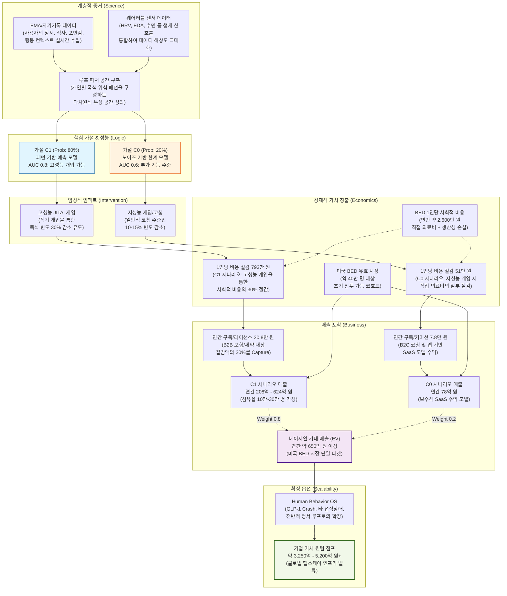
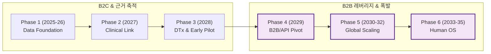

# 매출 가치 사슬 심층 분석 (KRW)

이 문서는 루프의 핵심 가설이 어떻게 실제 매출과 기업 가치로 전환되는지를 노드별 상세 설명과 함께 한화(KRW) 기준으로 도식화한 것입니다.

## 1. 정밀 매출 가치 사슬 도식

## 2. 연도별 성장 전략 및 매출 로드맵 (2025-2035)

가치 사슬의 구성 요소들이 시간에 따라 어떻게 확장되며 매출 폭발(Hockey-stick)을 만들어내는지에 대한 단계별 로드맵입니다.

### 2-1. 단계별 성장 도식

### 2-2. 단계별 핵심 전략 및 기대 매출 (KRW)

| 단계 | 기간 | 핵심 전략 (Strategic Focus) | 기대 매출 범위 (Base) |
| :--- | :--- | :--- | :--- |
| **1단계** | 2025-26 | **Behavioral Data Layer**: 한국 시장 Inner Loop 데이터셋 구축 및 모델 설계. | **연 4억 ~ 8억 원** |
| **2단계** | 2027 | **Healthcare Integration**: 비만/정신건강 클리닉 제휴 및 GLP-1 대응 프로토콜 v1. | **연 8억 ~ 12억 원** |
| **3단계** | 2028 | **DTx Authorization**: 섭식장애 DTx 허가 획득 및 해외 Behavioral Pilot 시작. | **연 10억 ~ 20억 원** |
| **4단계** | 2029 | **B2B/API Pivot**: GLP-1 Behavioral OS 출시 및 **제약/보험사 대상 API 유료화 시작**. | **연 30억 ~ 60억 원** (1차 폭발) |
| **5단계** | 2030-32 | **Global Scaling**: Multi-country 모델 확장 및 글로벌 헬스케어 인프라 진입. | **연 500억 ~ 600억 원** (본격 폭발) |
| **6단계** | 2033-35 | **Human OS 완성**: 정서·습관·신경계 통합 OS 엔진 라이선스 및 M&A/IPO 가치 극대화. | **연 2조 ~ 6.5조 원** (야망) |

---

## 3. 주요 환산 기준 (FX: 1,300 KRW/USD)

- **사회적 비용/절감**: 1인당 연간 발생 비용 및 솔루션 도입 시 기대 절감액.
- **매출 (Capture)**: 솔루션이 창출한 경제적 이익 중 LOOP가 가져오는 몫 (가치 기반 과금).
- **기업 가치**: 연간 기대 매출에 헬스케어 SaaS/DTx 멀티플(5-8x)을 적용한 추정치.

## 3. 전략적 시사점

1. **데이터 해상도의 중요성**: Evidence 계층에서 피처 공간이 정교할수록 C1 가설의 예측력(AUC)이 유지되며, 이는 곧 High-Impact 개입으로 연결됩니다.
2. **가치 기반 과금 (Value-based Pricing)**: 단순 앱 구독료가 아닌, 사회적 비용 절감액의 일정 비율(20.8만 원/년)을 획득하는 B2B 전략이 매출 폭발의 핵심입니다.
3. **베이지안 베이팅**: C1(80%)에 높은 가중치를 두는 근거는 이미 쌓인 EMA/센서 기반 선행 연구들의 긍정적 결과에 기반합니다.
