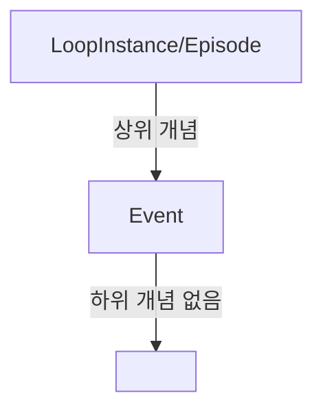
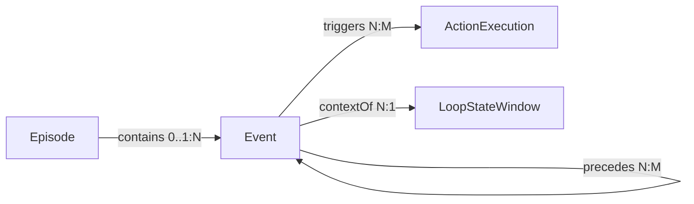
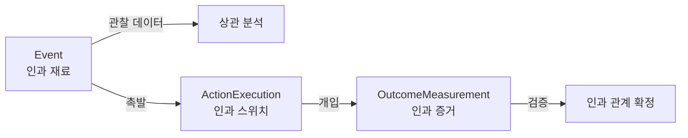

---
# GraphRAG 최적화 메타데이터
entity_type: CoreEntity
entity_name: Event
entity_id: entity:event:v0.1

# 온톨로지 계층
parent: [LoopInstance]
children: []
related: [Episode, LoopStateWindow, ActionExecution]

# 관계 정의 (GraphRAG가 그래프 구축 시 사용)
relations:
  - type: contains
    source: Episode
    target: Event
    direction: incoming
    cardinality: "0..1:N"
    semantic: "Episode가 Event를 시간적으로 포함"
  - type: precedes
    source: Event
    target: Event
    direction: bidirectional
    cardinality: "N:M"
    semantic: "시간적 선후 관계"
  - type: triggers
    source: Event
    target: ActionExecution
    direction: outgoing
    cardinality: "N:M"
    semantic: "Event가 개입을 촉발"
  - type: contextOf
    source: Event
    target: LoopStateWindow
    direction: outgoing
    cardinality: "N:1"
    semantic: "Event가 특정 상태 윈도우의 맥락"

# 커뮤니티 분류 (GraphRAG 커뮤니티 탐지)
community: [C1_Core_Entities, C3_Causality]
domain: [eating-loop, emotional-loop, habit-loop, reward-loop, nervous-loop]
layer: data-model
time_scale: [micro, meso]

# 버전 & 상태
version: "0.1"
status: active
lifecycle: stable
spec_version: "0.1"

# 중요도 (GraphRAG 랭킹에 영향)
importance: critical
centrality: 0.95
usage_frequency: high

# 다층 요약 (GraphRAG가 추상화 레벨별로 사용)
summaries:
  executive: "원자적 사실 기록 엔티티"
  technical: "관찰 기반 최소 단위 데이터. eventType과 timestamp 필수. episodeId로 Episode에 선택적 연결."
  detailed: "ILOS에서 meal, emotion_tag, urge, binge, sleep 등을 기록하는 불변 엔티티. 단독으로는 상관관계 분석까지 가능하나, 인과관계 확정은 ActionExecution/OutcomeMeasurement와의 연결 필요."

# 태그 (기존 시스템 유지)
tags: [ontology/entity, version/v0-1, status/active, core]

# 메타
created: 2024-12-18
updated: 2024-12-18
author: ILOS-ontology-team
---

# Event

> 핵심 엔티티 | v0.1 | 원자적 사실 기록

## Executive Summary (경영진용)
원자적 사실 기록 엔티티. ILOS 데이터의 최소 단위.

## Technical Summary (개발자용)
관찰 기반 최소 단위 데이터. eventType(meal, emotion_tag, urge, binge 등)과 timestamp를 필수로 가지며, 선택적으로 Episode에 연결됨(episodeId). 불변 ID 구조.

## Detailed Summary (온톨로지 전문가용)
Event는 Inner Loop OS에서 관찰 가능한 사실(fact)의 최소 단위입니다. meal, satiety_check, emotion_tag, urge, binge, sleep, pms, social, context_change 등 다양한 eventType을 가질 수 있으며, 각 타입별로 payload 스키마가 별도로 정의됩니다.

Event 단독으로는 상관관계(correlation) 분석까지 가능하지만, 인과관계(causality)를 확정하려면 ActionExecution(개입)과 OutcomeMeasurement(결과)와의 연결이 필요합니다. 이것이 Event-Action-Result 인과 구조의 핵심입니다.

episodeId 필드를 통해 Episode 컨테이너에 선택적으로(0개 또는 1개) 연결되며, 미분류 이벤트도 허용됩니다.

---

## 온톨로지 위치

### 계층 구조


### 관련 엔티티
- **상위**: [[Episode]] (LoopInstance)
- **동등**: [[LoopStateWindow]], [[ActionExecution]], [[OutcomeMeasurement]] (동일 레벨의 코어 엔티티)
- **관련**: [[SignalObservation]] (센서 데이터), [[PredictionRun]] (위험 예측)

---

## 필드 정의

### 공통 필드 (상속)
| 필드 | 타입 | 필수 | 설명 |
|------|------|------|------|
| `id` | string | ✅ | 불변 고유 식별자 (예: `event_abc123`) |
| `userId` | string | ✅ | 사용자 ID |
| `createdAt` | timestamp | ✅ | 생성 시각 (ISO 8601) |
| `updatedAt` | timestamp | ✅ | 수정 시각 (ISO 8601) |
| `source` | enum | ✅ | 데이터 소스 (`app` \| `coach` \| `system` \| `import`) |
| `specVersion` | string | ✅ | 스펙 버전 (예: `"0.1"`) |

### 엔티티 고유 필드
| 필드 | 타입 | 필수 | 설명 |
|------|------|------|------|
| `eventType` | string | ✅ | 이벤트 타입 (meal, emotion_tag, urge, binge, sleep, pms, social, context_change 등) |
| `timestamp` | timestamp | ✅ | 이벤트 발생 시각 (ISO 8601) |
| `payload` | object | ✅ | eventType별 데이터 (스키마는 v0.2+ registry로 분리 예정) |
| `episodeId` | string \| null | ❌ | 연결된 Episode ID (미분류 시 null) |

### 권장 필드 (선택)
| 필드 | 타입 | 설명 |
|------|------|------|
| `confidence` | enum | 데이터 신뢰도 (`self-report` \| `coach-labeled` \| `system-inferred`) |
| `tags` | string[] | 맥락 태그 (예: `["home", "evening", "alone"]`) |
| `contextClusterId` | string | 환경 클러스터 ID (v0.2+) |

---

## 관계 (Relations)

### 관계 그래프


### 들어오는 관계 (Incoming)
| 관계 | From | 설명 | Cardinality | v0.1 구현 |
|------|------|------|-------------|----------|
| `contains` | [[Episode]] | 에피소드가 이벤트를 시간적으로 포함 | 0..1:N | `episodeId` 필드 |

### 나가는 관계 (Outgoing)
| 관계 | To | 설명 | Cardinality | v0.1 구현 |
|------|-----|------|-------------|----------|
| `precedes` | [[Event]] | 시간적 선행 관계 (시퀀스) | N:M | 시간 기반 추론 |
| `triggers` | [[ActionExecution]] | 이벤트가 개입을 촉발 | N:M | ActionExecution의 `triggeredBy` 참조 |
| `contextOf` | [[LoopStateWindow]] | 이벤트가 상태 윈도우의 맥락 제공 | N:1 | 시간 윈도우 기반 추론 |

### 양방향 관계 (Bidirectional)
| 관계 | With | 설명 | Cardinality |
|------|------|------|-------------|
| `correlatesWith` | [[Event]] | 통계적 상관관계 (학습됨) | N:M |

---

## 제약조건 (Constraints)

### 필수 제약 (v0.1 고정)
1. **ID 불변성**: `id` 필드는 생성 후 변경 불가
2. **Timestamp 필수**: `timestamp`는 절대 null이 될 수 없음
3. **Episode 단일 연결**: `episodeId`는 0개 또는 1개만 허용 (N:1 불가)
4. **eventType 존재**: eventType은 빈 문자열이 될 수 없음

### 권장 제약
1. **시간 일관성**: `createdAt <= updatedAt`
2. **Episode 시간 범위**: episodeId가 있다면, `Episode.startTime <= Event.timestamp <= Episode.endTime`
3. **Source 일관성**: source가 'coach'라면 confidence는 'coach-labeled'

### 비즈니스 규칙
1. **폭식 이벤트**: eventType='binge'인 경우, payload에 severity(1-10) 필수
2. **식사 이벤트**: eventType='meal'인 경우, payload에 mealType(breakfast/lunch/dinner/snack) 권장

---

## 예시

### JSON 예시 1: 기본 식사 이벤트
```json
{
  "id": "event_abc123",
  "userId": "user_xyz789",
  "eventType": "meal",
  "timestamp": "2024-12-18T12:30:00Z",
  "payload": {
    "mealType": "lunch",
    "foods": ["rice", "chicken", "salad"],
    "duration_minutes": 20,
    "satiety_before": 3,
    "satiety_after": 7
  },
  "episodeId": "episode_def456",
  "source": "app",
  "confidence": "self-report",
  "tags": ["office", "weekday"],
  "specVersion": "0.1",
  "createdAt": "2024-12-18T12:30:00Z",
  "updatedAt": "2024-12-18T12:30:00Z"
}
```

### JSON 예시 2: 감정 태그 이벤트
```json
{
  "id": "event_emotion_001",
  "userId": "user_xyz789",
  "eventType": "emotion_tag",
  "timestamp": "2024-12-18T14:15:00Z",
  "payload": {
    "emotion": "anxiety",
    "intensity": 7,
    "trigger": "work deadline",
    "coping": null
  },
  "episodeId": "episode_def456",
  "source": "app",
  "confidence": "self-report",
  "tags": ["office", "stress"],
  "specVersion": "0.1",
  "createdAt": "2024-12-18T14:15:00Z",
  "updatedAt": "2024-12-18T14:15:00Z"
}
```

### JSON 예시 3: 미분류 이벤트
```json
{
  "id": "event_orphan_999",
  "userId": "user_xyz789",
  "eventType": "urge",
  "timestamp": "2024-12-18T22:45:00Z",
  "payload": {
    "urge_type": "snack",
    "intensity": 8,
    "resisted": false
  },
  "episodeId": null,
  "source": "app",
  "confidence": "self-report",
  "tags": ["home", "evening", "alone"],
  "specVersion": "0.1",
  "createdAt": "2024-12-18T22:45:00Z",
  "updatedAt": "2024-12-18T22:45:00Z"
}
```

### 실제 사용 사례 시나리오

**시나리오 1: 폭식 예측을 위한 Event 시퀀스**
```
14:00 - Event(emotion_tag: anxiety, intensity=7)
14:30 - Event(urge: snack, intensity=5)
15:00 - Event(context_change: "left office")
15:20 - Event(emotion_tag: emptiness, intensity=8)
15:30 - Event(urge: snack, intensity=9)
16:00 - Event(binge: severity=8)  # 폭식 발생
```
→ GraphRAG는 이 시퀀스에서 "anxiety → emptiness → high urge → binge" 패턴 학습

**시나리오 2: Episode 컨테이너 내 Event들**
```
Episode(id=ep1, startTime=18:00, endTime=21:00, type="evening_risk_window")
  contains-
    - Event(18:10, meal: dinner)
    - Event(18:50, satiety_check: fullness=6)
    - Event(19:30, emotion_tag: boredom)
    - Event(20:00, urge: snack, intensity=7)
    - Event(20:30, meal: snack, type="late_snack")
```

---

## Event-Action-Result 인과 구조에서의 역할

### Event의 위치


### 인과 체인 예시
1. **Event**: 야간 공복감(hunger) + 스트레스(anxiety) 관찰
2. **ActionExecution**: 코치가 "저녁 9시 이후 따뜻한 물 마시기" 개입
3. **OutcomeMeasurement**: 다음 2시간 야식 빈도 50% 감소
4. **인과 학습**: "스트레스 + 공복감" → "따뜻한 물" → "야식 감소" 패턴 확립

---

## v0.2+ 확장 계획

### v0.2에서 추가될 기능
1. **EventType Registry**
   - eventType을 문자열에서 구조화된 타입으로
   - 각 타입별 payload 스키마 정의
   - 버전 관리 (eventType v1.0, v1.1 등)

2. **Event → Link 승격**
   - `precedes` 관계를 Reference에서 Link 엔티티로
   - 관계 메타데이터 추가 (strength, confidence, learned_from)

3. **Multi-modal Event**
   - SignalObservation과의 명시적 연결
   - 웨어러블 데이터(HRV, 걸음수)와 자가보고 통합

### 하위 호환성
- v0.1 데이터는 v0.2에서도 읽기 가능
- specVersion 필드로 해석 규칙 자동 전환
- Migration script 제공 예정

---

## 커뮤니티 소속

### C1: Core Entities
Event는 ILOS의 5대 핵심 엔티티 중 하나로, v0.1에서 고정.
[[C1_Core_Entities]] 커뮤니티의 핵심 멤버.

### C3: Causality
Event-Action-Result 인과 구조의 출발점.
[[C3_Causality]] 커뮤니티에서 "인과 재료" 역할.

---

## 설계 원칙 & 철학

### Rule A: Type System 고정
Event는 코어 타입으로 v0.1+에서 절대 삭제 불가. 의미 변경도 금지.

### Rule B: ID & Reference 불변
- `id` 필드명 고정
- `episodeId` reference 구조 고정
- 향후 LinkType으로 승격 가능하도록 참조 유지

### 최소주의 원칙
payload 내부는 유연하게, 코어 필드는 최소한으로.

---

## 쿼리 예시 (Dataview)

### 특정 타입의 모든 이벤트
```dataview
TABLE eventType, timestamp, episodeId
FROM "실제 데이터 폴더"
WHERE entity_type = "Event" AND eventType = "binge"
SORT timestamp DESC
```

### Episode별 Event 개수
```dataview
TABLE
  episodeId,
  length(filter(rows, (r) => r.entity_type = "Event")) as event_count
FROM "실제 데이터 폴더"
WHERE episodeId != null
GROUP BY episodeId
```

---

## 참고 문서

### 코어 스펙
- [[Ontology-lite v0.1 (ILOS) — 규칙(4조건) + 최소 엔티티 스펙]]
- [[Inner Loop OS 정의v1]]

### 관련 엔티티
- [[Episode]] - Event를 포함하는 컨테이너
- [[ActionExecution]] - Event가 촉발하는 개입
- [[LoopStateWindow]] - Event의 맥락을 제공하는 상태 윈도우

### 관련 관계
- [[contains]] - Episode-Event 관계
- [[precedes]] - Event-Event 시간 순서
- [[triggers]] - Event-ActionExecution 인과 관계

### 커뮤니티
- [[C1_Core_Entities]]
- [[C3_Causality]]

### 실제 구현
- SoSi: `/Users/gim-eunhyang/dev/flutter/sosi/lib/models/event.dart`
- KkokKkokFit: `/Users/gim-eunhyang/dev/flutter/kkokkkokfit_web/lib/models/event.dart`

---

## 버전 히스토리

| 버전 | 날짜 | 변경 사항 | 작성자 |
|------|------|-----------|--------|
| 0.1 | 2024-12-15 | 초기 정의. 5개 코어 엔티티로 고정 | ontology-team |
| 0.1.1 | 2024-12-18 | GraphRAG 최적화 메타데이터 추가 | claude-code |

---

**마지막 업데이트**: 2024-12-18
**문서 상태**: Active (Stable)
**리뷰 필요**: No
**다음 리뷰**: v0.2 계획 시
