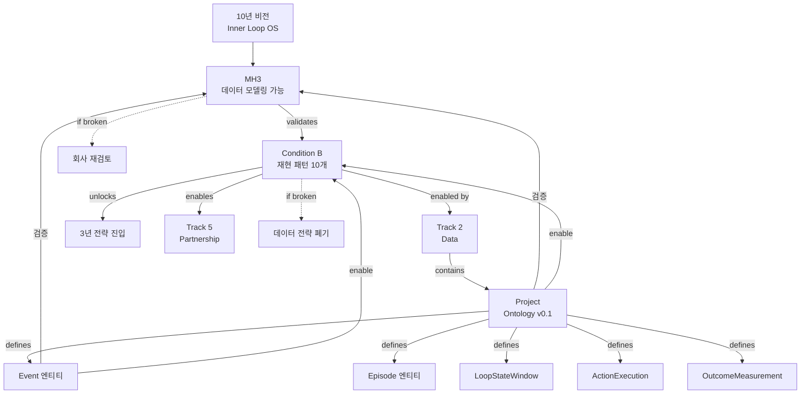

# 온톨로지와 전략의 연결

> **핵심**: 온톨로지는 단순한 데이터 모델이 아니라, 회사 전략의 검증 도구이자 실행 수단

---

## Executive Summary

**온톨로지가 하는 일 (한 줄)**:
MH3("루프는 데이터 모델링 가능하다")를 검증하고, Condition B("재현 패턴 10개")를 가능하게 만드는 데이터 인프라.

**만약 온톨로지가 실패하면**:
- MH3 위험 → 회사 존재 이유 재검토
- Condition B 달성 불가 → 3년 전략 진입 불가
- Track 2 (Data) 실패 → 데이터 전략 폐기

→ **온톨로지는 회사 생존의 필수 조건**

---

## 온톨로지의 전략 계층 위치

### 전체 구조
```
10년 비전: Human Inner Loop OS
 ↓
MH3: 루프는 데이터 모델링 가능 ← 온톨로지가 검증
 ↓
Condition B: 재현 패턴 10개 ← 온톨로지가 enable
 ↓
Track 2: Data ← 온톨로지가 소속
 ↓
Project: Ontology v0.1 ← 온톨로지 프로젝트
 ↓
Tasks: 엔티티 정의, 규칙 확정, 실제 구현 검증
```

### 온톨로지의 3가지 역할

#### 1. MH3 검증 도구
**Meta Hypothesis 3**: "정서-섭식-습관 루프는 데이터로 모델링 가능한 구조를 가진다"

**온톨로지의 검증 방법**:
- ✅ 5개 코어 엔티티로 모든 Loop 데이터 표현 가능한지
- ✅ Event-Action-Result 인과 구조가 실제 데이터로 동작하는지
- ✅ 재현 패턴을 엔티티로 포착 가능한지

**현재 검증 상태**: 70% (긍정적)
- ✅ meal, emotion, urge, binge 모두 Event로 표현 가능
- ✅ Episode로 2-4시간 위험 구간 캡처 가능
- ✅ 스키마가 2개월간 안정적

**만약 MH3가 거짓이라면**?
→ 회사 존재 이유 재검토 (Loop를 데이터로 다룰 수 없다면 OS 불가능)

**문서**: [[MH3_데이터_모델링_가능]]

---

#### 2. Condition B Enable 인프라
**Condition B**: "데이터 수가 아니라 재현 가능한 패턴이 늘어나는가?"

**온톨로지가 Enable하는 방법**:
1. **패턴 저장소**: Event-Episode-Action-Outcome으로 패턴 데이터화
2. **재현 테스트**: 동일 패턴이 다른 사용자에게서도 나타나는지 측정
3. **패턴 카운트**: 재현 패턴 수를 정량적으로 측정

**현재 상태**:
- 재현 패턴 3개 발견 (목표 10개)
- 패턴 발견 속도 월 1개

**만약 Condition B가 깨진다면**?
→ 데이터 전략 폐기, 3년 전략 진입 불가

**온톨로지 없으면**?
- 패턴을 데이터로 저장 못 함
- 재현 테스트 불가능
- Condition B 측정 불가능

**문서**: [[Condition_B_Loop_Dataset]]

---

#### 3. Track 2 핵심 구성요소
**Track 2 (Data)**: "코치+기록 기반 데이터는 패턴화 가능하다"

**온톨로지는 Track 2의 Focus 3**:
- Focus 1: 고밀도 Tier1/Tier2 확장
- Focus 2: Loop Pattern v1
- **Focus 3: Schema 안정화** ← 온톨로지

**Track 2 성공 조건**:
- 고밀도 50명 ✅
- 재현 패턴 10개 ← **온톨로지 필수**
- 스키마 3개월 안정 ← **온톨로지 필수**

**문서**: [[Track_2_Data]]

---

## 온톨로지 v0.1의 핵심 구조

### 5개 코어 엔티티 (절대 불변)
| 엔티티 | 역할 | 전략 기여 |
|--------|------|----------|
| [[Event]] | 원자적 사실 기록 | 패턴의 재료 |
| [[Episode]] | 한 번의 루프 컨테이너 | 패턴의 단위 |
| [[LoopStateWindow]] | 30-60분 상태 벡터 | 예측의 입력 |
| [[ActionExecution]] | 개입 실행 트랜잭션 | 인과의 스위치 |
| [[OutcomeMeasurement]] | 결과 측정 | 인과의 증거 |

### 4조건 규칙 (v0.1 고정)
- **Rule A**: Type System 고정 (5개 엔티티 불변)
- **Rule B**: ID & Reference 불변
- **Rule C**: Action은 트랜잭션 + 전/후 윈도우 강제
- **Rule D**: specVersion 강제

**문서**: [[30_Ontology/Schema/v0.1/Ontology-lite v0.1]]

---

## 온톨로지가 검증하는 가설

### 주 가설: MH3 (데이터 모델링 가능)
**가설**: "정서-섭식-습관 루프는 데이터로 모델링 가능한 구조를 가진다"

**온톨로지 검증 방법**:
```
가설: 루프는 모델링 가능
  ↓
설계: 5개 코어 엔티티로 표현
  ↓
구현: SoSi/KkokKkokFit 실제 적용
  ↓
테스트: 3개월 안정성 + 패턴 발견
  ↓
결과: 표현 가능 → MH3 지지
      표현 불가 → MH3 거짓
```

**현재 증거 (긍정적)**:
- ✅ meal, emotion_tag, urge, binge 모두 Event로 표현 가능
- ✅ 2-4시간 위험 구간이 Episode로 캡처
- ✅ 30-60분 5대 루프 상태가 LoopStateWindow로 추적
- ✅ 폭식 전조 패턴 3개 발견
- ✅ 스키마가 2개월간 안정

**부정적 증거**:
- ⚠️ 패턴 3개에서 1개월 정체
- ⚠️ 일부 사회적 압력 루프 표현 어려움
- ⚠️ 재현율 미측정 (데이터 부족)

---

### 부 가설: 세부 검증 가설들

#### H1: "Loop는 5개 엔티티로 충분히 표현 가능"
**현재 상태**: 80% 검증

**증거**:
- Event로 표현 가능: meal, emotion, urge, binge, satiety_check, pms, sleep
- Episode로 표현 가능: risk_window, binge_episode, meal_episode
- LoopStateWindow로 표현 가능: 5대 루프 상태 벡터

**반증 가능성**:
- 사회적 압력 루프 (친구 모임 먹기)
- 관계 루프 (가족 갈등 → 먹기)
- 일부 복합 루프

→ **만약 표현 불가능한 중요 데이터 발견 시**: v0.2로 엔티티 추가

**문서**: [[60_Hypotheses/H_Loop_모델링_가능]]

---

#### H2: "Event-Action-Result 인과 구조는 작동한다"
**현재 상태**: 60% 검증

**증거**:
- Event(폭식 전조) → ActionExecution(개입) → OutcomeMeasurement(결과) 체인 성립
- 코치가 이 구조로 개입 계획 가능
- 사후 분석으로 인과 추론 가능

**미검증**:
- 예측 모델 아직 구축 안 됨
- Outcome 측정 자동화 미완

→ **2025 Q2에 검증 예정**

---

#### H3: "스키마는 3개월 이상 안정적"
**현재 상태**: 67% 검증 (2개월 경과)

**증거**:
- v0.1 스키마로 2개월간 큰 변경 없음
- SoSi 앱에서 안정적으로 사용 중
- 코치 5명이 일관되게 라벨링 가능

**위험**:
- 1개월 더 필요 (목표 3개월)
- 새로운 루프 타입 발견 시 스키마 변경 가능성

→ **2025-01에 최종 검증**

---

## 온톨로지 실패 시나리오

### 시나리오 1: 표현 불가능한 중요 데이터 발견
**증상**:
- 5개 엔티티로 표현 못하는 핵심 Loop 데이터 발견
- 예: 복잡한 사회적 루프, 트라우마 루프 등

**판단**:
- MH3는 여전히 유효 (모델링 가능, 단지 스키마가 부족)
- 온톨로지 v0.1 → v0.2 재설계

**대응**:
1. 엔티티 추가 (Rule A 위반 아님, 새 엔티티는 허용)
2. v0.2 스키마 설계
3. 마이그레이션 스크립트

**영향**:
- Track 2 지연 (3개월)
- Condition B 지연
- 하지만 MH3는 여전히 유효

---

### 시나리오 2: 스키마가 계속 깨짐
**증상**:
- SoSi/KkokKkokFit에서 매주 스키마 변경 필요
- 코치 라벨링 일관성 50% 미만
- 안정화 불가능

**판단**:
- 온톨로지 설계가 근본적으로 틀림
- 또는 루프가 너무 복잡해서 단순 스키마로 불가능

**대응**:
1. v0.1 폐기, v0.2로 전면 재설계
2. 더 유연한 구조 (예: payload 확장, 메타데이터 강화)
3. 또는 복잡도 수용 (완벽한 스키마 포기, 80% 커버리지)

**영향**:
- Track 2 실패 위험
- MH3 부분 위험
- 하지만 회사 폐기 수준은 아님 (재설계 가능)

---

### 시나리오 3: 패턴이 전혀 재현 안 됨
**증상**:
- 온톨로지는 안정
- 하지만 패턴이 3개에서 정체
- 6개월간 신규 패턴 0개

**판단**:
- **MH3가 거짓일 가능성** (루프는 모델링 불가능)
- 또는 패턴 발견 방법론이 틀림

**대응**:
1. **Hard Trigger**: MH3 재검토 → 회사 존재 이유 재검토
2. 패턴 발견 방법론 전면 재검토
3. 개인화 극대화 (일반 패턴 포기)
4. Loop OS 피봇 (예측 OS가 아닌 관찰 OS)

**영향**:
- Condition B 깨짐 → 3년 전략 포기
- 데이터 전략 폐기
- 회사 방향 전면 재검토

→ **이 시나리오는 온톨로지 탓이 아님** (패턴 자체의 문제)

---

## 온톨로지 성공 시나리오

### 성공 기준 (2025-06)
1. ✅ 5개 엔티티로 3개월간 깨지지 않음
2. ✅ 재현 패턴 10개 이상 발견
3. ✅ 코치 라벨링 일관성 70% 이상
4. ✅ SoSi/KkokKkokFit 실제 구현 안정

### 성공 시 Unlock
**Condition B 충족**:
- 재현 패턴 10개 달성
- 패턴 재현율 70% 이상
- 3년 전략 진입 가능

**MH3 검증**:
- "루프는 데이터 모델링 가능하다" 확인
- 10년 비전 타당성 강화
- 회사 기반 튼튼해짐

**Track 5 (Partnership) 본격 시작**:
- 의료 기관 설득 근거 확보
- IRB 승인 가능
- 임상 프로토콜 설계 가능

**글로벌 확장 기반**:
- Condition C (Global Data) 준비
- 문화권 간 패턴 비교 가능
- 글로벌 표준 가능성

---

## 온톨로지와 실제 구현의 관계

### 온톨로지 = 이상적 설계
- 5개 코어 엔티티
- 4조건 규칙
- Event-Action-Result 인과 구조

### 실제 구현 = 현실
- **SoSi** (`/Users/gim-eunhyang/dev/flutter/sosi`)
  - Firestore 기반
  - 모바일 앱
  - 사용자 대면 UI
- **KkokKkokFit Web** (`/Users/gim-eunhyang/dev/flutter/kkokkkokfit_web`)
  - RDB 기반
  - 웹 코칭 인터페이스
  - 코치 대시보드

### 갭 분석 프로세스
```
1. 온톨로지 스펙 작성
   ↓
2. SoSi/KkokKkokFit 실제 Firestore/RDB 스키마 확인
   ↓
3. 갭 분석:
   - 온톨로지에는 있지만 구현에는 없는 필드 → 구현 계획
   - 구현에는 있지만 온톨로지에는 없는 필드 → 온톨로지 확장
   ↓
4. 조정:
   - 온톨로지가 더 나은 설계 → 구현 변경 제안 (마이그레이션)
   - 구현이 더 현실적 → 온톨로지 조정 (v0.1 규칙 위반 금지)
   ↓
5. 동기화
```

### 중요 원칙
- ❌ 온톨로지 스펙 변경 없이 실제 구현 변경 제안 금지
- ✅ 실제 데이터 구조를 이해한 후 온톨로지 확장
- ✅ 갭이 있을 경우 마이그레이션 계획 수립

**문서**: [[70_Experiments/Use-cases/]]에 검증 결과 문서화

---

## 온톨로지 타임라인

### Phase 1 (완료): v0.1 설계
**2024-11 ~ 2024-12**
- ✅ 5개 코어 엔티티 정의
- ✅ 4조건 규칙 확정
- ✅ Event-Action-Result 인과 구조 설계

**문서**: [[30_Ontology/Schema/v0.1/Ontology-lite v0.1]]

---

### Phase 2 (진행 중): v0.1 검증
**2024-12 ~ 2025-03**

**목표**:
- 스키마 3개월 안정화
- 재현 패턴 5개 발견
- SoSi/KkokKkokFit 실제 구현 안정

**현재 상태** (2024-12):
- 스키마 2개월 안정 (목표 3개월)
- 재현 패턴 3개 (목표 5개)
- 실제 구현 검증 진행 중

**성공 기준**: 스키마 안정 + 패턴 5개

**전환 신호**: 매주 스키마 변경 / 패턴 3개 정체

---

### Phase 3 (예정): v0.1 완성 + Condition B
**2025-04 ~ 2025-06**

**목표**:
- 재현 패턴 10개 달성
- 패턴 재현율 70%
- Condition B 충족

**성공 기준**: Condition B 충족

**전환 신호**: 패턴 5개 정체 / 재현율 50% 미만

---

### Phase 4 (미래): v0.2 계획
**2025-07 ~**

**v0.2 승격 후보**:
- ActionType registry (actionName string → 구조화)
- Metric registry (metricName string → 계산식)
- LinkType (Reference → 1급 관계 엔티티)
- 추가 엔티티 (필요시)

**트리거**:
- v0.1이 안정적으로 3개월 이상 작동
- 새로운 요구사항 명확
- 의료/글로벌 확장 준비

---

## GraphRAG 활용을 위한 메타데이터

### 온톨로지 엔티티의 전략 메타데이터
모든 온톨로지 엔티티 (Event, Episode 등)는 YAML frontmatter에 전략 연결 포함:

```yaml
---
entity_type: CoreEntity
entity_name: Event

# 🆕 전략 연결
strategy_link:
  validates: [MH3]
  part_of: [Project:Ontology_v0.1]
  enables: [Condition_B]
  supports: [Track_2_Data]

# 🆕 가설 검증 기여
hypothesis_contribution:
  - hypothesis: "Loop는 모델링 가능"
    evidence: "Event로 meal/emotion/urge/binge 모두 표현 가능"
---
```

### GraphRAG가 답할 수 있는 질문
**전략 → 온톨로지**:
- "MH3를 검증하는 도구는?" → Ontology v0.1
- "Condition B를 enable하는 인프라는?" → 5개 코어 엔티티
- "Track 2의 핵심 구성요소는?" → Ontology v0.1 (Focus 3)

**온톨로지 → 전략**:
- "Event 엔티티는 어떤 가설 검증?" → MH3
- "온톨로지 실패하면?" → MH3 위험 → 회사 재검토
- "온톨로지가 enable하는 조건은?" → Condition B

**인과 체인**:
- "패턴 10개를 위해 필요한 것은?" → 온톨로지 + 고밀도 50명 + 코치 확장
- "온톨로지 성공 시 unlock되는 것?" → Condition B → 3년 전략 → 의료 진입

---

## 관계도 (전체)



---

## 참고 문서

### 전략 계층
- [[10년 비전]] - 최상위 비전
- [[MH3_데이터_모델링_가능]] - 온톨로지가 검증할 가설
- [[Condition_B_Loop_Dataset]] - 온톨로지가 enable할 조건
- [[Track_2_Data]] - 온톨로지가 소속된 Track

### 온톨로지 계층
- [[30_Ontology/Schema/v0.1/Ontology-lite v0.1]] - 스키마 스펙
- [[Event (GraphRAG 최적화 예시)]] - 엔티티 예시
- [[30_Ontology/_MOC_온톨로지_개발]] - 개발 현황

### 프로젝트
- [[50_Projects/P3_Ontology_v0.1/Project_정의]] - 온톨로지 프로젝트

### 가설
- [[60_Hypotheses/H_Loop_모델링_가능]] - 세부 검증 가설

---

**최초 작성**: 2024-12-18
**마지막 업데이트**: 2024-12-18
**다음 업데이트**: 온톨로지 v0.1 완성 시 (2025-03)
**책임자**: Founder + 온톨로지 팀 + 전략 팀
