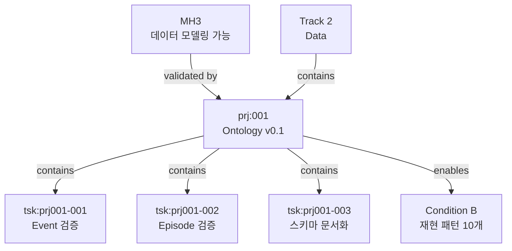

# Project: Ontology v0.1

> Project ID: `prj:001` | Track: `trk:2` Data | Status: Active (40%)

## 프로젝트 목표

**"5개 코어 엔티티로 Loop 데이터 표현 가능성 검증"**

---

## 전략적 위치

```
MH3 (데이터 모델링 가능)
    ↓ validates
Ontology v0.1 (이 프로젝트)
    ↓ enables
Condition B (재현 패턴 10개)
    ↓ unlocks
3년 전략 진입
```

---

## 성공 기준

| 기준 | 목표 | 현재 | 상태 |
|------|------|------|------|
| 스키마 안정성 | 3개월 변경 없음 | 1개월 | 🟡 진행 중 |
| 코치 라벨링 일관성 | 70% | 측정 전 | ⏸️ |
| 재현 패턴 수 | 5개 | 3개 | 🟡 진행 중 |

---

## Tasks

```dataview
TABLE
  status as "Status",
  assignee as "담당자",
  priority as "우선순위",
  due as "마감일"
FROM "50_Projects/2025/P001_Ontology/Tasks"
WHERE entity_type = "Task"
SORT status ASC, priority DESC
```

---

## Kanban 보기

[[_Kanban_View|📋 Kanban Board 열기]]

---

## 관계도



---

## 참고 문서

- [[Track_2_Data]] - 소속 Track
- [[MH3_데이터_모델링_가능]] - 검증 대상
- [[Condition_B_Loop_Dataset]] - Enable 대상
- [[30_Ontology/Schema/v0.1/Ontology-lite v0.1]] - 스키마 정의

---

**Created**: 2024-12-01
**Owner**: Founder + 온톨로지 팀
**Target End**: 2025-06-30
