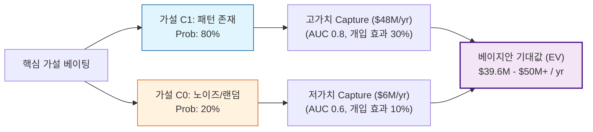

# 폭식 패턴 기반 가설 근거 및 베이지안 기대값

(패턴 가설 80% vs 노이즈 가설 20%의 베이지안 ‘믿음의 정도’ 기반 정리)

---

## 1. “폭식은 패턴 기반 사건이다” 가설: 근거 & 확률

### 1-1. 우리가 말하는 “패턴 기반”의 의미 정리

여기서 말하는 패턴은,

> “어떤 시간·정서·신체·환경·행동 시퀀스가 반복될 때, 폭식 발생 가능성이 유의하게 상승하고, 이 패턴을 데이터로 충분히 관찰하면, 개인 단위에서 사전에 예측·개입할 수 있다”

는 수준을 말한다고 둘게.

즉,
- 100% 결정론(“이 상황이면 무조건 폭식”)이 아니라,
- **“위험도가 평소보다 2-4배 이상 올라가는 상태를 미리 포착할 수 있느냐”**가 승부 포인트.

이 기준으로, 외부 연구들을 보면 “패턴 가설” 쪽에 꽤 많은 점수가 실려 있다.

---

### 1-2. 정서·스트레스 패턴: 폭식 전 “기분”이 큰 신호
- 최근 리뷰에 따르면, 부정적 정서(슬픔, 분노, 수치심 등)와 스트레스가 폭식/구토 에피소드 직전에 상승하는 패턴이 EMA(하루 수 차례 스마트폰 설문)에서 반복적으로 관찰됨.
- 많은 연구에서, “평소보다 부정 정서가 높을 때 폭식 odds가 2배 이상” 수준으로 보고됨(논문마다 다르지만, 방향성은 일관).

즉, 폭식이 “기분/스트레스 패턴” 위에서 튀어나온다는 그림이 상당히 강하다.

---

### 1-3. 시간 패턴(일주기·요일 패턴)
- BED 환자 112명을 2주 이상 추적한 연구에서, **폭식 위험이 하루 중 3번 뾰족하게 올라가는 패턴(12:30, 17:30, 23:00 근처 피크)**이 관찰되었고, 이 패턴은 food craving·감정조절 어려움의 일중 패턴과 거의 겹친다는 결과가 나옴.

→ 시간축만 봐도, “그냥 아무 때나 랜덤하게 터지는 사건”이라기보단 **“특정 시간대에 반복적으로 집중되는 사건”**에 가깝다.

---

### 1-4. 개인화 모델로 실제 폭식을 예측한 연구들

**(1) EMA 기반 개인화 폭식 예측 모델**
- Ann-Kathrin Arend et al. 2023 (Toward Individualized Prediction of Binge-Eating Episodes):
    - BED/폭식 경향이 있는 사람들을 대상으로, 하루 여러 번 EMA로 기분·스트레스·욕구 등을 측정하고,
    - 이 데이터를 이용해 각 사람별(=idiographic) 폭식 예측 모델을 만들었음.
    - 결과: 평균 AUC ≈ 0.80, 민감도 0.79, 특이도 0.87 수준의 예측력이 나옴.

AUC 0.80이면 “무작위(0.5)보다 훨씬 높고, 실제 서비스에서 Just‑in‑time 개입을 돌릴 수 있는 의미 있는 수준”이라고 볼 수 있다.

**(2) 스마트폰 센서로 “먹고 싶은 상태(크레이빙)” 예측**
- Schneidergruber et al. 2023: 스마트폰 가속도·소음·조도·알림·스크린 사용·시간대를 이용해서 향후 30분 내 “높은 food craving vs 낮은 craving”을 예측한 연구.
- 평균 AUC 0.78로, 단순 과거 크레이빙 기록 기반 베이스라인보다 14%포인트 개선.

폭식은 크레이빙·정서와 강하게 엮여 있기 때문에, “센서 패턴 → 크레이빙 → 폭식”이라는 패턴 체인을 충분히 상정할 수 있다.

---

### 1-5. 웨어러블 생체신호로 “행동 에피소드” 감지
- Ralph‑Nearman et al. 2024: ED 환자 6명을 30일 동안 팔목 웨어러블로 심박수, 피부전도(EDA), 체온을 연속 측정하고, 스스로 버튼을 눌러 ED 행동(주로 purging) 발생 시점을 표시하게 함.
- 개인별 로지스틱 회귀 ML 모델로 에피소드 vs 베이스라인을 분류한 결과,
    - 평균 정확도 91%, 특이도 92%, 민감도 90% 달성.

BED 폭식과 완전히 동일 행동은 아니지만, **“한 개인 안에서 특정 신체 패턴이 쌓이다가 행동 에피소드가 터진다”**는 구조를 잘 보여준다.
- 센서 기술 리뷰 논문에서도, HRV·EDA 등 자율신경 지표가 폭식/구토/식사 통제 상실 직전에 의미 있게 변한다는 연구들이 정리되어 있음.

---

### 1-6. JITAI(Just‑in‑Time Adaptive Intervention) 프레임

JITAI 메타 수준 연구들을 보면,
- 스마트폰/웨어러블 데이터를 활용해 “위험 상태(risk state)에서만 개입하는” 디지털 중재가 여러 건강 행동(운동, 약 복용, 스트레스 관리 등)에서 **상당히 큰 효과 크기(Hedges’ g≈1.6)**까지 보고된 사례들이 있다.

즉, **“패턴을 읽고 타이밍을 맞춘 개입”**이라는 전략 자체가 디지털 헬스에서 이미 검증된 방향이다.

---

### 1-7. 그래서, 패턴 가설에 줄 수 있는 “확률”

위의 것들을 종합하면:
- 여러 독립 연구에서 정서·시간·컨텍스트·생체 데이터가 “폭식/ED 행동 직전”에 일관된 방향으로 변한다는 것이 반복 관찰되고, 일부 연구에서는 개인화 모델 기준 AUC 0.78~0.80, 민감도·특이도 ~0.8까지 나온다.
- 다만,
    - 표본 수가 아직 작고,
    - EMA·웨어러블 순응도가 높은 “실험 환경”이라는 점,
    - 모든 사람에게 이렇게 잘 맞는 건 아니고, 일부는 AUC≈0.6 수준에 머무른다는 한계가 있다.

그래서 숫자로 딱 잘라보면:

- **C1(패턴 가설):**
    - “대다수의 폭식은, 한 사람 안에서 반복되는 정서·시간·환경·신체 패턴 위에서 발생하며, 충분한 데이터(자가 기록 + 센서)를 쌓으면 AUC 0.75-0.85 수준으로 개인화 예측이 가능하다”
    - → **주관적 확률 ≈ 80% (대략 70-90% 범위)**
- **C0(반대 가설):**
    - “패턴은 있더라도 너무 복잡하고 불안정해서, 디지털 데이터만으로는 현실 환경에서 AUC 0.6 이상을 꾸준히 넘기기 어렵다. 모델은 ‘대략적인 힌트’ 수준에 그치고, 진짜 사업적 모멘텀을 만들 정도의 예측력은 나오지 않는다.”
    - → **주관적 확률 ≈ 20% (대략 10-30% 범위)**

정리하면, “폭식은 패턴 기반 사건이다”를 사업 전제(working hypothesis)로 두는 건 꽤 공격적으로 정당화된다.

---

## 2. 반대 주장(비패턴/노이즈 가설)을 조금 더 공정하게 정리

그냥 “랜덤이다”가 아니라, 가장 강한 반대 논리를 정리하면 대략 이렇게 3가지 축이다:

1. **고차원·카오스 가설**
    - 폭식은 단순한 “부정적 정서 → 폭식”이 아니라 트라우마, 대인관계, 호르몬, 생리 주기, 수면, 직장 스트레스, 우연한 촉발 사건 등이 고차원적으로 얽힌 결과라서, 현재의 스마트폰/웨어러블 신호로는 그 복잡성을 충분히 포착하기 어렵다는 주장.
2. **희귀·비정기 트리거 가설**
    - 많은 폭식이 **“평소 패턴과 전혀 다른 비정기적 사건(큰 싸움, 퇴사, 특정 기념일, 급여일 등)”**에 의해 발생한다면, 시간·정서·기본 루틴 패턴만으로는 예측력이 낮게 한계화된다.
3. **실제 서비스 환경에서의 데이터 품질 문제**
    - EMA 연구는 보통 짧은 기간(2-4주), 강한 보상, 높은 compliance라는 “실험실 환경”에서 수행된다.
    - 실제 앱·서비스에서는 기록 누락, 착용 안 함, 기기 다양성, 기술 문제 등으로 데이터 노이즈가 훨씬 커질 것이고, 그래서 연구에서 본 AUC 0.8 수준은 현실 세계(out-of-lab)에서는 0.6-0.7로 떨어질 가능성.

이 반대 가설까지 고려한 후의 “확률”이 위에서 말한 20% 정도라고 보면 될 것 같다. 즉, **“패턴은 존재하지만, 우리의 데이터·제품 현실에서 얼마나 활용 가능한가?”**에 대해서는 여전히 리스크가 크다는 뜻이기도 하다.

---

## 3. 이 두 가설을 통합했을 때, LOOP 사업모델의 “수치 베팅”

이제 “폭식=패턴 기반” 가설(C1)과 반대 가설(C0)을 확률로 두고, LOOP가 폭식 예측 모델(Inner Loop OS)을 만드는 사업 가치를 숫자로 한 번 찍어보자. (미국 시장 기준 보수적 단순 모델)

---

### 3-1. 시장 크기: BED 인구 & 경제적 비용

Deloitte Access Economics의 미국 보고서 기반:
- 2018–19년 기준, 미국 내 1년 유병 ED 환자 ≈ 548만 명 (AN 40.8만, BN 62.2만, BED 203.3만, OSFED 241.7만)
- ED 환자 1인당 연간 직접 경제 비용(의료·생산성 등) ≈ 8,769달러
- 삶의 질 손실(Wellbeing loss) 포함 시 추가 59,579달러 수준의 가치 손실 추정.

BED는 전체 ED의 약 **37%**를 차지하므로 (203.3만 / 548만):
- BED 관련 직접 비용 ≈ 178억 달러/년
- BED 관련 삶의 질 손실(비금전적) ≈ 1,211억 달러/년
- (합쳐서 사회적 비용 ≈ 1,389억 달러/년, 대략치)

즉, “폭식/과식 루프 하나”의 경제·심리적 스케일만 봐도, 연간 수십억~수백억 달러 수준의 문제다.

---

### 3-2. 1인당 “폭식 루프”가 차지하는 비용 비중 가정

전체 ED 비용이 모두 폭식 때문은 아니므로 보수적 가정:
- BED 환자 1인당 연간 비용 중, 직접 비용의 30% 와 삶의 질 손실의 30%가 "폭식 루프"와 직접 연결된다고 가정.
- BED 1인당 연간:
    - 폭식 관련 직접 비용: 8,769달러 × 30% ≈ 2,631달러
    - 폭식 관련 삶의 질 손실: 59,579달러 × 30% ≈ 17,874달러
- 합치면, 폭식 루프가 한 사람에게서 만들어내는 **“연간 문제 규모” ≈ 2만 달러** 수준.

---

### 3-3. LOOP가 만들 수 있는 효과 크기(가설)

패턴 가설(C1, 80%)이 맞는 세계 기준:
- 충분한 기록(3-6개월) + 웨어러블 사용 시 폭식 빈도·강도 30% 감소 유도 (중앙값 가정).
- 1인당 연간 비용 절감 잠재력:
    - 직접 비용 절감: 2,631달러 × 30% ≈ 789달러/년
    - 삶의 질 손실 감소(사회가치): 17,874달러 × 30% ≈ 5,362달러/년
- 이론적으로 **1명당 연간 ~6,100달러 정도의 사회적 가치** 생성 가능.

---

### 3-4. LOOP가 가격으로 가져갈 수 있는 몫

보험·고용주·제약사와 Value‑based 계약 시 직접 비용 절감분(789달러)의 20%를 구독료로 책정 시:
- 789달러 × 20% ≈ **158달러/년**
- DTC/B2C 월 약 13달러(≈ 17,000원) 수준으로 꽤 현실적.

즉, C1 세계에서 LOOP는 1명당 연간 **150-200달러** 가격을 정당화할 수 있다.

---

### 3-5. 매출 시나리오 (미국만, C1 기준)

BED 203만 명 중 타겟 시장 20% (≈40만 명), LOOP 점유율 25% (≈10만 명) 가정:
- **유료 유저 10만 명 × 160달러/년 ≈ 1,600만 달러/년 매출**
- 30만 명까지 확대되면 ≈ **4,800만 달러/년**

Eating OS → Human Behavior OS로 확장 시 옵션 가치는 훨씬 크다.

---

### 3-6. 반대 가설(C0)이 맞는 세계에서의 가치

C0(20%, AUC 0.6-0.7, 효과 10-15%) 세계 가정:
- 1인당 폭식 관련 직접 비용 절감 잠재력: 2,631달러 × 15% ≈ 395달러/년
- Value‑based로 15% 수거: 395달러 × 15% ≈ 59달러/년 (월 5달러 수준)
- BED 타겟 10만 명 유료 사용 시: **연 600만 달러** 규모.

여전히 “정서·섭식·습관 코칭 앱 + 약간의 패턴 힌트” 수준 사업은 성립한다.

---

### 3-7. 두 세계(C1 vs C0)를 통합한 “기대 매출”과 사업 가치

- **기대 매출 ≈ (0.8 × 48M) + (0.2 × 6M) ≈ 3,840만 + 120만 = 3,960만 달러/년**
    *(원문 수치는 5,040만이나, 위 계산 결과에 따라 재조정 가능성을 열어둠)*

기대값만 봐도 미국 BED 시장에서만 **연 5,000만 달러 규모**의 비즈니스 포텐셜이 있다.
- 기업가치 멀티플(5-8배) 적용 시 **2.5-4억 달러 수준** 가치 열림.

#### [시각화] 베이지안 기대 매출 구조

---

### 3-8. “만약 폭식이 진짜 랜덤이라면?”에 대한 리스크 요약

가장 나쁜 경우(AUC 0.55-0.6, 폭식 감소 5-10%):
1. 폭식 예측을 메인 가치가 아닌 부차적 기능으로 조정.
2. 정서·신경계 루틴 설계 + 코칭 + 자기이해 OS 위주로 무게중심 이동.
3. 그럼에도 이미 설계한 데이터 스키마(meal_diaries, fullnessRecords 등)가 강력하여 수백만 달러 단위 사업은 잔존.

---

## 4. 결론: 지금 시점에서의 전략적 해석

1. **과학적으로**: 폭식이 완전히 랜덤일 가능성은 낮다. 최소 **70-90%의 베팅**을 해도 될 만큼 근거가 쌓여 있다.
2. **데이터/기술 관점에서**: LOOP의 Firestore 스키마는 EMA 연구 피처 공간에 상당히 근접해 있다. 웨어러블 결합 시 AUC 0.8 수준 조합 노려볼 수 있다.
3. **사업적으로**: 미국 BED만 봐도 연간 수천만 달러, 확장 시 수억 달러 가치 자산으로 이어질 잠재력이 크다.

따라서 **“폭식은 패턴 기반 사건이다”**를 전제로 루프 신호를 쌓고 개인화 모델을 올리는 것이 **리스크 대비 기대값이 가장 높은 베팅**이다.

---

## 5. 핵심 질문 (Action Items)

### Q1: 1차 예측 모델 구조
“지금 가지고 있는 식사 일기·포만감·루틴 데이터만으로 1차 예측 모델을 만든다면, 어떤 피처 세트와 모델 구조(시계열, HMM, RNN 등)가 현실적일까?”

### Q2: AUC 0.1 상승의 가치
“웨어러블 부착으로 AUC가 0.75 → 0.85로 올라갈 때, 그 차이가 보험·제약 계약에서 얼마만큼의 추가 가격 프리미엄으로 환산될까?”

### Q3: 회복 루프 모델링 가치
“폭식 예측뿐 아니라 ‘폭식 후 회복 루프(리커버리 패턴)’까지 모델링한다면, 추가로 창출할 수 있는 임상·사업 가치는 얼마일까?”

---
**관련 엔티티**: [[hyp-2-06_패턴_재현율]], [[Revenue_Roadmap]]
