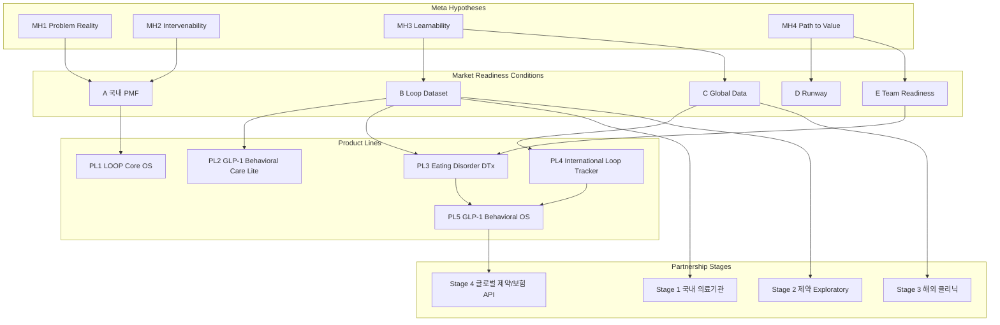

🎯 **Mid-Level Roadmap (2026–2028) — 조건 기반 전략 정리본 v3**

※ 연도가 아니라 **조건(Condition)이 충족되면 다음 단계(Product/Partnership)가 Unlock**되는 구조

※ PMF·데이터·스키마·자금·해외 검증을 모두 통합한 최종 버전

---

대표의 사고구조(결과는 너를 꺾지만, 가설은 너를 깨운다.)를 기반으로 한 가설 전제:

Metric is not for learning.

Metric is for stopping.

본 전략 문서에서 수치는 ‘성과를 평가하기 위한 지표’가 아니라, 가설 탐색을 끝내고 의사결정을 내리기 위한 **중단 신호(stop signal)**로 사용한다.

따라서 모든 핵심 수치는 다음 질문에만 답해야 한다:

- 왜 여기서 사람들이 멈췄는가?
- 이 가설이 맞다면 반드시 움직여야 하는 숫자는 무엇인가?
- 이 수치가 움직이지 않았다면, 어떤 가설을 폐기해야 하는가?

**나쁜 수치는 자책의 근거가 아니라, 다음 실험의 단서다.**

**단, Hard Falsification Trigger는 예외적으로 ‘중단 신호’다.**

## 0) 전체 구조

Mid-Level Roadmap은 3개의 Layer로 구성된다.

1. **Market Readiness Conditions** (시장 준비 조건)
2. **Product Line Roadmap** (제품 Unlock 로드맵)
3. **Partnership Roadmap** (제휴 단계)

부가적으로 다음을 함께 정의한다.

- **Override Protocol** (조건이 동시에 충족될 때 우선순위 규칙)
- **Failure Branch** (조건 미달 시 대응 시나리오)
- **Resource Conditions** (조직/재정 조건)

---



## 1) Market Readiness Conditions (시장 진입 기준점)

연도가 아니라 **아래 조건 충족 시 자동으로 다음 단계로 이동**한다.

|코드|이름|충족 기준|충족 시 Unlock|Failure Branch|Hard Falsification Trigger|
|---|---|---|---|---|---|
|A|국내 PMF|DAU 3k~6k, 유지율 25~30%, 고밀도 800~1,200, Loop Mapping v1|Core OS 강화, GLP-1 콘텐츠 투입, 의료 제휴 검토|UX 재설계, 고밀도 중심 축소, ‘섬세한 먹기 OS’ 소프트 피봇|**2026년 말까지 Tier1/2 사용자가 Loop 언어로 자신의 문제를 설명하거나 Loop 기반 선택을 하지 않는다면 PMF 가설 폐기**|
|B|Loop Dataset|고밀도 5k~7k, Pattern v1, 500K~800K datapoints|GLP-1 Lite, DTx 설계, 의료 Stage 1|GLP-1 Lite 연기, 고밀도 집중 캠페인|**고밀도 수는 늘지만 재현 가능한 Loop 패턴 수가 증가하지 않으면 데이터 전략 폐기**|
|C|Global Data|US/JP 스키마 검증, 글로벌 3k~4k|Intl Tracker, 해외 파일럿|일본 중심 전환, 해외 제품 지연|**문화권별 Loop 해석이 구조적으로 수렴하지 않으면 글로벌 확장 가설 폐기**|
|D|Runway|월 2~5천만 또는 18개월|GLP-1 OS 착수|비용 절감, 비규제 매출 집중|_(재정은 정량 판단이므로 별도 Trigger 불필요)_|
|E|Team|Core 5~7, PM/Dev/Data|Global Schema, DTx 준비|외주 병행, Lite 중심|_(조직은 구조 조정으로 대응, 별도 Trigger 불필요)_|

[Condition A — Notes (국내 PMF)](https-//www.notion.so/Condition-A-Notes-PMF-2c86a363106a8035980ad6653003153c?pvs=21)

[Condition B — Notes (Loop Dataset)](https-//www.notion.so/Condition-B-Notes-Loop-Dataset-2c86a363106a80a79369f2b983e96844?pvs=21)

[Condition C — Notes (Global Data)](https-//www.notion.so/Condition-C-Notes-Global-Data-2c86a363106a80a08aa4e2a3f9f52746?pvs=21)

[Condition D — Notes (Runway)](https-//www.notion.so/Condition-D-Notes-Runway-2c86a363106a80058525c34f8d651b94?pvs=21)

[Condition E — Notes (Team Readiness)](https-//www.notion.so/Condition-E-Notes-Team-Readiness-2c86a363106a8013883aca5029d5af3e?pvs=21)

※ Hard Falsification Trigger에 명시된 수치/조건은 추가 해석 없이 가설을 폐기하거나 전략을 전환하는 최종 판단 기준으로 사용한다.

## **Product Line Roadmap**

|Product Line|기간|Unlock 조건|구성 요소|목표|
|---|---|---|---|---|
|Product Line 1 — LOOP Core OS|2026|- Condition A (국내 PMF)|- Loop Mapping v1||

- Emotion–Eating–Habit Tracking v1
    
- Loop Intervention v0.5
    
- 폭식/정서 루프 탐지 기능
    
    ```
      - GLP-1 대비 Core Schema | - 국내 PMF 확립
    ```
    
- 고밀도 루프 데이터 확보 | | Product Line 2 — GLP-1 Behavioral Care Lite | 2026–2027 | - Condition B (고밀도 데이터 5~7천) | - GLP-1 ON-phase 정서 둔화 탐지
    
- OFF-phase Crash Predictor v1
    
- Rebound/요요/충동 모델
    
- 행동 루틴 자동화
    
- 의사·클리닉용 행동 지표 리포트 | - 2027 Crash 전 GLP-1 Behavioral OS 1등 포지션 확보 | | Product Line 3 — Eating Disorder DTx | 한국 중심, 2027–2028 | - Condition B + Condition E
    
- 국내 병원 2곳 제휴 | - DTx 프로토콜 v1
    
- Early Warning Index v1
    
- IRB/임상 설계
    
- 비급여/식약처 루트 | - 매출이 아니라 “의료 등급(Medical Grade)” 권위 획득 | | Product Line 4 — International Loop Tracker | 미국/일본 | - Condition C (해외 스키마 검증) | - 감정·섭식 루프 국제 스키마 적용
    
- Mini Loop Agent v0
    
- 자동/반자동 루프 기록
    
    ```
      - 국가별 언어 Skin Layer 적용 | - 해외 데이터 분포 확보
    ```
    
- 글로벌 Loop Schema 정합성 확보 | | Product Line 5 — GLP-1 Behavioral OS / 병용 DTx | 2028 | - Product Line 3 완료
    
- Global Schema v1 | - Off-phase Crash Predictor v2
    
- GLP-1 Behavioral DTx v1
    
- 제약/보험사 유지율 API
    
- 글로벌 파트너십 확장 | - “GLP-1 + LOOP = 정석 조합” 시장 공식화 |
    

---

## 3) Partnership Roadmap (조건 기반 제휴 단계)

|Stage|기간|Unlock 조건|결과|
|---|---|---|---|
|Stage 1 — 국내 의료기관|2026–2027|- Loop Dataset 3,000+ 고밀도|- 비만·정신건강센터 제휴|

- Early Warning Index validation
    
- IRB 준비
    
- DTx 프로토콜 공동 개발 | | Stage 2 — 제약사 Exploratory | 2027 | - GLP-1 사용자 데이터 ≥ 1,000명 | - 유지율/RWE 니즈 확보
    
- Behavioral OS 협업 논의
    
- GLP-1 병용 DTx 초기 구조 공유 | | Stage 3 — 해외 클리닉 파일럿 | 2027–2028 | - Condition C Phase 1 (해외 500~2,000명) | - Non-regulated Behavioral Pilot
    
- Loop Index 국제 버전 검증
    
- Cross-Cultural Loop Model 확보 | | Stage 4 — 글로벌 제약/보험 API | 2028+ | - GLP-1 Behavioral OS v1 | - 보험 유지율 API 적용
    
- 제약 파트너링
    
- 글로벌 OS 확장 |
    

---

## 4) Override Protocol (중요! 동시 충족 시 우선순위)

여러 Condition이 동시에 충족되면, **리소스 우선순위는 다음과 같다:**

1. **GLP-1 Behavioral Care Lite (Product Line 2)**
2. **Core OS 고도화 (Product Line 1 고도화)**
3. **International Loop Tracker (Product Line 4)**

**이유:**

- GLP-1 Crash는 타이밍이 정해져 있고(2027)
- 해외 확장은 유연하게 미뤄도 됨

---

## 6) 최종 요약 (Mid-Level Roadmap 요약)

**2026–2028 전략은 연도 기반이 아니라 다음 조건 기반이다:**

- Condition A: 국내 PMF
- Condition B: Loop Dataset
- Condition C: 해외 데이터
- Condition D: 런웨이
- Condition E: 조직 준비

조건이 충족되면 Product Line이 순차적으로 Unlock된다.

하고 싶은 것보다, **준비된 것부터** 나아가는 전략이다.

원하면 이 내용을 바탕으로 **Notion용 페이지 구조 버전**, **Table Version**, 혹은 **조건 기반 OKR 버전**으로 다시 재구성해도 된다.

# 1. 유닛 단위 설정 요약

## 1️⃣ 코칭 단가·구조 (Table)

|구분|항목|내용|
|---|---|---|
|코칭 단가 (2026)|범위|1인당 월 **30–35만 원**|
||계산 기준|[추론] 계산 편의 기준|
||보수적 (Cons)|**30만 원**|
||기준 (Base)|**32.5만 원**|
||상단 (Stretch)|**35만 원**|
|코칭 단가 (2027–2028)|2027년|[추측] **35–40만 원** (평균 **37.5만 원** 가정)|
||2028년|[추측] **40–50만 원** (평균 **45만 원** 가정)|
|코치 구조|담당 인원|코치 1명당 **25–30명** 책임|
||운영 원칙|코치는 **최대한 적은 수 관리**|
||보수적 시나리오|[추론] 코치 **3명 × 20명 = 60명** (슬롯 일부만 채운 상태)|

---

## 2️⃣ 앱(꼭꼭) 단가·구조 (Table)

## 5️⃣ 그래서 해결책은 “수치를 버리기”가 아니다

### ❌ 수치를 안 본다

→ 관념적 전략가가 됨

### ⭕ **호기심을 자극하는 수치만 만든다**

→ 이게 네 타입에 맞는 해법이다.

예를 들면 이런 질문형 수치:

- “왜 여기서 사람들이 멈췄지?”
- “이 가설이 맞으면 반드시 움직여야 하는 숫자는?”
- “이 수치가 바뀌지 않았다면, 어떤 가설이 틀린 거지?”

이건 **평가가 아니라 탐구**다.

---

## 6️⃣ 너한테 맞는 수치의 재정의 (이거 중요)

> ❌ 수치 = 성과 평가
> 
> ⭕ **수치 = 호기심을 멈추게 만드는 신호**

수치는:

- 재미없게 결론을 내리는 도구 ❌
- **“여기까진 생각해봤고, 이제 결정하자”를 알려주는 장치 ⭕**

---

## 7️⃣ 현실적인 규칙 하나 제안할게

이 규칙만 지켜도 균형이 맞는다.

> 호기심 단계에서는 수치를 보지 않는다. 대신, 결정 단계에서는 수치 없이 결정을 못 한다.

- 탐색 중:
    - 마음껏 재밌게
    - 질문 늘리기
- 결정 직전:
    - 딱 1~2개 수치만
    - Yes / No 판단

이렇게 하면:

- 재미도 살고
- 회사도 산다

---

## 8️⃣ 아주 솔직한 한 줄

> 사업은 재미있는 질문으로 시작하지만, 살아남는 건 재미없는 숫자 덕분이다.

|구분|항목|내용|
|---|---|---|
|유료화 정책|시작 시점|**2025년부터 전면 유료화**|
|가격 가정|기본 가정|MAU 기준 모두 **월 9,800원** 지불|
||ARPU|유료 이용자 1인당 **9,800원 / 월**|
|가격 경로 (2026)|1분기|**5,900원**|
||2분기 말|**9,800원**으로 인상|
|연평균 단가|2026년 평균|[추론] **약 8,338원 / 월** 수준으로 가정|

---

# 2. 2026년 매출 시나리오 (Cons / Base / Stretch) [추론]

## 2-1 코칭 매출 시나리오 (월·연 기준)

|시나리오|코치 수|코치당 인원|총 참여자|1인 단가|월 매출|연 매출|
|---|---|---|---|---|---|---|
|**보수적 (Cons)**|3명|20명|60명|30만 원|**1,800만 원**|**2.16억 원**|
|**기준 (Base)**|5명|25명|125명|32.5만 원|**4,062.5만 원**|**약 4.88억 원**|
|**상단 (Stretch)**|6명|30명|180명|35만 원|**6,300만 원**|**약 7.56억 원**|

> 가정 요약
> 
> - 코치 수 목표: 2–3명 → 5–8명
> - 코칭 참여자 목표: 60명 → 150명
> - [추론] 12개월 실행 문서 기준

---

## 2-2 앱(꼭꼭) 매출 시나리오 (월·연 기준)

|시나리오|MAU|월 평균 단가|월 매출|연 매출|
|---|---|---|---|---|
|**보수적 (Cons)**|2,000명|8,338원|**약 1,667만 원**|**약 2.00억 원**|
|**기준 (Base)**|3,000명|8,338원|**약 2,501만 원**|**약 3.00억 원**|
|**상단 (Stretch)**|4,000명|8,338원|**약 3,335만 원**|**약 4.00억 원**|

> 가정 요약
> 
> - 2025년 말 MAU ≈ 3,000명
> - 유료화 일부 이탈 반영 [추측]
> - 2026년 평균 단가: **약 8,338원/월** [추론]

---

## 2-3. 2026년 총합 매출 (코칭+앱) [추론]

|시나리오|코칭 (월)|앱 (월)|합계 (월)|합계 (연)|
|---|---|---|---|---|
|보수적|1,800만|1,667만|3,468만|약 4.16억|
|기준|4,062만|2,501만|6,564만|약 7.88억|
|상단|6,300만|3,335만|9,635만|약 11.56억|

해석:

- 12개월 실행 계획의 Condition D(“월 2,000만, 런웨이 18개월”) 최소 기준과 비교하면,
- **보수적 시나리오만 가동해도 이미 해당 최소선을 충분히 상회하는 구조**다. [추론]

---

# 3. 2027–2028년 가능 매출 범위 (개략) [추론]

> 여기부터는 문서에 직접적인 숫자는 없고,
> 
> 단가/정책/Condition을 바탕으로 한 모델링이라 **정확히 검증할 수 없습니다.**

## 3-1. 가격 가정

- 2027 코칭 단가: 35–40만 → 평균 37.5만 기준 [추측]
- 2028 코칭 단가: 40–50만 → 평균 45만 기준 [추측]
- 앱: 2027·2028 모두 9,800원/월 유지 가정 [추론]

---

## 3-2. 인원/MAU 가정 [추론]

Condition A/B 달성에 필요한 성장 속도를 고려한 가정:

- **코칭 참여자(동시 활성)**
    - 2027:
        - 보수적 120명 / 기준 160명 / 상단 220명
    - 2028:
        - 보수적 130명 / 기준 180명 / 상단 250명
- **앱 MAU**
    - 2027:
        - 보수적 3,000 / 기준 4,000 / 상단 6,000
    - 2028:
        - 보수적 4,000 / 기준 5,000 / 상단 7,000

이 수치는 실제 유저 행동 데이터를 보기 전까지는 **가설**이며,

실제 전환율·이탈률에 따라 조정이 필요하다. [검증되지 않음]

---

## 3-3. 2027년 매출 (요약) [추론]

### 코칭(월)

- 보수적: 120명 × 35만 = 4,200만
- 기준: 160명 × 37.5만 ≈ 6,000만
- 상단: 220명 × 40만 = 8,800만

### 앱(월)

- 보수적: 3,000 × 9,800 = 2,940만
- 기준: 4,000 × 9,800 = 3,920만
- 상단: 6,000 × 9,800 = 5,880만

### 합계

|시나리오|합계 (월)|합계 (연)|
|---|---|---|
|보수적|7,140만|약 8.57억|
|기준|9,920만|약 11.90억|
|상단|1억 4,680만|약 17.62억|

---

## 3-4. 2028년 매출 (요약) [추론]

### 코칭(월)

- 보수적: 130명 × 40만 = 5,200만
- 기준: 180명 × 45만 = 8,100만
- 상단: 250명 × 50만 = 1억 2,500만

### 앱(월)

- 보수적: 4,000 × 9,800 = 3,920만
- 기준: 5,000 × 9,800 = 4,900만
- 상단: 7,000 × 9,800 = 6,860만

### 합계

|시나리오|합계 (월)|합계 (연)|
|---|---|---|
|보수적|9,120만|약 10.94억|
|기준|1억 3,000만|약 15.60억|
|상단|1억 9,360만|약 23.23억|

---

# 4. 해석 및 리스크 인식 [추론]

1. **재정 Condition 관점**
    - 12개월 실행 계획에서의 최소 조건:
        - “월 2,000만, 런웨이 18개월” 수준.
    - 새 코칭 단가 + 전면 유료 앱 구조를 적용하면
        - **보수적 시나리오(2026)만으로도 이 최소선을 상당히 초과**한다.
    - 재정 때문에 Inner Loop OS 전략 자체를 포기할 가능성은 낮아지는 구조다. (물론 실제 수요가 이 가설을 따라줄 경우에 한함)
2. **전략 초점 전환**
    - 매출 절대값을 “몇 억 찍자” 관점으로 보기보다는,
        - Condition A/B (DAU, 고밀도 루프 사용자 수)
        - Schema 업그레이드(v0.7)
        - GLP-1 Behavioral Care Lite 준비등 **조건 충족에 초점을 두고, 매출은 그 결과로 따라오는 구조**로 재해석하는 것이 Inner Loop OS 전략과 더 잘 맞는다.
3. **리스크 인식**
    - 위 시나리오는 모두
        - “MAU 대부분이 유료로 남아 있다”
        - “코칭 슬롯이 일정 수준 채워진다”는 가정에 의존한다.
    - 실제 유저 반응(전환률, 이탈률, 가격 저항)은 현재 시점에서 **검증되지 않았으며**,
    - 실험 결과에 따라 “보수적/기준/상단”의 Entire Range 자체를 축소·조정해야 할 가능성이 있다.